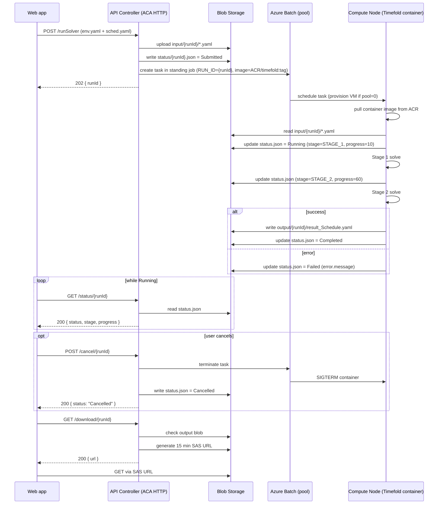

# Timefold Scheduler — Azure Architecture (v1)

This document is the **decided** architecture for the first deployable version.
Decisions are made here; alternatives are kept in the appendix at the bottom for
future reference.

---

## 1. The shape (v1)

```
┌──────────┐   POST /runSolver   ┌──────────────────────┐  create task  ┌──────────────────────┐
│ Web app  │ ──────────────────▶ │  API Controller       │ ────────────▶ │  Azure Batch          │
│ (React)  │ ◀─────── 202 ──────│  (Azure Container     │               │  (compute-optimized   │
│          │                     │   Apps, HTTP)         │               │   VM pool, autoscale) │
└──────────┘                     └──────────────────────┘               └──────────┬───────────┘
     ▲                                    │     ▲                                  │
     │ GET /status/{runId}                │     │  terminate task / job            │  schedule task
     │ GET /download/{runId}              │     │  (cancel)                        ▼
     │ POST /cancel/{runId}               │     │                       ┌──────────────────────┐
     │ DELETE /run/{runId}                │     │                       │  Compute Node         │
     │                                    │     │                       │  (Timefold container, │
     │                                    │     │                       │   pulled from ACR)    │
     │                                    │     │                       └──────────┬───────────┘
     │                                    ▼     │                                  │
     │                          ┌─────────────────────────────────────────────────────┐
     └──────────────────────────│  Azure Blob Storage                                  │
                                │   input/{runId}/   *.yaml                            │
                                │   output/{runId}/  result_Schedule.yaml              │
                                │   status/{runId}.json                                │
                                └─────────────────────────────────────────────────────┘
```

**Five moving parts.** Web → API → Batch (pool + node) → Blob. The Timefold
container image lives in Azure Container Registry (ACR); Batch nodes pull it
when they pick up a task.

No Service Bus. No Azure Functions. No Durable orchestration. Add them later only
if a real requirement appears.

### Why this shape (decided at meeting)
- **Azure Batch** gives us the full VM SKU catalogue — we can pick
  **compute-optimized** (Fsv2 / Fasv6) so single-thread solver phases run faster
  than they would on the generic vCPU sizing ACA Jobs offers.
- **Pool autoscale to 0** keeps the idle cost low; **low-priority VMs** (when
  acceptable) cut compute price by ~80 %.
- **Native parallel-task model** — adding more concurrent solves later is a
  pool-size knob, not a re-architecture.
- **Container support is first-class** — Batch tasks run our existing Docker
  image directly (the same one built in [Docker.md](./Docker.md)).
- **status.json** is the single source of truth for "what's happening with
  run X". Without it, the UI can't tell *running* from *failed* from
  *not-yet-started*.
- **Blob + SAS URL** keeps file data out of the API's hot path. Browser
  downloads directly from Blob via a short-lived signed URL.

### Trade-offs we accepted
- **Cold start is slower than ACA Job.** When the pool sits at 0 nodes, the
  first task waits ~5 minutes for a VM to provision. For an 8 hr solve this
  is rounding error; for very short solves it would be noticeable.
- **Pool needs explicit autoscale formula** (a small Batch DSL). We'll
  template this in IaC so it's not hand-tuned per environment.
- **More moving parts than ACA Job.** Batch account, pool, autoscale, job,
  task — vs ACA's single "job" resource. Acceptable for the SKU and parallelism
  benefits.

---

## 2. Run states (locked)

Every run is always in exactly one of these five states. They are stored in
`status/{runId}.json` and returned by `GET /status/{runId}`.

| State        | Meaning                                                                                  |
| ------------ | ---------------------------------------------------------------------------------------- |
| `Submitted`  | API received the request, input is in Blob, the ACA Job was started. Not yet running.    |
| `Running`    | Compute container started; Timefold is solving (Stage 1 or Stage 2).                     |
| `Completed`  | Solver finished; `output/{runId}/result_Schedule.yaml` is in Blob.                       |
| `Failed`     | Solver crashed or input was invalid. `error` field carries a message.                    |
| `Cancelled`  | User pressed Cancel before the solve finished. The ACA Job execution was stopped.        |

### `status.json` schema
```json
{
  "runId":      "20260527_001",
  "status":     "Submitted | Running | Completed | Failed | Cancelled",
  "stage":      "STAGE_1 | STAGE_2 | null",
  "progress":   "optional integer 0–100",
  "startedAt":  "2026-05-27T09:00:00.000Z",
  "updatedAt":  "2026-05-27T09:00:13.000Z",
  "finishedAt": "2026-05-27T17:14:00.000Z",
  "error":      { "type": "...", "message": "..." },
  "output":     "output/20260527_001/result_Schedule.yaml"
}
```

### Who writes the file
| Field                          | Written by                                                    |
| ------------------------------ | ------------------------------------------------------------- |
| `Submitted` (initial create)   | API Controller, right after the Batch task is created         |
| `Running`, `stage`, `progress` | Compute container (Batch task), after it boots                |
| `Completed`, `output`          | Compute container, after writing the result yaml              |
| `Failed`, `error`              | Compute container, in its catch-all error path                |
| `Cancelled`                    | API Controller, when `POST /cancel/{runId}` succeeds (after Batch task termination is requested) |

---

## 3. HTTP API contract (locked)

Five endpoints. Each one does exactly one thing.

### `POST /runSolver` — start a run
Uploads input files and starts the solver. Returns immediately with a `runId`.

```jsonc
// Request: multipart/form-data
//   runId             (optional; server generates if missing)
//   env               (file)
//   sched             (file)
//   originalEnvPath   (optional string, user-supplied annotation)
//   originalSchedPath (optional string)
//   label             (optional string)

// 202 Accepted
{ "runId": "20260527_001" }
```

Side effects:
1. Uploads `input/{runId}/{EnvConfig.yaml, Schedule.yaml}` to Blob.
2. Writes `status/{runId}.json = { status: "Submitted", startedAt: now, ... }`.
3. Creates an **Azure Batch task** in the standing job, passing `RUN_ID={runId}`
   as an environment variable. The task spec references the Timefold container
   image in ACR. Batch schedules the task to a pool node (provisioning one if
   the pool is currently at zero).

### `GET /status/{runId}` — poll status
```jsonc
// 200
{
  "runId": "20260527_001",
  "status": "Running",
  "stage": "STAGE_2",
  "progress": 90,
  "startedAt": "2026-05-27T09:00:00.000Z",
  "updatedAt": "2026-05-27T17:10:33.000Z"
}

// 404 — unknown runId
```

The web app polls this every 5–10 s while a run is `Submitted` or `Running`.
When it sees `Completed`, it stops polling and shows "Show Result" enabled.
When it sees `Failed` or `Cancelled`, it stops polling and shows the message.

### `POST /cancel/{runId}` — cancel a running solve
```jsonc
// Empty body
// 200
{ "ok": true, "status": "Cancelled" }

// 409 — run is already in a terminal state (Completed/Failed/Cancelled)
{ "ok": false, "status": "Completed" }

// 404 — unknown runId
```

Side effects:
1. Calls the **Batch task-terminate** REST API
   (`POST {batchUrl}/jobs/{jobId}/tasks/{taskId}/terminate`) to stop the
   in-flight task. Batch sends the task process `SIGTERM`, waits the
   configured `retentionTime` grace period, then kills the container.
2. Writes `status/{runId}.json = { status: "Cancelled", finishedAt: now }`.

A `Cancelled` run has **no output yaml**. Partial work is discarded.

> **Optional refinement:** if the Timefold Java code installs a SIGTERM hook
> that calls `solver.terminateEarly()` then dumps the best-found-so-far
> solution, Cancel can return a partial result. Not in v1.

### `GET /download/{runId}` — get the result
Generates a short-lived (15 min) SAS URL pointing at the result blob.

```jsonc
// 200 — output exists
{
  "url": "https://<account>.blob.core.windows.net/timefold/output/20260527_001/result_Schedule.yaml?<sas>",
  "expiresAt": "2026-05-27T17:25:00.000Z"
}

// 404 — no output yet (still running, failed, or cancelled)
{ "ready": false, "status": "Running" }
```

Browser follows the URL with a plain `GET` to download the file. No bytes flow
through the API Controller.

### `DELETE /run/{runId}` — remove a run completely
```jsonc
// 200
{ "ok": true }
```

Side effects:
1. If the run is `Submitted` or `Running`, it is cancelled first.
2. Deletes `input/{runId}/`, `output/{runId}/`, and `status/{runId}.json` from Blob.
3. The web app removes the row from its local cache.

---

## 4. Blob layout (locked)

```
https://<account>.blob.core.windows.net/timefold/
├── input/
│   └── {runId}/
│       ├── EnvConfig.yaml
│       └── Schedule.yaml
├── output/
│   └── {runId}/
│       └── result_Schedule.yaml
└── status/
    └── {runId}.json
```

`{runId}` matches the run folder in the web app (e.g. `20260527_001`).

---

## 5. End-to-end sequence



---

## 6. Compute choice (decided: **Azure Batch**)

A Batch **account** owns a **pool** (a fleet of VMs); each solve becomes one
**task** in a long-lived **job**. The pool autoscales — minimum 0 nodes when
idle, scaling up as tasks queue.

### Pool sizing (initial defaults — adjust during load test)

| Setting              | Value                                            | Why                                                                 |
| -------------------- | ------------------------------------------------ | ------------------------------------------------------------------- |
| VM size              | `Standard_F4s_v2` (4 vCPU, 8 GB)                 | Compute-optimized, high clock; cheap; matches our local Docker test |
| OS image             | `microsoft-azure-batch / ubuntu-server-container`| Pre-pulled Docker runtime so container start is faster              |
| Min / target nodes   | 0 / 0 (autoscale formula drives it)              | $0 idle                                                              |
| Max nodes            | 3 (cap so a bug can't spin up 100 VMs)            | Cost safety                                                          |
| Node fill type       | Pack                                             | Stack tasks on a node when possible before scaling out               |
| Tasks per node       | 1                                                | Solver is CPU-bound; sharing a node hurts both runs                  |
| VM priority          | **Low-priority / Spot** for dev, **Standard** for prod | ~80% cheaper; evictions are fine because cancelled runs can retry |
| Autoscale formula    | "1 node per pending task, decommission idle nodes after 10 min" | Cheap + responsive |

### Cancel

Cancel calls the Batch task-terminate REST API:
```
POST {batchUrl}/jobs/{jobId}/tasks/{taskId}/terminate
Authorization: Bearer <AAD token from API Controller's Managed Identity>
```
Batch sends the running container `SIGTERM`, waits the task's `retentionTime`
(default 30s — raise to 60s in our config so the entrypoint has time to write
`status.json = Cancelled`), then kills it.

The entrypoint script in our Docker image **already handles SIGTERM** — see
`docker/entrypoint.sh` in [Docker.md](./Docker.md). Same behaviour as
`docker stop` locally.

### Container image source

The Batch task references the same Docker image we built locally:
```
{registry}.azurecr.io/timefold:{tag}
```
The pool's Managed Identity is granted `AcrPull` so nodes can pull the image
from ACR without secrets.

---

## 7. Cost (rough, per 8 hr solve)

| Component          | Azure product                                                         | Approx. cost / run | Notes                                                                          |
| ------------------ | --------------------------------------------------------------------- | ------------------ | ------------------------------------------------------------------------------ |
| **Compute (std)**  | Batch — `Standard_F4s_v2`, 8 h                                        | ~$1.50             | Standard (non-low-priority) VM, billed while node exists                       |
| **Compute (low-pri)** | Batch — same SKU, **low-priority/spot**, 8 h                       | ~$0.30             | ~80 % cheaper; risk of mid-solve eviction (rare for this SKU)                  |
| **Pool idle**      | Batch — 0 nodes                                                        | $0                 | Autoscale to 0 between runs; no charge until a task arrives                    |
| **Image pull**     | ACR (Basic SKU)                                                        | ~$0.17/day flat    | $5/mo for the registry; image transfer to Batch is free in-region              |
| **Storage**        | Blob (Standard LRS)                                                    | pennies            | A few MB of YAML per run plus minimal egress on download                       |
| **API Controller** | ACA HTTP (small)                                                       | ~$0 idle           | Scale-to-zero; negligible cost for occasional calls                            |
| **Batch account**  | —                                                                      | $0                 | The Batch service itself is free; you only pay for the VMs it allocates        |

**Total per run ≈ $0.50 (low-pri) – $1.70 (standard)**, dominated by VM time.
Monthly fixed cost ≈ $5 for ACR if we always have an image hosted there.

### Cost-cutting levers, in order of impact
1. **Use low-priority VMs in dev** — biggest single saving, ~80 %.
2. **Aggressive autoscale-to-0** — pool sits at 0 nodes when no tasks pending.
3. **Right-size the SKU** — start with F4s_v2; benchmark before going larger.
4. **Use ACR Basic** ($5/mo) instead of Standard ($20) — sufficient for this size.
5. **Tear down dev pool on Fridays** if no weekend work expected.

---

## 8. Auth and security (sketch)

- **Web → API**: Azure Entra ID auth on the ACA HTTP app (or API Management in
  front of it). Token validated by the API.
- **API → Blob**: **Managed Identity** assigned to the ACA HTTP app, granted
  `Storage Blob Data Contributor` on the storage account. No keys in code.
- **API → Batch**: Same Managed Identity, granted **`Azure Batch Account
  Contributor`** at the Batch account scope (lets the API create jobs/tasks
  and terminate them via AAD-authenticated REST). The Batch account itself is
  configured for **AAD-only auth** — no shared keys floating around.
- **Batch pool nodes → Blob**: The pool is created with a **user-assigned
  Managed Identity** which is granted `Storage Blob Data Contributor` (same
  storage account). The Timefold container uses `DefaultAzureCredential` to
  pick up that identity automatically.
- **Batch pool nodes → ACR**: Same pool Managed Identity is granted **`AcrPull`**
  on the container registry so nodes pull the Timefold image without secrets.
- **Browser → Blob**: Short-lived SAS URLs only. Never expose the account key.

### Summary of Managed Identities used
| Identity                              | Where it lives                  | Roles granted                                     |
| ------------------------------------- | ------------------------------- | ------------------------------------------------- |
| `mi-tf-api`                           | ACA HTTP app (system-assigned)  | Storage Blob Data Contributor; Azure Batch Account Contributor |
| `mi-tf-pool`                          | Batch pool (user-assigned)      | Storage Blob Data Contributor; AcrPull            |

---

## 9. Open questions to resolve before v1 ships

| Question                                         | Default proposal                                                    |
| ------------------------------------------------ | ------------------------------------------------------------------- |
| Authentication mechanism for the web app         | Entra ID, single-tenant                                             |
| Retention policy for old runs                    | 30 days then auto-delete via Blob lifecycle                         |
| Concurrent run limit (pool max nodes)            | 3                                                                   |
| VM SKU for the Batch pool                        | `Standard_F4s_v2` (4 vCPU / 8 GB, compute-optimized)                |
| Low-priority VMs OK?                             | Dev = yes; Prod = revisit after measuring eviction rate             |
| Autoscale formula                                | "1 node per pending task, drop idle nodes after 10 min"             |
| Logging / observability                          | Batch task stdout/stderr → Storage + Log Analytics                  |
| status.json update frequency from compute        | Every solver step + every 30 s heartbeat                            |
| SIGTERM handling in Timefold Java                | Add shutdown hook calling `solver.terminateEarly()` (return partial result) |
| Container Registry tier                          | ACR Basic ($5/mo) — sufficient for image size and pull rate         |

---

## Appendix A — Why not Service Bus (in v1)

The classic shape (`API → Service Bus → Function → Compute`) adds value when:
- You have **bursty** traffic that needs buffering.
- You want **at-least-once retry** if the worker crashes.
- You're processing **many small messages**, not few large jobs.

We have **few jobs per day, each running for hours**. Service Bus + Function
adds two more components (and ~$10/month idle cost) for no real benefit in v1.
If we later need retry/burst-smoothing, we can insert it between API and ACA Job
without touching the web or the compute container.

## Appendix B — Why not ACA Job (considered, not chosen)

ACA Jobs were the first proposal and are still a strong option for this
workload. They offer:

- Faster cold start (<1 min vs Batch's ~5 min when pool=0)
- Single Container Apps environment shared with the API → one platform to operate
- Simpler resource model (no pool, no autoscale formula, no separate Batch account)
- Built-in `replicaTimeout` up to 7 days

**Why Batch won at the meeting:**
- ACA Jobs only offer generic vCPU/memory sizing — no access to
  compute-optimized (Fsv2/Fasv6) or HPC SKUs the solver benefits from.
- ACA Jobs don't expose low-priority/spot pricing → ~5× the per-hour cost
  for the same workload.
- Future plans include heavier concurrent runs (the company side may want to
  burst to many solves). Batch's pool/task model handles that natively;
  ACA Jobs would need a redesign at that point.

If a future v2 finds Batch operationally heavier than expected and we don't
end up needing the SKU/concurrency, ACA Jobs remain a one-week refactor away
(the API contract and Docker image don't change).

## Appendix C — Why not Durable Functions (in v1)

Durable Functions shine for multi-step workflows with fan-out/fan-in, human-in-
the-loop steps, or long-running orchestrations across multiple activities. Our
pipeline is a single step (solve), so the orchestrator buys us nothing while
adding a stateful Functions runtime to operate.

---

## 10. Local development before Azure

While we wait for cloud resources, the same architecture runs locally:

- **API Controller** → the Vite dev middleware in `webapp/vite.config.ts`
  (already exposes the same endpoint shapes).
- **Blob Storage** → folders under `webapp/public/local/{runId}/` on disk.
- **status.json** → planned addition at `webapp/public/local/status/{runId}.json`.
- **Batch compute node** → a **Docker container** running the Timefold JVM
  locally, mounting the same local folders as volumes (see [`Docker.md`](./Docker.md)).
  This is the *exact same image* Batch will run; locally we just `docker run`
  it ourselves instead of letting Batch schedule it.
- **Cancel** → `docker stop <containerId>` (sends SIGTERM, same as Batch task-terminate).
- **ACR** → the local Docker daemon's image cache (`timefold-scheduler:local` tag).

The web app's `VITE_API_BASE_URL` env var flips between local and Azure modes —
when it's empty, the app talks to the Vite middleware; when set, it talks to
the real API Controller. Same UI, same React code.
