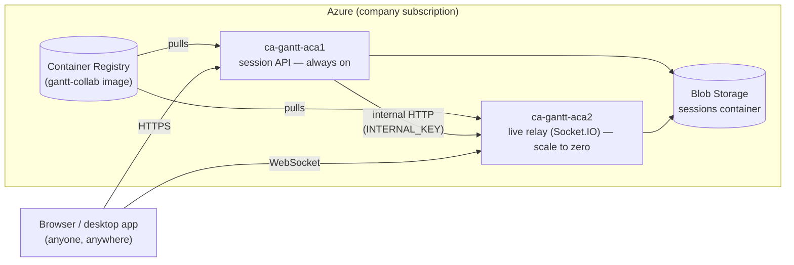

# GanttChartEditor — Build & Push the ACA Container, Step by Step

> **Date:** 2026-09-17
> Everything needed to build the online-collaboration backend image, push it to Azure Container
> Registry, and stand up **ACA1** (session API) + **ACA2** (live relay) — written to be run on a
> machine that actually has company Azure access (this dev machine does not).
> **Decisions to make first** (who can reach Storage, secrets option, RBAC, cost): see
> `GanttChartEditor_OnlineCollab_AzurePrep20260908.md`. This doc is the "now run it" companion.

---

## 0. The short answer to "do I need to rebuild every time I change a feature?"

**Yes, for the two things running in Azure (ACA1 + ACA2) — no, for the desktop app.**

| You changed… | What you must do |
|---|---|
| Anything under `GanttChartEditor/server/src/**` (the collab backend: session API, socket relay, storage) | **Rebuild the image, push it to ACR, tell ACA1 *and* ACA2 to use the new tag.** Nothing auto-syncs from a `git commit` or a local save — Azure only ever runs whatever image tag you last pointed the Container App at. §4–§5 below. |
| Only `GanttChartEditor/src/**` (the React UI) and you're using the **local-run web client** (§"Web client" in AzurePrep) | No image rebuild — just `npm run dev` locally again, or if you deployed to Static Web Apps, rebuild + redeploy *that* (a separate, much smaller/faster step — `npx vite build` + `swa deploy`, no Docker involved). |
| Only an **env var** (`WEB_ORIGIN`, rate limits, timeouts, …) | No rebuild at all — `az containerapp update --set-env-vars ...` (§6). |
| The **desktop app** (Electron `ROLE=local`, what most people actually use day to day) | **Nothing here applies.** It bundles its own copy of `server/dist` and runs entirely on the user's PC — no ACR, no ACA1/ACA2, no network round-trip to Azure at all. Only affects someone who explicitly opens an online session against the deployed ACA1. See `GanttChartEditor_OnlineCollab_DesktopLANTest20260911.md`. |

So: **cloud feature work → rebuild + push + update, every time.** It's two commands (§4, §5) once the resources exist, and can be a single `git push` later if `.github/workflows/deploy-collab.yml` (§8) gets wired up — but there is no way around *some* form of "build a new image, tell Azure about it" for server-side changes. A currently-open meeting on ACA2 will drop and reconnect when its revision is replaced (§7 has the caveat on timing that).

---

## 1. Architecture recap



One codebase (`GanttChartEditor/server/src`), one Docker image, `ROLE` env var picks behaviour:

- **`ROLE=aca1`** — the public session API (`/api/sessions`, list/create/open/delete). No sockets.
- **`ROLE=aca2`** — the public Socket.IO relay clients actually connect to once a session is open,
  plus an `/internal/*` control plane ACA1 calls (list an app doesn't reach directly).
- **`ROLE=local`** — both roles on one port, in-process, no network hop. This is what the **desktop
  app** and LAN testing use — see `GanttChartEditor_OnlineCollab_DesktopLANTest20260911.md`. Not
  deployed to Azure; only mentioned here for contrast.

Design rationale (ACA1/ACA2 split, why ACA2 scales to zero, Socket.IO sticky sessions, the
`StorageClient` abstraction): `GanttChartEditor_OnlineCollabAzure_Design20260904.md`.

---

## 2. Repo layout — where everything actually lives

```
web/                                    (not itself a git repo — a folder of sibling repos)
├─ GanttChartEditor/                    ← app source, its own git repo
│  ├─ src/                                the React/Electron client — never containerized
│  ├─ server/                             the ACA1+ACA2+local backend
│  │  ├─ src/                             actual TypeScript source — this is what gets built
│  │  ├─ package.json, package-lock.json
│  │  ├─ .dockerignore                    ⚠ MUST stay here — see §3 note
│  │  ├─ docker-compose.mock.yml          LOCAL testing only (Azurite-free fs mock), no Azure
│  │  └─ MOCK_AZURE.md
│  └─ (no Dockerfile, no infra/ anymore — moved out, see below)
│
├─ gantt-collab-container/              ← THIS is the new piece. Separate git repo.
│  ├─ Dockerfile                          builds GanttChartEditor/server — see §3 why it's here
│  ├─ deploy.sh                           the one-shot "create everything" script
│  ├─ README.md                           quick reference
│  └─ .github/workflows/deploy-collab.yml CI (manual-dispatch only until wired up, §8)
│
└─ documents/GanttChartEditor/          ← you are here
   ├─ GanttChartEditor_ACA_ContainerBuildAndPush.md   (this doc)
   ├─ GanttChartEditor_OnlineCollab_AzurePrep20260908.md  (resource decisions, RBAC, cost)
   └─ GanttChartEditor_OnlineCollabAzure_Design20260904.md (why the architecture looks like this)
```

**Both `GanttChartEditor` and `gantt-collab-container` must be checked out as sibling folders**
(same parent directory) for the default relative paths in `deploy.sh` and the Dockerfile's build
instructions to work unmodified. If your company machine's checkout differs, `deploy.sh` has a
`GANTT_SERVER_DIR` override (§4).

---

## 3. Why the Dockerfile lives in a *separate* repo from the app

This was a deliberate restructure (2026-09-17) — previously the Dockerfile lived at
`GanttChartEditor/server/Dockerfile`. Reasons to keep them apart:

- **Different lifecycles.** The Dockerfile/deploy script change when *infrastructure* changes
  (Node version, ACA topology, secrets wiring). The app code changes constantly. Bundling them in
  one repo means every infra tweak is a commit in the app's history and vice versa.
- **Different audiences / access.** Whoever manages Azure resources doesn't need write access to
  the React/Electron app source, and app contributors don't need to touch deploy scripts.
- **Cleaner CI.** A workflow that builds-and-pushes can live next to the thing it builds (the
  Dockerfile) without needing app-repo write access to add a `.github/workflows/*.yml`.

**The one subtlety this creates:** `.dockerignore` only takes effect when it sits at the **build
context root** — and the context is still `GanttChartEditor/server/` (that's where `package.json`
and `src/` are), even though the Dockerfile itself now lives elsewhere. So `.dockerignore`
**stays** in `GanttChartEditor/server/.dockerignore` — don't move it. Every `az acr build` /
`docker build` command below passes `-f <path-to-Dockerfile>` **and** a separate context argument
for exactly this reason.

---

## 4. Prerequisites (once, on the company machine)

```bash
az --version        # >= 2.53
az login
az account list -o table
az account set --subscription "<the Timefold company subscription>"
```

You need (ask whoever ran `documents/SchedulerWeb/azure/Azure-Company-01-Access-And-Resources.md`
if unsure you have these — see `AzurePrep20260908.md` §RBAC for the full list):

- `AcrPush` on the company Container Registry
- `Container Apps Contributor` on the resource group (or the two new apps)
- Network: **`az acr build` must run on the company network** — the registry is behind a private
  endpoint, same as SchedulerWeb's.

Clone both repos as siblings if you haven't:

```bash
cd /path/to/some/workspace
git clone <GanttChartEditor remote>          GanttChartEditor
git clone <gantt-collab-container remote>    gantt-collab-container
```

(If `gantt-collab-container` has no remote yet — it was created locally and never pushed — copy
the folder across, or `git init` a new remote for it and push once, from wherever you do have
network access to your git host. Its own git history is independent of `GanttChartEditor`'s.)

---

## 5. Build + push the image

Everything below assumes you're in `gantt-collab-container/` and it sits next to `GanttChartEditor/`.

```bash
cd gantt-collab-container

# Resource names from AzurePrep20260908.md — reusing the existing SchedulerWeb
# registry, NOT creating a new one:
ACR=<existing SchedulerWeb ACR name, no ".azurecr.io">
RG=<existing SchedulerWeb resource group>

# Tag by the GanttChartEditor commit actually being built (traceability):
TAG=$(git -C ../GanttChartEditor rev-parse --short HEAD)
IMAGE=gantt-collab

az acr build -r "$ACR" -t "${IMAGE}:${TAG}" -f Dockerfile ../GanttChartEditor/server
```

What that command means, piece by piece:

- `-r "$ACR"` — build **inside Azure** (no local Docker needed at all — this is the same
  `az acr build` pattern SchedulerWeb uses; the registry does the build itself). If you'd rather
  build locally and push, see the "local docker build" box below.
- `-f Dockerfile` — the Dockerfile, found relative to **this folder** (`gantt-collab-container/`),
  not relative to the context.
- `../GanttChartEditor/server` — the **build context**: everything the Dockerfile's `COPY`
  instructions can see (`package.json`, `src/`) — and where `.dockerignore` applies from (§3).

This pushes `<ACR>.azurecr.io/gantt-collab:<TAG>` straight to the registry — no separate `docker
push` step needed with `az acr build`.

<details>
<summary>Alternative: build locally with Docker, then push (if you'd rather not build in Azure)</summary>

```bash
az acr login -n "$ACR"
docker build -t "${ACR}.azurecr.io/${IMAGE}:${TAG}" -f Dockerfile ../GanttChartEditor/server
docker push "${ACR}.azurecr.io/${IMAGE}:${TAG}"
```

Same context/Dockerfile split rule applies. Needs Docker Desktop (or another local daemon) running.
</details>

**Verify it landed:**

```bash
az acr repository show-tags -n "$ACR" --repository gantt-collab -o table
```

---

## 6. Deploy / update ACA1 + ACA2

### First time ever (creates everything)

```bash
cd gantt-collab-container
export SUFFIX=abc123                         # short, globally unique — see deploy.sh header
export WEB_ORIGIN=https://REPLACE-WITH-WEB-ORIGIN
./deploy.sh
```

Reads `ACR`, `STG`, `RG`, etc. from env if you already have `~/azure-ganttcollab-env.sh` sourced
(see `AzurePrep20260908.md`), otherwise picks the defaults in the script's own header — **review
every `az` line before running against the real subscription**, especially the resource-create
steps if you're reusing existing SchedulerWeb resources (skip re-creating the RG/ACR/environment
in that case — see AzurePrep's "New resources" table for exactly which calls to keep vs. skip).

### After that — pushing a feature update (the common case)

Once the two Container Apps already exist, you don't re-run the whole script — you just point them
at the new image tag:

```bash
cd gantt-collab-container
TAG=$(git -C ../GanttChartEditor rev-parse --short HEAD)
ACR=<your ACR name>
RG=<your resource group>
IMG="${ACR}.azurecr.io/gantt-collab:${TAG}"

# build + push (§5) first, then:
az containerapp update -n ca-gantt-aca2 -g "$RG" --image "$IMG"
az containerapp update -n ca-gantt-aca1 -g "$RG" --image "$IMG"
```

That's the entire "ship a server change" loop: **build → push → update ACA2 → update ACA1.**
Order matters a little — updating ACA2 first means any brief window where ACA1 is new but ACA2 is
old (or vice versa) leans toward "ACA1 can still talk to a working ACA2", not the other way round;
in practice both come up in seconds and the window is negligible.

### Env-var-only change (no image rebuild)

```bash
az containerapp update -n ca-gantt-aca1 -g "$RG" --set-env-vars WEB_ORIGIN=https://new-origin
az containerapp update -n ca-gantt-aca2 -g "$RG" --set-env-vars WEB_ORIGIN=https://new-origin
```

---

## 7. What actually happens during a redeploy (revisions, not restarts)

Azure Container Apps doesn't overwrite the running container in place — `az containerapp update
--image` creates a **new revision** and shifts traffic to it (single-revision mode, the default,
retires the old one once the new one is healthy). Practically:

- **ACA1** (always-on, stateless session API): a redeploy is unnoticeable — new requests just land
  on the new revision within a few seconds.
- **ACA2** (the live relay): every open Socket.IO connection on the *old* revision drops when it's
  retired. Clients' `socket.io-client` auto-reconnects and re-runs the join/sync-init flow (the
  same path a network blip already exercises), so nobody loses data — but anyone mid-meeting sees
  a momentary "disconnected" flicker in the participant/status indicator. **Avoid redeploying ACA2
  during an active meeting if you can help it**; there's no maintenance-window feature here, just
  "redeploy when nobody's obviously using it," same as most small internal tools.

Rollback is the same command with an older tag:

```bash
az acr repository show-tags -n "$ACR" --repository gantt-collab -o table   # find the old tag
az containerapp update -n ca-gantt-aca2 -g "$RG" --image "${ACR}.azurecr.io/gantt-collab:<old-tag>"
az containerapp update -n ca-gantt-aca1 -g "$RG" --image "${ACR}.azurecr.io/gantt-collab:<old-tag>"
```

(Images aren't deleted by a redeploy — every tag you've ever pushed stays in ACR until you
explicitly `az acr repository delete`, so rollback is always just "point at an older tag.")

---

## 8. Automating it (optional, later)

`gantt-collab-container/.github/workflows/deploy-collab.yml` does §5+§6 on `workflow_dispatch`
(manual "Run workflow" button) today. To make it automatic on push:

1. Uncomment the `push:` trigger block at the top of the workflow.
2. Fill in `repository: REPLACE-WITH-ORG/GanttChartEditor` (it needs a **second checkout** — the
   workflow lives in `gantt-collab-container` but builds `GanttChartEditor/server`).
3. Add repo secrets: `AZURE_CREDENTIALS` (a service principal with `Contributor` on the resource
   group — same as SchedulerWeb's CI) and, if `GanttChartEditor` is a different repo/org than
   `gantt-collab-container`, `GANTT_EDITOR_REPO_TOKEN` (a PAT or deploy key with read access to it).

Until then, §5+§6 by hand is the whole story — two `az` commands per redeploy, no CI required.

---

## 9. Smoke test

```bash
ACA1_FQDN=$(az containerapp show -n ca-gantt-aca1 -g "$RG" --query properties.configuration.ingress.fqdn -o tsv)
ACA2_FQDN=$(az containerapp show -n ca-gantt-aca2 -g "$RG" --query properties.configuration.ingress.fqdn -o tsv)

curl -s "https://${ACA1_FQDN}/api/health"   # {"ok":true,"role":"aca1",...}
curl -s "https://${ACA2_FQDN}/api/health"   # {"ok":true,"role":"aca2",...}

curl -s -X POST "https://${ACA1_FQDN}/api/sessions" -H 'content-type: application/json' \
  -d '{"name":"smoke","schedule":{"planRange":{"startDate":"2026-01-01","endDate":"2026-01-31"},"workflowTaskList":[],"assignmentList":[]},"envConfig":{"workerList":[]},"currentView":"worker"}'
# → {"ok":true,"sessionId":"...","ownerToken":"..."}
```

Full click-through (create → join from a second device → co-edit → lock/unlock): see
`AzurePrep20260908.md`'s checklist, last item.

---

## 10. Troubleshooting

| Symptom | Likely cause |
|---|---|
| `az acr build` hangs / times out | Not on the company network — ACR is behind a private endpoint. |
| Image builds but ACA1 can't reach ACA2 (`ECONNREFUSED` in ACA1 logs) | `ACA2_URL` env var on ACA1 doesn't match ACA2's actual FQDN, or `INTERNAL_KEY` differs between the two apps. |
| Client gets CORS errors from the browser | `WEB_ORIGIN` on ACA1/ACA2 doesn't match the page's actual origin (exact scheme+host+port). |
| ACA2 clients randomly disconnect under load | Sticky sessions not set (`az containerapp ingress sticky-sessions set … --affinity sticky`) — Socket.IO's handshake + upgrade must land on the same replica. |
| `STORAGE=blob is required...` startup error | `BLOB_CONNECTION_STRING` or `WEB_ORIGIN` missing — `config.ts` intentionally refuses to boot without both once `STORAGE=blob` (production CORS/secret hygiene, not a bug). |
| Old code still running after "update" | You updated the image tag but forgot one of the two apps — ACA1 and ACA2 are separate `containerapp update` calls, always update both. |

---

## Checklist

- [ ] `az login` + correct subscription set, on the company network
- [ ] `GanttChartEditor` and `gantt-collab-container` checked out as sibling folders
- [ ] Resource decisions from `AzurePrep20260908.md` settled (Storage account, secrets option)
- [ ] First-time only: `./deploy.sh` (or the reused-resources variant per AzurePrep) run once
- [ ] `az acr build ... -f Dockerfile ../GanttChartEditor/server` succeeds and pushes a tag
- [ ] Both `az containerapp update` calls run (ACA2 **and** ACA1) after every server code change
- [ ] `/api/health` on both apps returns `{"ok":true}`
- [ ] `POST /api/sessions` smoke test returns a `sessionId`
- [ ] Understood: desktop app (`ROLE=local`) needs none of this, ever
