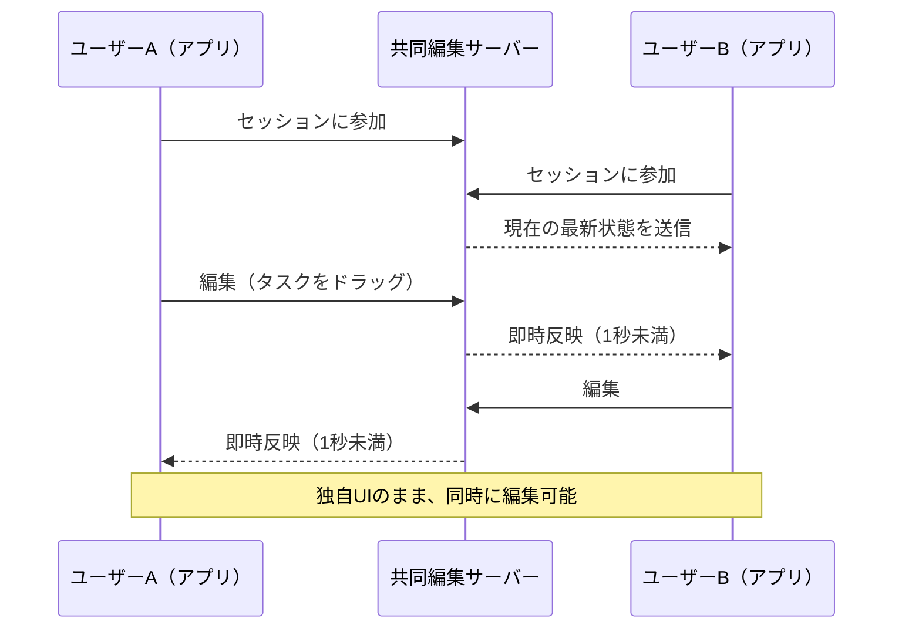
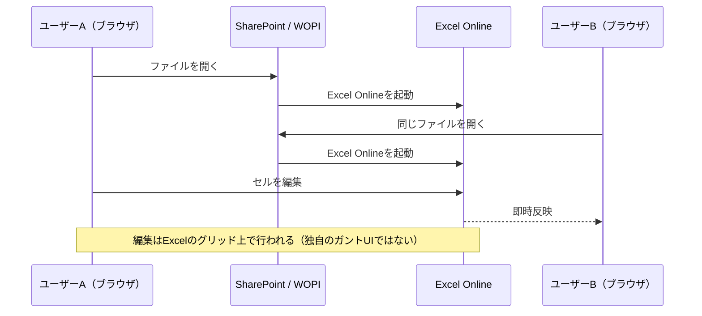
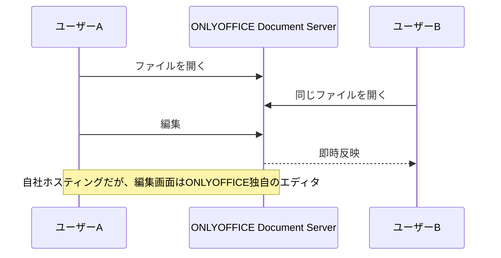
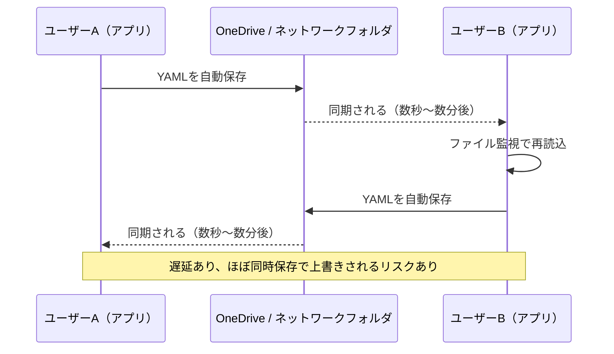
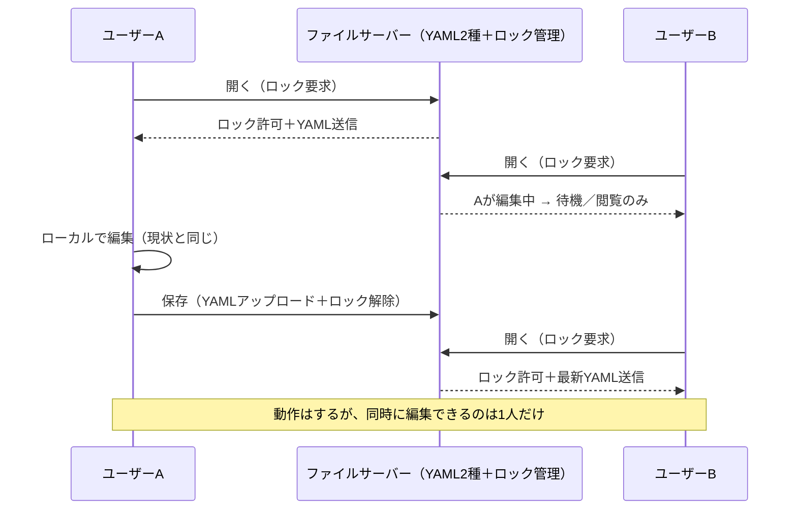
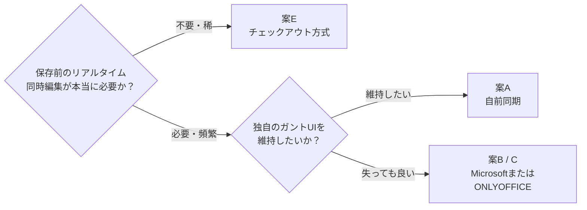

# GanttChartEditor — 複数人編集の選択肢

**目的：** 同じガントチャート（スケジュール）を複数人で編集できるようにする。
**制約：** ガントチャートのタイムラインは独自開発のUI（Excelでもスプレッドシートでもない）。

---

## 案A — 自前でリアルタイム同期を構築する

| 現在のUI維持 | 同時編集 | 新規インフラ | 想定期間 |
|---|---|---|---|
| ✅ | ✅ | 小規模な自社サーバー | 3〜8週間 |

**メリット：** 真のリアルタイム共同編集、UIはそのまま、ライセンス費用なし。
**デメリット：** 開発工数が最も大きい、同期ロジックを自社で保守する必要あり。

---

## 案B — Microsoft 365 / SharePoint（Excel Online / WOPI）

| 現在のUI維持 | 同時編集 | 新規インフラ | 想定期間 |
|---|---|---|---|
| ❌ | ✅（Microsoftのエンジン） | SharePoint（独自WOPIホストなら追加開発） | 数日（SharePointのみ）〜2〜3ヶ月以上（本格統合） |

**メリット：** 実績あるMicrosoftの共同編集エンジン、Microsoft/Teamsアカウントとの親和性、同期ロジックの開発が不要。
**デメリット：** 独自のガントタイムラインを失う（スプレッドシートになる）、Microsoft 365のライセンス費用。

---

## 案C — ONLYOFFICE Document Server

| 現在のUI維持 | 同時編集 | 新規インフラ | 想定期間 |
|---|---|---|---|
| ❌ | ✅（ONLYOFFICEのエンジン） | 自社ホスティングのDocument Server | 5〜9週間 |

**メリット：** Microsoftライセンス不要でリアルタイム共同編集が可能、自社ホスティングでデータを自社管理できる。
**デメリット：** 案Bと同様にUIを失う、追加サーバーの運用が必要、UX面のメリットが薄いわりに案Aと同程度のコスト。

---

## 案D — 共有フォルダによるファイル同期（サーバー不要）

| 現在のUI維持 | 同時編集 | 新規インフラ | 想定期間 |
|---|---|---|---|
| ✅ | ❌ | なし | 3日〜2週間 |

**メリット：** 新規インフラ・コストゼロ、最速で構築可能。
**デメリット：** リアルタイムではない、他人の変更を無言で上書きしてしまう実際のリスクがある。

---

## 案E — チェックアウト／ファイルロック方式（先輩案）

| 現在のUI維持 | 同時編集 | 新規インフラ | 想定期間 |
|---|---|---|---|
| ✅ | ❌（1人ずつ） | 小規模なファイル＋ロックサーバー | 3日〜2週間 |

**メリット：** サーバー方式の中で最も低コスト、UIはそのまま、**データ上書きのリスクがゼロ**（ロックを持つ人しか保存できない）。
**デメリット：** 保存前の他人の編集は見られない＝真の「ライブ」共同編集ではない、ファイルを開きっぱなしにする運用だとボトルネックになり得る。

---

## 全体比較

| | A. 自前同期 | B. Microsoft | C. ONLYOFFICE | D. フォルダ同期 | E. ロック方式 |
|---|---|---|---|---|---|
| 独自UI維持 | ✅ | ❌ | ❌ | ✅ | ✅ |
| 同時リアルタイム編集 | ✅ | ✅ | ✅ | ❌ | ❌ |
| データ上書きリスク | 低 | 低 | 低 | **高** | **なし** |
| 新規インフラ | 小規模サーバー | SharePoint | 自社ホスティングサーバー | なし | 小規模サーバー |
| ライセンス費用 | なし | Microsoft 365ライセンス | なし（大規模利用時はEnterprise版） | なし | なし |
| 想定期間 | 3〜8週間 | 数日 〜 2〜3ヶ月以上 | 5〜9週間 | 3日〜2週間 | 3日〜2週間 |

---

## 推奨

**推奨ステップ：** まず**案E**（最も低コスト・低リスクでUIも維持）を先行導入し、実際の利用状況を見て本当に同時編集が頻繁に必要であれば**案A**への拡張を検討する。
