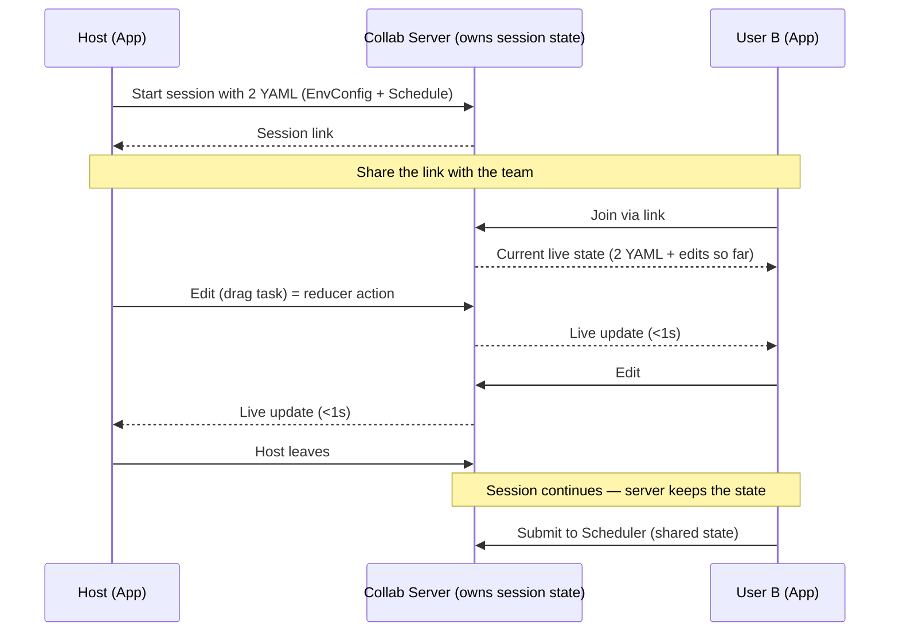
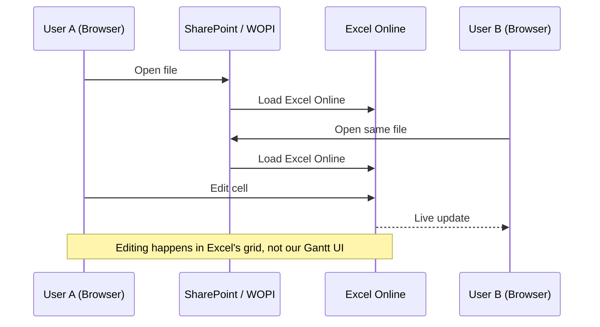
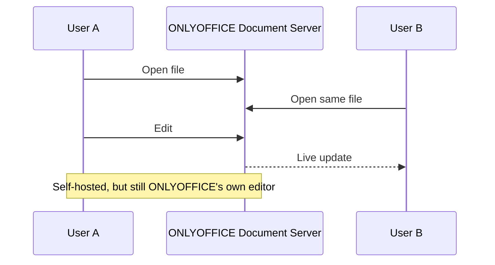
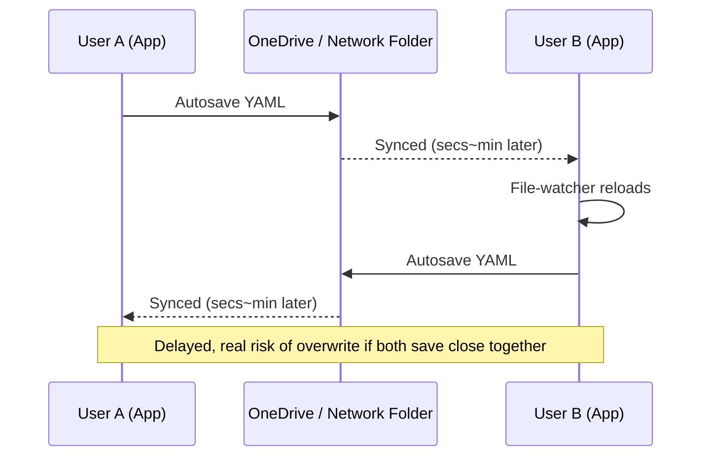
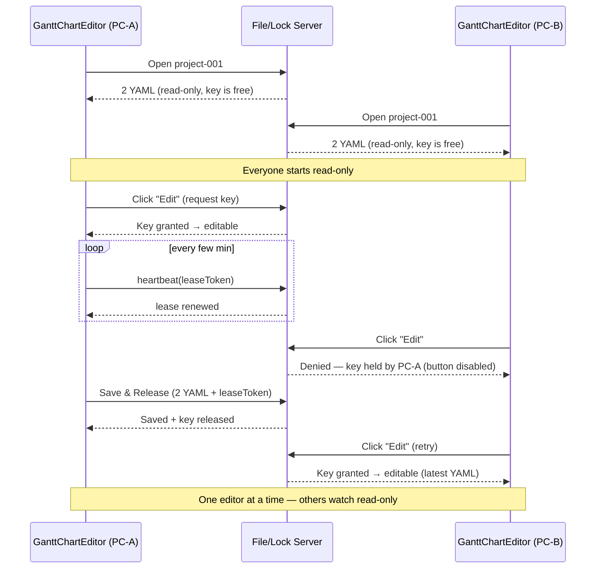
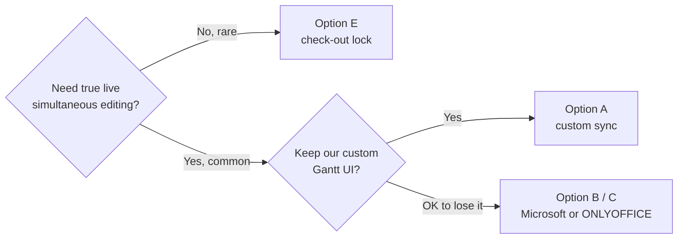

# GanttChartEditor — Multi-User Editing: Option Overview

**Goal:** let multiple people edit the same Gantt schedule.
**Constraint:** the Gantt timeline is a custom-built UI (not Excel, not a spreadsheet).

---

## Option A — Build Our Own Real-Time Sync  

  



  

| Keeps our UI | Live edit | New infra           | Est. time |
| ------------ | --------- | ------------------- | --------- |
| Yes          | Yes       | Small custom server | 1-2 wks   |

**How it works**  

- Host loads the 2 YAML and starts a session → gets a shareable link.  

- Anyone with the link joins and sees the current state (initial data + edits already made).  

- Everyone, including the host, sees the same board and edits together.  

- Only the small edit "action" is sent each time (reused reducer actions), not the whole file.  

  

**Key points**  

- **No login needed** — a per-device token can identify each PC instead.  

- **Testable on one PC** — run the server on localhost, open 2 tabs/windows.  

- **Host leaving ≠ session ends** — state lives on the server; it ends only when the server drops an idle room (persistence can save it first).  

- **Submit to Scheduler still works** — from the shared state, within a session.  

- **Cost:** one small always-on server (free on localhost / self-host; small monthly on Azure). No per-seat license.  

  

**Pro:** true live co-editing, our UI unchanged, no per-seat license.  

**Con:** most engineering effort, we own the sync logic.

---

## Option B — Microsoft 365 / SharePoint (Excel Online / WOPI)



| Keeps our UI | Live edit | New infra | Est. time |
|---|---|---|---|
| ❌ | ✅ (Microsoft's engine) | SharePoint (+ WOPI host if custom) | Days (no integration) → 2–3+ mo (real integration) |

**Pro:** proven co-authoring, native Microsoft/Teams login, zero sync code to write.
**Con:** loses our custom timeline; becomes a spreadsheet; Microsoft 365 licensing.

---

## Option C — ONLYOFFICE Document Server



| Keeps our UI | Live edit | New infra | Est. time |
|---|---|---|---|
| ❌ | ✅ (ONLYOFFICE's engine) | Self-hosted Document Server | 5–9 wks |

**Pro:** live co-editing without Microsoft licensing, self-hosted / data stays with us.
**Con:** same UI loss as Option B; another server to run; comparable cost to Option A for less UX fit.

---

## Option D — Shared-Folder File Sync (No Server)



| Keeps our UI | Live edit | New infra | Est. time |
|---|---|---|---|
| ✅ | ❌ | None | 3 days–2 wks |

**Pro:** zero new infrastructure/cost, fastest to build.
**Con:** not real-time, real risk of silently losing someone's changes.

---

## Option E — Check-Out / File-Lock Server *(senpai's idea)*

  



  

|Keeps our UI|Live edit|New infra|Est. time|
|---|---|---|---|
|✅|❌ (one editor at a time)|Small file+lock server|3 days–2 wks|

  

**What the server stores** (folder-per-project + one lock record each)

  

```

server-storage/

  project-001/

    EnvConfig.yaml

    Schedule.yaml

    lock.json      ← the "edit key" record

  project-002/

    EnvConfig.yaml

    Schedule.yaml

    lock.json

```

  

```json

// project-001/lock.json  (when held)

{ "locked": true, "holder": "PC-A", "since": "10:32",

  "lastHeartbeat": "10:41", "leaseToken": "xyz789" }

```

  

**How the edit key works**

- **Acquire** on open → if free, server grants lock + a fresh `leaseToken` (the key).

- **Hold** → app heartbeats every few min so the key stays valid.

- **Save** → must present the `leaseToken`; server writes YAML, then releases the lock.

- **Auto-expire** → no heartbeat for N min (crash/network loss) = key invalidated, lock freed.

- Lock is **per project** — project-001 locked doesn't block project-002.

  

**What GanttChartEditor needs (small addition)**

- "Open from server" screen: list projects + lock status (available / "locked by X").

- Locked project → opens read-only; reuse the **existing YAML import** for the rest.

- Swap Save target from local disk → server; add a heartbeat timer.

- Core timeline/reducer/YAML format **unchanged**.

  

**Note:** lock lives in the server record, not the OS file — opening the raw YAML in VS Code does **not** lock it (only the app's shared-open path respects the lock).

  

**Pro:** cheapest server-based option, our UI unchanged, **zero data-loss risk** (only the lock-holder can write).

**Con:** does not show others' edits before save — no true "live" collaboration; can bottleneck if files stay open a long time.

---

## Compare All

| | A. Custom sync | B. Microsoft | C. ONLYOFFICE | D. Folder sync | E. Lock server |
|---|---|---|---|---|---|
| Our UI kept | ✅ | ❌ | ❌ | ✅ | ✅ |
| Live simultaneous edit | ✅ | ✅ | ✅ | ❌ | ❌ |
| Data-loss risk | Low | Low | Low | **High** | **None** |
| New infra | Small server | SharePoint | Self-hosted server | None | Small server |
| License cost | None | MS 365 seats | None (or Enterprise) | None | None |
| Est. time | 3–8 wks | Days → 2–3+ mo | 5–9 wks | 3 days–2 wks | 3 days–2 wks |

---

## Recommendation



**Suggested path:** ship **Option E** first — cheapest, safest, keeps the UI — then upgrade to **Option A** later if real usage shows people frequently need true simultaneous editing.