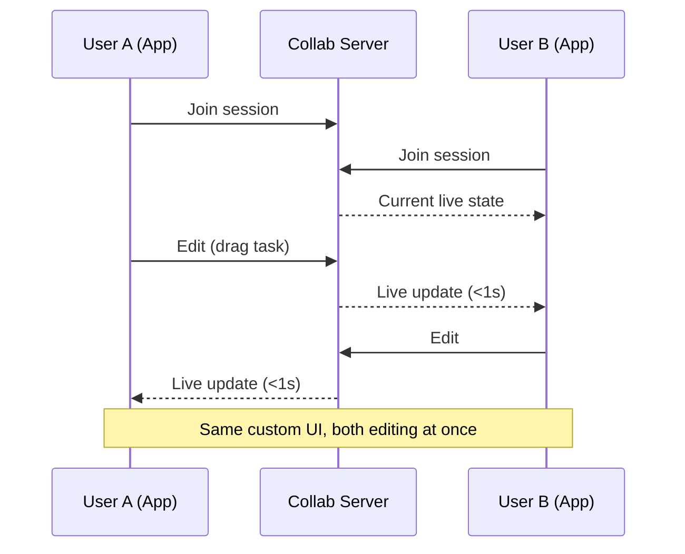
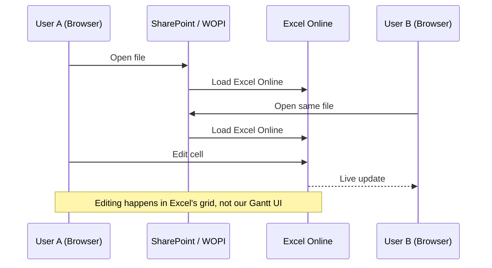
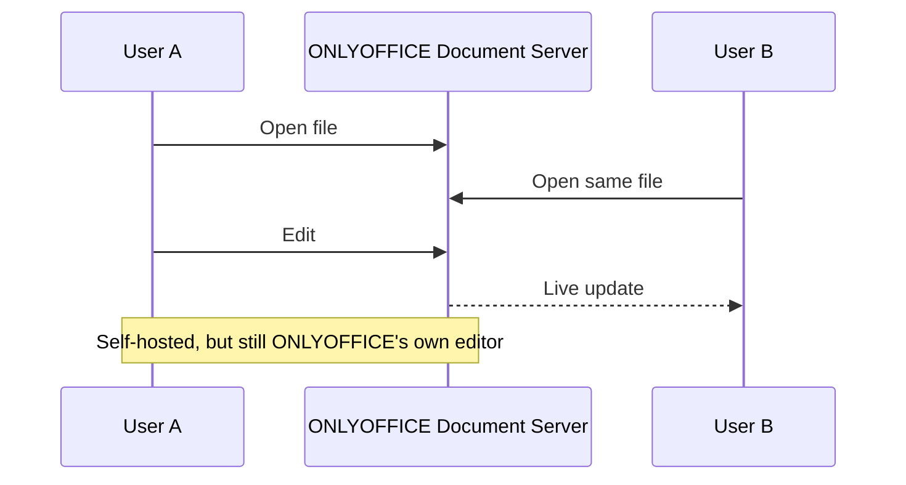
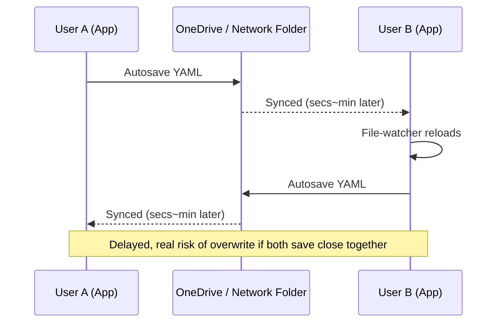
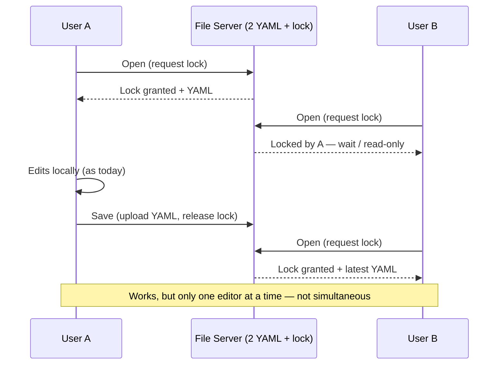
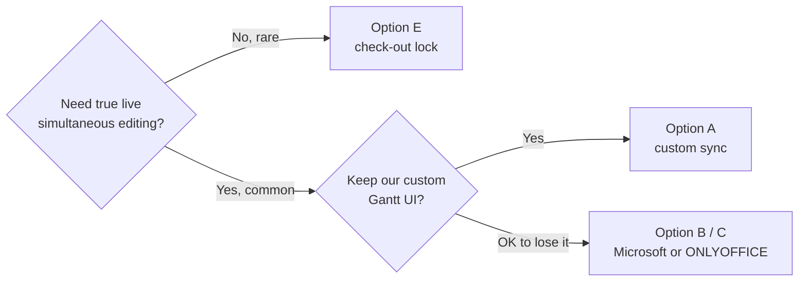

# GanttChartEditor — Multi-User Editing: Option Overview

**Goal:** let multiple people edit the same Gantt schedule.
**Constraint:** the Gantt timeline is a custom-built UI (not Excel, not a spreadsheet).

---

## Option A — Build Our Own Real-Time Sync

| Keeps our UI | Live edit | New infra | Est. time |
|---|---|---|---|
| ✅ | ✅ | Small custom server | 3–8 wks |

**Pro:** true live co-editing, our UI unchanged, no per-seat license.
**Con:** most engineering effort, we own the sync logic.

---

## Option B — Microsoft 365 / SharePoint (Excel Online / WOPI)

| Keeps our UI | Live edit | New infra | Est. time |
|---|---|---|---|
| ❌ | ✅ (Microsoft's engine) | SharePoint (+ WOPI host if custom) | Days (no integration) → 2–3+ mo (real integration) |

**Pro:** proven co-authoring, native Microsoft/Teams login, zero sync code to write.
**Con:** loses our custom timeline; becomes a spreadsheet; Microsoft 365 licensing.

---

## Option C — ONLYOFFICE Document Server

| Keeps our UI | Live edit | New infra | Est. time |
|---|---|---|---|
| ❌ | ✅ (ONLYOFFICE's engine) | Self-hosted Document Server | 5–9 wks |

**Pro:** live co-editing without Microsoft licensing, self-hosted / data stays with us.
**Con:** same UI loss as Option B; another server to run; comparable cost to Option A for less UX fit.

---

## Option D — Shared-Folder File Sync (No Server)

| Keeps our UI | Live edit | New infra | Est. time |
|---|---|---|---|
| ✅ | ❌ | None | 3 days–2 wks |

**Pro:** zero new infrastructure/cost, fastest to build.
**Con:** not real-time, real risk of silently losing someone's changes.

---

## Option E — Check-Out / File-Lock Server *(senpai's idea)*

| Keeps our UI | Live edit | New infra | Est. time |
|---|---|---|---|
| ✅ | ❌ (one editor at a time) | Small file+lock server | 3 days–2 wks |

**Pro:** cheapest server-based option, our UI unchanged, **zero data-loss risk** (only the lock-holder can write).
**Con:** does not show others' edits before save — no true "live" collaboration; can bottleneck if files stay open a long time.

---

## Compare All

| | A. Custom sync | B. Microsoft | C. ONLYOFFICE | D. Folder sync | E. Lock server |
|---|---|---|---|---|---|
| Our UI kept | ✅ | ❌ | ❌ | ✅ | ✅ |
| Live simultaneous edit | ✅ | ✅ | ✅ | ❌ | ❌ |
| Data-loss risk | Low | Low | Low | **High** | **None** |
| New infra | Small server | SharePoint | Self-hosted server | None | Small server |
| License cost | None | MS 365 seats | None (or Enterprise) | None | None |
| Est. time | 3–8 wks | Days → 2–3+ mo | 5–9 wks | 3 days–2 wks | 3 days–2 wks |

---

## Recommendation

**Suggested path:** ship **Option E** first — cheapest, safest, keeps the UI — then upgrade to **Option A** later if real usage shows people frequently need true simultaneous editing.
