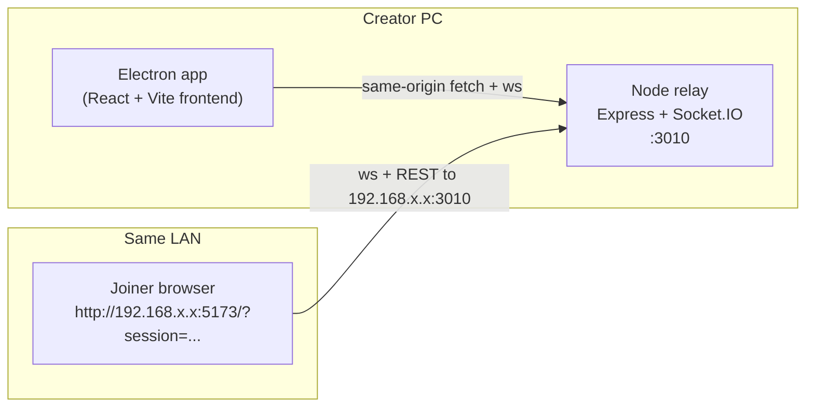
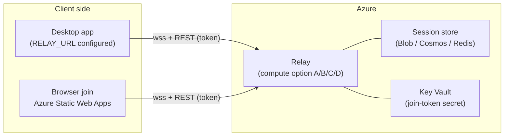
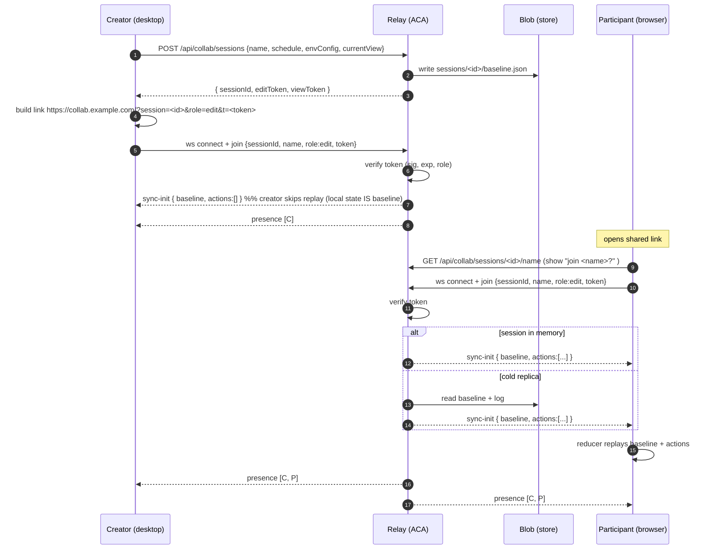
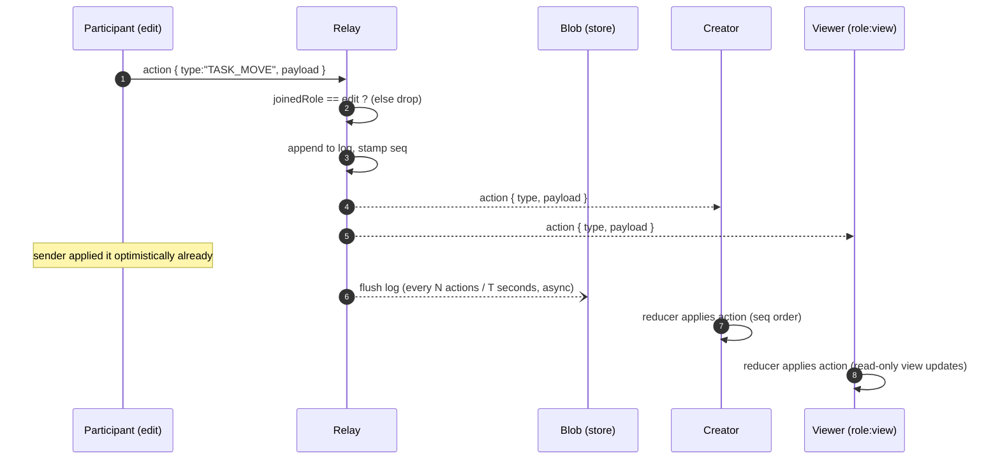
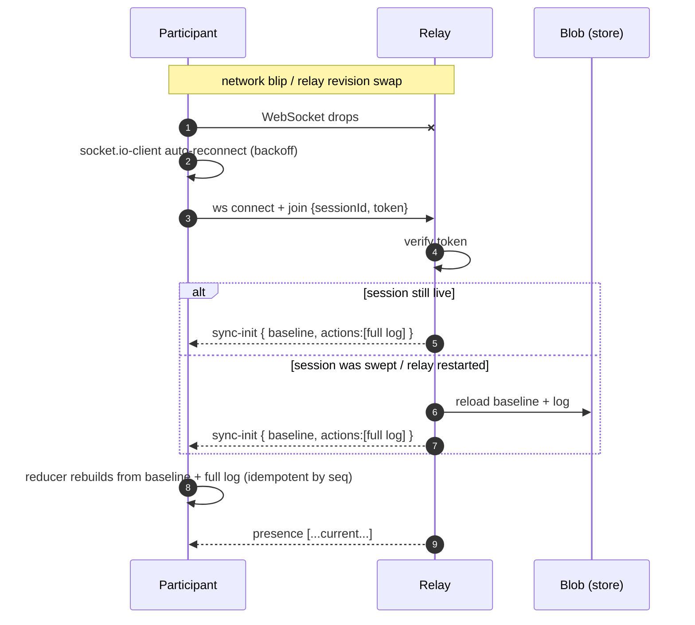
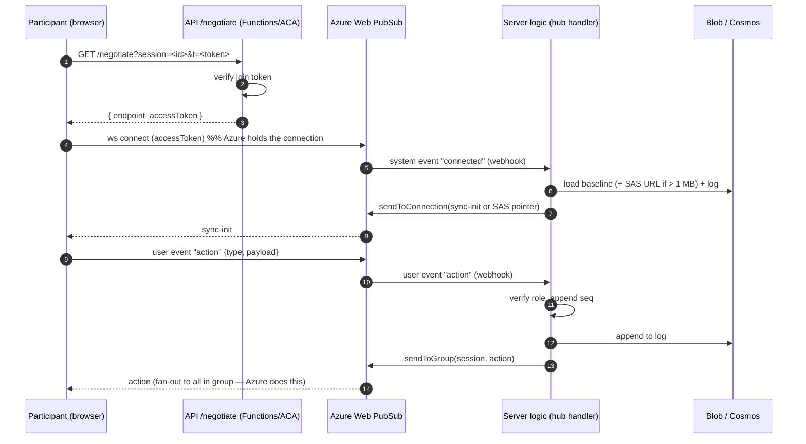
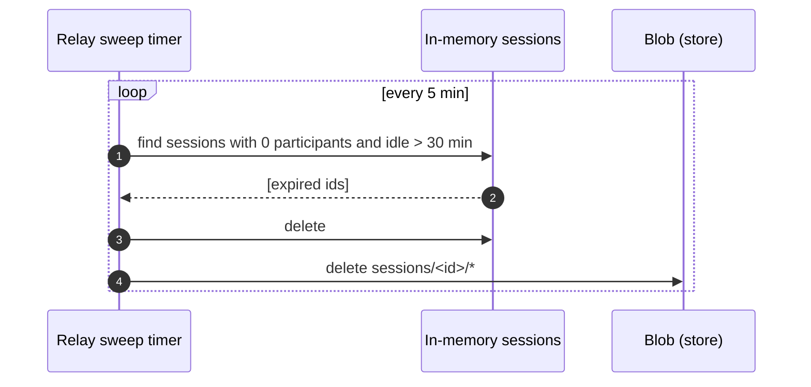

# Online Collaboration for GanttChartEditor — Azure Design (Engineering Detail)

> **Status:** Draft for team meeting · **Date:** 2026-09-04 · **Owner:** (you)
> **Companion doc:** `GanttChartEditor_OnlineCollabAzure_Presentation20260904.md` (slide-oriented, diagrams + tables only)
> **Builds on:** `GanttChartEditor_LiveCollabEdit_Design20260826.md` (the event-sourced relay this extends to the internet)
>
> This document is the deep version: every option, its pros/cons, and *how to make it
> happen* (CLI, config, code delta, cost). Nothing here is implemented yet — the point
> is to walk into the meeting able to defend a recommendation and answer "why not X".

---

## 1. Where we are today

### 1.1 Runtime shape



- **Frontend:** React 19 + Vite, `gantt-task-react`, shipped as an Electron desktop app
  (`electron-builder`, Windows NSIS). Packaged mode serves the built frontend *from the
  Node relay itself* so `fetch('/api/...')` stays same-origin.
- **Relay:** `server/` — Express + Socket.IO on port **3010**.
  - `server/src/index.ts` — REST routes + static hosting + wraps the app in an
    `http.Server` so Socket.IO can share the port.
  - `server/src/collab/collabSocket.ts` — the Socket.IO server: `join`, `action`,
    `leave`, `disconnect`, presence broadcast, idle sweep.
  - `server/src/collab/sessionStore.ts` — **pure in-memory `Map<sessionId, Session>`**.
  - `server/src/routes/collab.ts` — `POST /api/collab/sessions` (create),
    `GET /api/collab/sessions/:id/name`.
- **Client glue:** `src/services/collabService.ts` — `socket.io-client`, builds the
  socket origin as `window.location.hostname:3010`, builds the share link from
  `GET /api/network-info` (a **LAN IP**).

### 1.2 Collaboration model (this part is good — keep it)

Event-sourced. The server is a **dumb ordered log**, the client reducer
(`src/context/reducer.ts`) is the single source of truth.

| Concept | Where | Notes |
|---|---|---|
| `baseline` | `sessionStore` | `{ schedule, envConfig, currentView }` captured at session creation |
| `actions[]` | `sessionStore` | append-only, each gets a monotonic `seq` |
| `sync-init` | on `join` | server sends `baseline + actions` → client replays from baseline |
| `action` | on edit | server appends, stamps `seq`, broadcasts to the room (`socket.to(sessionId)`) |
| `presence` | on join/leave | server broadcasts the participant list |
| roles | `join` payload | `'edit'` \| `'view'` — server drops `action` from non-editors |

**Why this matters for the cloud move:** because state is a baseline + an ordered
action log, and clients already replay it on every (re)connect, the relay can lose a
connection, restart, or hand a client to a different instance *without corrupting the
document* — as long as the log is recoverable. That property is what makes the cheap
options viable.

### 1.3 What is explicitly LAN-only right now

| Thing | File | Why it breaks on the public internet |
|---|---|---|
| CORS allowlist = localhost + RFC1918 IPs | `server/src/index.ts`, `lanOrigin.ts` | A real web origin is rejected by preflight |
| Socket.IO `cors: { origin: true }` | `collabSocket.ts` | Reflects any origin — fine on a LAN, too open on the internet |
| Share link = LAN IP from `network-info` | `collabService.ts` `fetchCollabLink` | `192.168.x.x` is unroutable off the LAN |
| Socket origin = `window.location.hostname:3010` | `collabService.ts` `getSocketOrigin` | Assumes relay is on the same host as the page |
| In-memory `Map` session store | `sessionStore.ts` | A single process on one PC; no restart survival, no scale-out |
| **No authentication at all** | `collabSocket.ts` `join` | `join` only checks the session *exists*. On a public URL, anyone who guesses/receives a session id gets in |
| `POST /api/save-files` writes arbitrary absolute paths | `index.ts` | Desktop-only convenience. **Must not be reachable on a public relay** |
| `maxHttpBufferSize: 20 MB` | `collabSocket.ts` | Fine for self-hosted; **Azure Web PubSub caps a message at 1 MB** (see §6) |

---

## 2. Target: a hosted relay, reachable over the internet

Goal from the feedback: **participants no longer need to be on the same network**, while
**keeping cost near zero** for what is bursty, meeting-time usage. Auth stays
**anonymous share-link** (hardened). The local relay we already have keeps working for
solo/offline use.



### 2.1 What the hosted relay must add (independent of which compute option)

1. **Recoverable session state** — a store that outlives one process, so a deploy,
   crash, cold start, or scale event doesn't drop an in-progress meeting. (§5)
2. **Signed anonymous join token** — the share link carries a short-lived signed token
   binding `sessionId + role + expiry`. The relay verifies it before `join`. (§7)
3. **Real CORS** — replace the LAN allowlist with the known web origin(s); still allow
   no-Origin for the desktop app.
4. **Route split** — desktop-only routes (`/api/save-files`, `/api/network-info`,
   handoff/local-file bits) are **not registered** in the cloud build. Only
   `/api/collab/*` + health go public.
5. **TLS + custom domain** — every option below gives a free managed certificate.
6. **Abuse limits** — rate-limit session creation, cap participants/session, cap action
   payload size, cap sessions in memory.

### 2.2 Frontend delivery

- **Desktop app:** add a build-time `VITE_RELAY_URL` (fallback to `localhost:3010` for
  the offline/local relay). `getSocketOrigin()` and `fetchCollabLink()` in
  `collabService.ts` change to use it. Ship "Local session" vs "Online session" as a
  choice in the session dialog.
- **Browser join (recommended, this is what actually makes it "online"):** publish the
  Vite build to **Azure Static Web Apps** (Free tier: global CDN, custom domain, free
  cert, $0). A participant with no install opens
  `https://collab.example.com/?session=<id>&role=edit&t=<token>`.
- `fetchCollabLink()` stops calling `/api/network-info` and instead formats
  `https://<web-origin>/?session=...&role=...&t=<token>`.

---

## 3. Compute options for the relay

Four viable shapes, then the ones we deliberately reject. Each has: **what it is**,
**pros**, **cons**, **how to make it happen**, **rough cost**, **pick this when**.

The two *protocol* choices (Socket.IO vs Web PubSub) cut across these and get their own
section (§6). Options A and B are "self-host Socket.IO"; C and D are "Web PubSub".

---

### Option A — Azure Container Apps (ACA)

**What it is:** serverless container hosting (managed Kubernetes + KEDA + Envoy
underneath, but you never see it). You push the existing `server/` as a container image
and it runs. Native WebSocket support, HTTP ingress, free managed TLS, revisions with
traffic-splitting, optional session affinity.

**Pros**
- **Smallest code change of all options** — the relay runs exactly as-is; you only add
  config (env vars, port) and, later, a Redis adapter line if you scale past 1 replica.
- Portable — it's just a container. No Azure-specific SDK in the hot path. Low lock-in;
  you can move to any container host later.
- Consumption billing (per vCPU-second + GiB-second + requests) with a **monthly free
  grant** (~180k vCPU-s, ~360k GiB-s, 2M requests). A single small always-on replica
  often lands at or near $0 compute.
- Scale rules (HTTP concurrency / CPU / KEDA) and scale-to-many when a meeting is busy.
- Blue/green revisions, easy rollback, custom domain + free cert built in.

**Cons**
- **Scale-to-zero is a trap for live collab.** `minReplicas: 0` saves money at 3 a.m.
  but a cold start adds seconds *and* the in-memory hot log for any session on that
  replica is gone. In practice you run **`minReplicas: 1`** and accept a small
  always-on cost. (State recovery from the store, §5, makes even a forced recycle safe,
  but you don't want it on every idle gap.)
- **Multi-replica needs work you own:** Socket.IO across replicas needs the Redis
  adapter (§6.1) *and* a shared session store *and* ingress session affinity. That's
  the medium-scale tax.
- Long-lived WebSocket connections can be dropped on revision changes / platform
  maintenance. Tolerable here — `socket.io-client` reconnects and `sync-init` replays
  the log — but it is a reconnect the user may briefly notice.

**How to make it happen**

```bash
az extension add --name containerapp --upgrade
az group create -n rg-gantt-collab -l japaneast
az containerapp env create -n cae-gantt -g rg-gantt-collab -l japaneast

# Build the relay image straight from ./server (no local Docker needed)
az acr create -n acrganttcollab -g rg-gantt-collab --sku Basic
az acr build -r acrganttcollab -t gantt-relay:1 ./server

# Key Vault for the join-token secret, referenced as a secret ref below
az keyvault create -n kv-gantt-collab -g rg-gantt-collab -l japaneast
az keyvault secret set --vault-name kv-gantt-collab -n join-token-secret --value "$(openssl rand -hex 32)"

az containerapp create -n ca-gantt-relay -g rg-gantt-collab \
  --environment cae-gantt \
  --image acrganttcollab.azurecr.io/gantt-relay:1 \
  --registry-server acrganttcollab.azurecr.io \
  --target-port 3010 --ingress external \
  --min-replicas 1 --max-replicas 1 \
  --env-vars PORT=3010 WEB_ORIGIN=https://collab.example.com \
             JOIN_TOKEN_SECRET=secretref:join-token-secret \
             SESSION_STORE=blob AZURE_BLOB_URL=https://stgantt.blob.core.windows.net

# Only when you later raise --max-replicas above 1:
az containerapp ingress sticky-sessions set -n ca-gantt-relay -g rg-gantt-collab --affinity sticky

# Custom domain + free managed cert
az containerapp hostname add    -n ca-gantt-relay -g rg-gantt-collab --hostname collab-api.example.com
az containerapp hostname bind   -n ca-gantt-relay -g rg-gantt-collab --hostname collab-api.example.com --validation-method CNAME
```

Code deltas required: none to the socket logic for a single replica. Add a
`Dockerfile` in `server/` (node:20-alpine, `npm ci --omit=dev`, `npm run build`,
`CMD node dist/index.js`), plus the env-driven config from §2.1 / §7. CI: GitHub
Actions `azure/container-apps-deploy-action`.

**Rough cost (single region, JSON-sized traffic):**
- Small: 1 replica @ 0.5 vCPU / 1 GiB, mostly within the free grant → **~$0–15/mo** +
  Blob ~$1 + Static Web Apps $0.
- Medium: 3 replicas + Azure Managed Redis (entry tier ~$40–60) → **~$50–100/mo**.

**Pick this when:** you want the existing Node/Socket.IO relay online with the least
rework, predictable behaviour, and a clear (if manual) path to scale. This is the
recommended starting point (§8).

---

### Option B — Azure App Service (Linux, Node)

**What it is:** the classic "deploy a Node web app" PaaS. Zip-deploy or container,
toggle WebSockets on, done. Deployment slots, built-in "Easy Auth" (zero-code Entra ID
if you ever want it), mature diagnostics.

**Pros**
- Most familiar deployment model; least conceptual overhead for a team that has used
  App Service before.
- **Easy Auth** — if the "anonymous only" decision ever reverses, Entra ID is a config
  toggle, no code.
- Deployment slots (Standard+) for warm blue/green.
- Predictable flat monthly price.

**Cons**
- **No scale-to-zero, ever.** You pay for the plan 24/7 regardless of whether anyone is
  collaborating. For bursty meeting usage this is the *worst* cost fit of the four.
- WebSocket connection caps are per-instance and tier-bound (Free ~5, Basic/Standard
  ~350/instance, Premium effectively unlimited). Free/Shared also can't run **Always
  On**, so the app unloads when idle and the next joiner eats a cold start.
- Scale-out still needs the Socket.IO Redis adapter + shared store + ARR affinity —
  same medium-scale tax as ACA, with a higher floor price.
- Slightly more lock-in than a bare container (platform-specific deploy, app settings,
  Oryx build), though far less than Web PubSub.

**How to make it happen**

```bash
az appservice plan create -n plan-gantt -g rg-gantt-collab --is-linux --sku B1
az webapp create -n gantt-relay -g rg-gantt-collab -p plan-gantt --runtime "NODE:20-lts"

# The settings that actually matter:
az webapp config set -n gantt-relay -g rg-gantt-collab \
  --web-sockets-enabled true --always-on true
az webapp config appsettings set -n gantt-relay -g rg-gantt-collab --settings \
  WEB_ORIGIN=https://collab.example.com \
  JOIN_TOKEN_SECRET="@Microsoft.KeyVault(SecretUri=https://kv-gantt-collab.vault.azure.net/secrets/join-token-secret)" \
  SESSION_STORE=blob SCM_DO_BUILD_DURING_DEPLOYMENT=true

# ARR affinity cookie (on by default; keeps a client pinned to one instance)
az resource update -g rg-gantt-collab -n gantt-relay \
  --resource-type "Microsoft.Web/sites" --set properties.clientAffinityEnabled=true

# Deploy the built server
az webapp deploy -n gantt-relay -g rg-gantt-collab --type zip --src-path server-dist.zip

# Custom domain + free managed cert
az webapp config hostname add --webapp-name gantt-relay -g rg-gantt-collab --hostname collab-api.example.com
az webapp config ssl create  --name gantt-relay -g rg-gantt-collab --hostname collab-api.example.com
```

Code deltas: same env-driven config as ACA. `server/` needs a `start` script (already
has `node dist/index.js`) and to listen on `process.env.PORT`.

**Rough cost:**
- Small: **B1 ~$13/mo flat** + Blob ~$1 + Static Web Apps $0 → **~$15/mo**, always on.
- Medium: S1 (~$70) + Redis (~$40) → **~$110+/mo**.

**Pick this when:** the team already standardises on App Service and values that over
the ~bursty-cost saving, or you expect Entra ID auth to come back on the table soon.

---

### Option C — Azure Web PubSub (managed WebSocket service)

**What it is:** a managed pub/sub-over-WebSocket service. **Azure holds every client
connection**; your server code only runs business logic (append action, decide who to
send to) and talks to the service over REST/SDK. Two integration styles:

- **C1 — Web PubSub *for Socket.IO*:** keep `socket.io-client` on the client and your
  `io.on('connection')` logic on the server; add
  `@azure/web-pubsub-socket.io` so the *transport* is Web PubSub instead of your own
  process. The client connects to the Web PubSub endpoint; a tiny `/negotiate` call
  returns its access token.
- **C2 — Native Web PubSub:** client uses `@azure/web-pubsub-client`; server is a set
  of CloudEvents webhook handlers using `@azure/web-pubsub`. Bigger client rewrite, no
  Socket.IO at all.

**Pros**
- **Connection scaling, fan-out, and stickiness are Azure's problem, not yours.** No
  Redis adapter, no ARR affinity, no per-replica connection ceiling to design around.
- **Free tier** (1 unit, 20 concurrent connections, 20k messages/day, no SLA) genuinely
  covers a small internal pilot at **$0**.
- Pairs naturally with a scale-to-zero server (Functions, §D) → true pay-per-use.
- Standard tier scales in 1,000-connection units with a 99.9% SLA; autoscale up to 100
  units.

**Cons**
- **New Azure concept for the team** — hubs, event handlers, negotiate flow, client
  access tokens.
- **1 MB hard message-size limit.** The current relay sets `maxHttpBufferSize: 20 MB`
  because a full `baseline` / `sync-init` can be several MB of schedule JSON. With Web
  PubSub, large baselines must move **out of band** — store the baseline in Blob, send
  the client a short-lived SAS URL over the socket, client fetches it. Individual
  `action` payloads are small and fine.
- **You still need a session store** — Web PubSub does not persist messages or state.
  Baseline + action log still live in Blob/Cosmos/Redis (§5).
- **Local dev needs a tunnel** — the service calls your webhook, so you run
  `awps-tunnel` to route hub events to `localhost`. Extra step in every dev's loop.
- C1 is younger than plain Socket.IO; pin the package version and test upgrades. C2 is
  a real client rewrite (higher lock-in, `reducer.ts` untouched but `collabService.ts`
  and the connect/reconnect logic are rewritten).

**How to make it happen (C1)**

```bash
az extension add --name webpubsub
az webpubsub create -n wps-gantt -g rg-gantt-collab -l japaneast --sku Free_F1   # Standard_S1 later
CONN=$(az webpubsub key show -n wps-gantt -g rg-gantt-collab --query primaryConnectionString -o tsv)
```

Server (`server/src/index.ts`), the whole transport change:

```ts
import { useAzureSocketIO } from "@azure/web-pubsub-socket.io";

const io = new Server(httpServer, { path: "/collab/socket.io" });
await useAzureSocketIO(io, {
  hub: "collab",
  connectionString: process.env.WEBPUBSUB_CONNECTION_STRING!,
});
// io.on('connection', ...) in collabSocket.ts stays exactly as written
```

Client (`src/services/collabService.ts`): point `io(...)` at the Web PubSub endpoint
with the negotiated token instead of `hostname:3010`. Add a `GET /negotiate?session=..`
endpoint (hosted on the same small server, or a Function) that validates the join token
and returns `{ endpoint, accessToken }`.

For **C2** additionally: register the hub event handler webhook
(`az webpubsub hub create ... --event-handler url-template=... user-event-pattern="*"
system-event="connected" system-event="disconnected"`) and rewrite the client on
`@azure/web-pubsub-client`.

**Rough cost:**
- Small: Web PubSub **Free $0** (if ≤20 concurrent connections) + server (Functions, ~$0)
  + Blob ~$1 + Static Web Apps $0 → **~$1/mo**. If you need >20 connections: 1 Standard
  unit ~$50/mo.
- Medium: 1 Standard unit (1,000 connections) ~$50/mo + Functions ~$5 + Cosmos ~$10 →
  **~$65/mo** — and it barely changes as you add sessions until you cross 1,000
  concurrent connections.

**Pick this when:** "minimum idle cost / don't make me operate realtime infra" is the
priority and the team accepts a new Azure concept + the 1 MB baseline workaround.

---

### Option D — Azure Functions (Consumption) + Web PubSub

**What it is:** the serverless packaging of Option C. Web PubSub holds the connections;
the *server* is three or four small Functions:

| Function | Trigger | Job |
|---|---|---|
| `createSession` | HTTP `POST` | validate, write baseline to Blob, mint join token, return `sessionId + token` |
| `negotiate` | HTTP `GET` + `WebPubSubConnection` input binding | verify join token, return client access URL/token |
| `onMessage` | `WebPubSubTrigger` (user event `message`) | verify role, append action to the log in the store, `sendToGroup` |
| `onDisconnected` | `WebPubSubTrigger` (system event) | update presence, `sendToGroup` |

State in **Cosmos DB serverless** (append the action log, store the baseline pointer) or
Blob.

**Pros**
- **True scale-to-zero.** Idle cost ≈ storage only (cents). You pay per request/message
  when a meeting is actually happening. Best possible fit for "bursty, minimum cost".
- Functions Consumption has a large monthly free grant (1M executions, 400k GB-s).
- No servers to patch or keep warm; Azure scales the handlers with load.

**Cons**
- **Most moving parts** of any option — 4 Functions, hub event-handler wiring, bindings,
  a store, the negotiate flow. Most to learn, most to get subtly wrong.
- **Cold starts** on the HTTP Functions (`createSession`, `negotiate`) — a second or
  two when the first person in a while creates/joins. The *socket* itself is held by
  Web PubSub so mid-session latency is unaffected. Flex Consumption reduces this
  (optionally with always-ready instances, which reintroduces a small floor cost).
- Same 1 MB message limit and same "need a store" as Option C.
- Highest lock-in — Functions bindings + Web PubSub triggers are Azure-specific.
- Local dev: Functions Core Tools **and** `awps-tunnel`.

**How to make it happen**

```bash
az storage account create -n stganttcollab -g rg-gantt-collab -l japaneast --sku Standard_LRS
az functionapp create -n func-gantt -g rg-gantt-collab \
  --consumption-plan-location japaneast --runtime node --runtime-version 20 \
  --functions-version 4 --storage-account stganttcollab --os-type Linux

az cosmosdb create -n cos-gantt -g rg-gantt-collab --capabilities EnableServerless
az cosmosdb sql database create -a cos-gantt -g rg-gantt-collab -n collab
az cosmosdb sql container create -a cos-gantt -g rg-gantt-collab -d collab -n sessions --partition-key-path /sessionId

az functionapp config appsettings set -n func-gantt -g rg-gantt-collab --settings \
  WebPubSubConnectionString="$CONN" CosmosConnection="<cosmos-conn>" \
  JOIN_TOKEN_SECRET="@Microsoft.KeyVault(SecretUri=.../join-token-secret)" \
  WEB_ORIGIN=https://collab.example.com

# Wire the hub to the Functions webhook
az webpubsub hub create -n wps-gantt -g rg-gantt-collab --hub-name collab \
  --event-handler url-template="https://func-gantt.azurewebsites.net/runtime/webhooks/webpubsub?code=<sys-key>" \
                  user-event-pattern="*" system-event="connected" system-event="disconnected"
```

Code: this is a **rewrite of the server side** (`server/` becomes a Functions project),
but `reducer.ts` and the action/`seq` model are untouched. `collabService.ts` is
rewritten around the negotiate flow.

**Rough cost:**
- Small: Functions **~$0–5/mo** (within free grant) + Web PubSub Free $0 (or 1 Standard
  unit ~$50 if >20 connections) + Cosmos serverless ~$1–10 + Static Web Apps $0 →
  **~$5/mo** if the Free Web PubSub tier fits, **~$55–70/mo** if not.
- Medium: ~$65/mo (as Option C) + negligible extra Functions.

**Pick this when:** near-zero idle cost is a hard requirement and the team is willing to
own a more complex, more Azure-specific system to get it.

---

### Rejected options (be ready to say why)

| Option | Why not |
|---|---|
| **AKS (managed Kubernetes)** | Enormous operational surface (node pools, ingress controllers, upgrades) for what is one small stateless-ish relay. ACA gives the useful 10% of Kubernetes with none of the burden. |
| **Bare VM (IaaS)** | You re-own OS patching, TLS renewal, process supervision, autoscale, monitoring. No upside here. |
| **Azure SignalR Service** | The .NET-first sibling of Web PubSub (hub model, `@microsoft/signalr` JS client, serverless mode with Functions). For a Node + Socket.IO codebase, Web PubSub is the more natural fit and has the explicit "for Socket.IO" shim. Same shape, so if the team prefers SignalR the analysis in §C/§D transfers almost 1:1. |
| **Keep it P2P / LAN-only + a TURN relay / ngrok-style tunnel** | Fragile, hard to support, exposes a participant's PC, no session durability. The feedback explicitly wants a real hosted middle server. |

---

## 4. Compute decision matrix

| | A. Container Apps | B. App Service | C. Web PubSub (+small API) | D. Functions + Web PubSub |
|---|---|---|---|---|
| Protocol | Socket.IO (self-host) | Socket.IO (self-host) | Socket.IO (C1) / native (C2) | native Web PubSub |
| Client code change | none | none | C1: small · C2: rewrite | rewrite `collabService` |
| Server code change | none (+Dockerfile) | none | swap transport line | rewrite as Functions |
| Idle cost | ~1 small replica (~$0–15) | full plan 24/7 (~$13+) | Free tier $0 / 1 unit ~$50 | storage only (~$1) + WPS |
| Who scales connections | you (Redis + affinity) | you (Redis + affinity) | Azure | Azure |
| Cold starts | none (min 1) | none (Always On) / yes (Free) | on the small API only | yes, on HTTP Functions |
| Ops burden | low–medium | low–medium | medium | medium–high |
| Vendor lock-in | low | low–medium | medium (C1) / high (C2) | high |
| Big `sync-init` payload | fine (20 MB) | fine (20 MB) | **needs Blob+SAS (1 MB cap)** | **needs Blob+SAS (1 MB cap)** |
| Local dev | `node`, done | `node`, done | `+ awps-tunnel` | `+ Core Tools + awps-tunnel` |
| Best when | least rework, clear scale path | team standard is App Service | don't want to operate realtime infra | near-zero idle cost is mandatory |

---

## 5. Session-state store (orthogonal — every option needs one)

Web PubSub does not persist anything; ACA/App Service lose in-memory state on restart or
across replicas. Options, cheapest first:

| Store | Shape | Cost | Use it for | Notes |
|---|---|---|---|---|
| **Azure Blob Storage** | `sessions/<id>/baseline.json` + periodic `log.json` (or append blocks) | ~cents/mo | baseline snapshot + log for **small scale**, single relay replica | Not for per-action hot writes — flush every N actions / T seconds. Doubles as the SAS source for the Web PubSub 1 MB workaround. |
| **Azure Table Storage** | partition = `sessionId`, row = `seq` | ~cents/mo | append log at low volume | Cheap, simple, but chatty at higher action rates. |
| **Azure Cosmos DB (serverless)** | container partitioned by `sessionId`, one doc per action or a growing log doc | pay-per-RU, ~$1–10/mo bursty | durable log at medium scale, multi-writer | Scales with use, single-region, low idle cost. Natural pair for Functions. |
| **Azure Cache for Redis / Azure Managed Redis** | Socket.IO adapter backplane + hot log + presence | entry tier ~$16–60/mo, ~always-on | **multi-replica** Socket.IO (Options A/B at medium scale) | Lowest latency; also the pub/sub backplane so `socket.to(room)` crosses replicas. Only pay for this once you actually scale past 1 replica. |

**Recommended progression:**
1. **Small:** Blob snapshot + in-memory hot log with periodic flush. One relay replica.
   No Redis. ~$1/mo.
2. **Medium (Socket.IO path):** add Azure Managed Redis as adapter backplane + hot log;
   Blob keeps the durable snapshot.
3. **Medium (Web PubSub path):** Cosmos serverless for the log; Blob for baselines. No
   Redis needed (Web PubSub does the fan-out).

---

## 6. Protocol choice: Socket.IO vs Azure Web PubSub

This is the fork the team should decide explicitly. Both keep the event-sourced model
and `reducer.ts` untouched.

### 6.1 Socket.IO, self-hosted (Options A / B)

- **Client:** unchanged — already `socket.io-client`.
- **Server:** unchanged for one replica. For >1 replica add the Redis adapter:
  ```ts
  import { createAdapter } from "@socket.io/redis-adapter";
  import { Redis } from "ioredis";
  const pub = new Redis(process.env.REDIS_URL!);
  io.adapter(createAdapter(pub, pub.duplicate()));
  ```
  plus ingress session affinity (ACA `--affinity sticky` / App Service ARR cookie) so
  the HTTP long-polling handshake and the WebSocket upgrade land on the same replica.
- **You own:** connection ceiling per replica, scale rules, the backplane, affinity.
- **Upside:** zero client rework, mature, already working, portable, no per-message size
  limit beyond what you set, trivial local dev.

### 6.2 Azure Web PubSub (Options C / D)

- **Client:** C1 keeps the `socket.io-client` API but connects to the Web PubSub
  endpoint via a `/negotiate` token; C2 is a full rewrite on `@azure/web-pubsub-client`.
- **Server:** holds no connections; calls `sendToGroup` / handles hub webhooks.
- **Azure owns:** all connection scaling, fan-out, stickiness, the SLA.
- **You own:** the negotiate endpoint, the hub event-handler wiring, the **1 MB
  message workaround** (baseline via Blob + SAS), a store, and `awps-tunnel` in dev.
- **Upside:** you never design connection scaling; Free tier is a real $0 pilot;
  cleanest pairing with scale-to-zero compute.

### 6.3 Side-by-side

| | Socket.IO (self-host) | Azure Web PubSub |
|---|---|---|
| Client change | none | C1: small · C2: rewrite |
| Server holds connections | yes (your process) | no (Azure) |
| Scale-out fan-out | you add Redis adapter | built in |
| Sticky sessions | you configure | N/A |
| Per-replica connection cap | yes, you design around it | N/A (unit-based) |
| Idle cost floor | ~1 replica always on | Free tier $0, else ~$50/unit |
| Message size | whatever you set (now 20 MB) | **1 MB hard cap** |
| Reconnect + backfill | your code (already have `seq` log) | your code (same `seq` log) |
| Local dev | run `node` | run `node` + `awps-tunnel` |
| Vendor lock-in | low (portable container) | medium–high (Azure-specific) |
| Maturity in *this* stack | high (in production on LAN today) | C1 relatively new; pin versions |

---

## 7. Anonymous share-link, hardened for the internet

Keep the "whoever has the link can join" model. Add a signed token so a bare
`sessionId` is not enough, and so `role` can't be tampered.

### 7.1 Token

- On `POST /api/collab/sessions`: after `createSession`, mint
  `token = base64url(payload) + "." + HMAC_SHA256(payload, JOIN_TOKEN_SECRET)`
  where `payload = { sid, role, exp }` (`exp` ≈ now + 3 h). A signed JWT is equivalent;
  HMAC keeps deps minimal.
- Return `{ sessionId, editToken, viewToken }`. The creator's "copy link" builds
  `https://collab.example.com/?session=<sid>&role=<role>&t=<token>`.
- **Socket `join` / Web PubSub `negotiate`:** verify signature, `exp`, and that
  `role` in the token matches the requested role. Reject otherwise. Today `join` only
  checks the session exists — this is the main security gap to close.

### 7.2 Other limits

| Control | Where | Value (starting point) |
|---|---|---|
| Rate-limit session creation | `express-rate-limit` on `POST /collab/sessions` | 10 / hour / IP |
| Max participants / session | `addParticipant` | 25 |
| Max concurrent sessions | `createSession` | 100 (small tier) |
| Action payload cap | Socket.IO `maxHttpBufferSize` / Web PubSub | 1 MB (matches Web PubSub; big baselines go via Blob) |
| Session TTL | existing idle sweep | keep 30 min idle; add absolute 8 h cap |
| CORS | `index.ts` + `collabSocket.ts` | `[WEB_ORIGIN]` + allow no-Origin (desktop) |
| Secret storage | Key Vault ref in app settings | `JOIN_TOKEN_SECRET` |
| Route split | `index.ts` | cloud build registers only `/api/collab/*` + `/api/health` |

### 7.3 Phase-2 hook (not now)

If anonymous ever becomes unacceptable: App Service Easy Auth or an MSAL front-end +
validate the Entra ID token in the same `join` guard. The token check is already the
single choke point, so this is an additive change, not a redesign.

---

## 8. Sequence diagrams

### 8.1 Create session + first joins (Socket.IO path, Option A)



### 8.2 Live edit propagation



### 8.3 Reconnect / catch-up



### 8.4 Web PubSub variant (Option C1) — same flow, transport split out



### 8.5 Idle expiry



---

## 9. Recommendation for the meeting

**Start with Option A (Azure Container Apps), `minReplicas: 1`, Blob snapshot store, no
Redis, plus Azure Static Web Apps (Free) for browser join.**

Reasoning:
- The existing Node + Socket.IO relay goes online with **no socket-code changes** — only
  env-driven config, the token guard, and a Dockerfile.
- Cost lands around **$5–20/mo** for internal use; there is no rewrite to write off if
  the feature doesn't take off.
- Low lock-in — it's a container. If Web PubSub later proves worth it, the
  event-sourced model and `reducer.ts` move over unchanged.
- Clear, documented path to medium scale (add Redis adapter + affinity + raise
  `maxReplicas`).

**Choose Option D (Functions + Web PubSub) instead if** the team decides near-zero idle
cost is a hard requirement and accepts a server-side rewrite + a more Azure-specific
system. The Free Web PubSub tier makes a pilot genuinely $0, but the 20-connection cap
means Standard (~$50/mo) as soon as it's real.

**Avoid Option B (App Service) unless** App Service is already the team standard — for
bursty meeting usage, paying for an always-on plan is the weakest cost story of the
four.

**The protocol fork to decide in the room:** self-hosted **Socket.IO** (less change,
you operate scaling) vs **Azure Web PubSub** (more change + 1 MB workaround, Azure
operates scaling). Everything else follows from that.

### Rough cost summary

| Path | Small (internal, ≤25 online) | Medium (100–500 online) |
|---|---|---|
| A: ACA + Blob + Static Web Apps | **~$5–20/mo** | ~$50–100/mo (+ Managed Redis) |
| B: App Service B1 + Blob | ~$15/mo (always on) | ~$110+/mo (S1 + Redis) |
| C: Web PubSub + small API | ~$1/mo (Free WPS) or ~$55/mo (Standard) | ~$65/mo |
| D: Functions + Web PubSub | ~$5/mo (Free WPS) or ~$55–70/mo | ~$65/mo |

*All figures approximate, single region (Japan East), JSON-sized traffic, excl. egress.
Verify against the Azure Pricing Calculator before committing.*

---

## 10. Open questions to close in the meeting

1. **Protocol:** Socket.IO or Web PubSub? (drives A/B vs C/D)
2. **Idle cost tolerance:** is "~$15/mo always-on" fine, or is scale-to-zero a hard
   requirement?
3. **Expected concurrency** at 6 and 12 months — confirms small vs medium sizing.
4. **Custom domain** — do we have one for the browser-join origin + API?
5. **Who owns the Azure subscription / resource group / cost centre?**
6. **Region** — Japan East assumed; any data-residency constraint?
7. **Does browser-join ship in v1**, or desktop-app-only pointing at the cloud relay?
