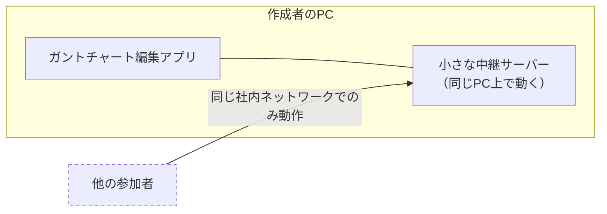
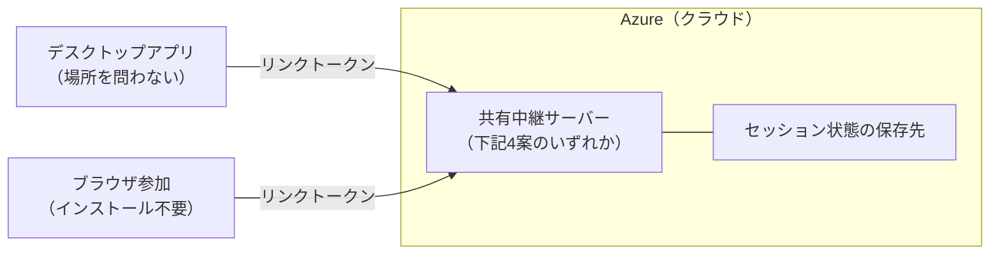
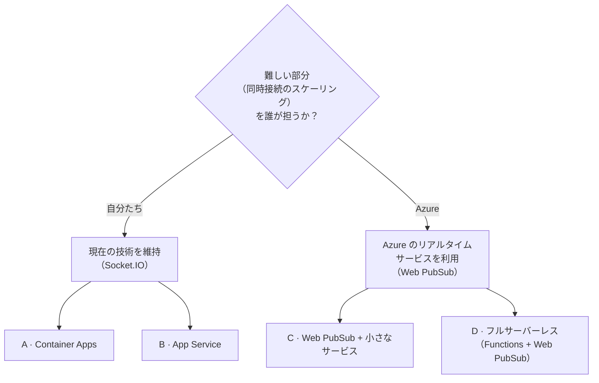
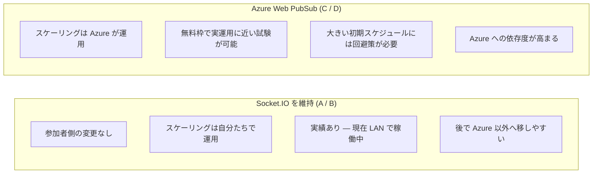
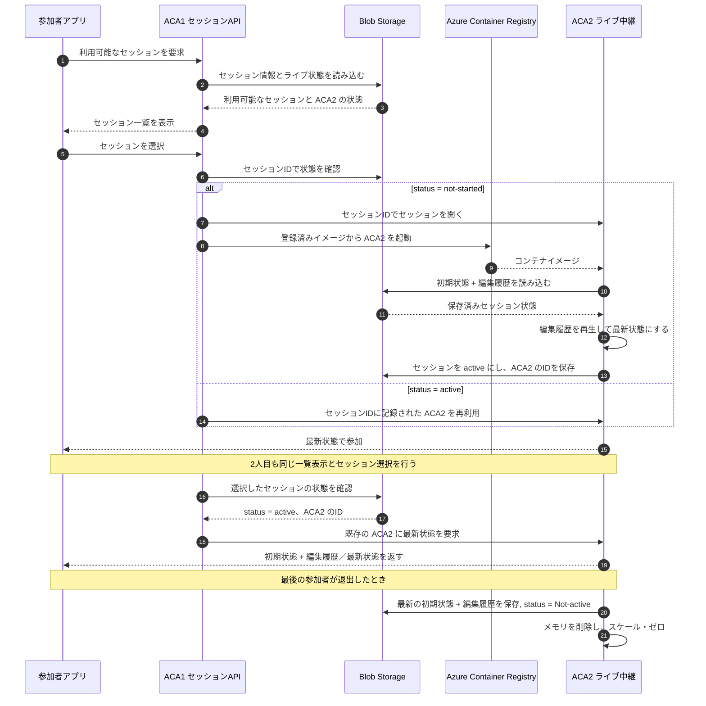
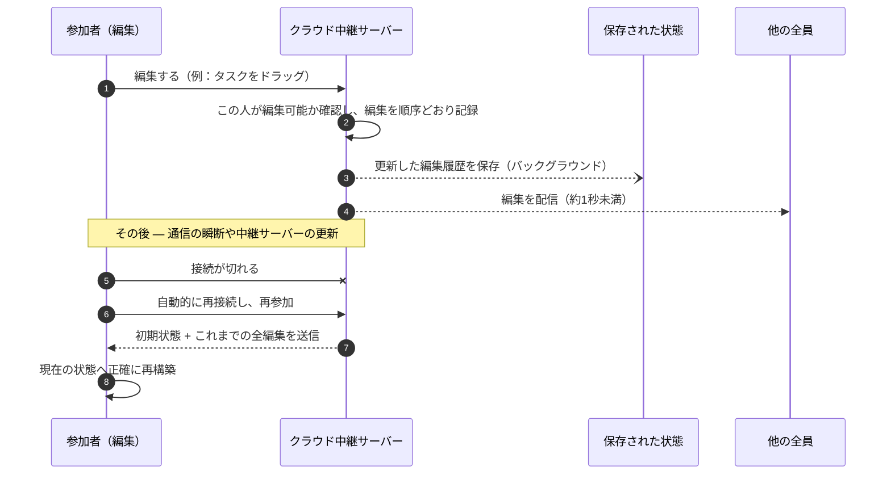
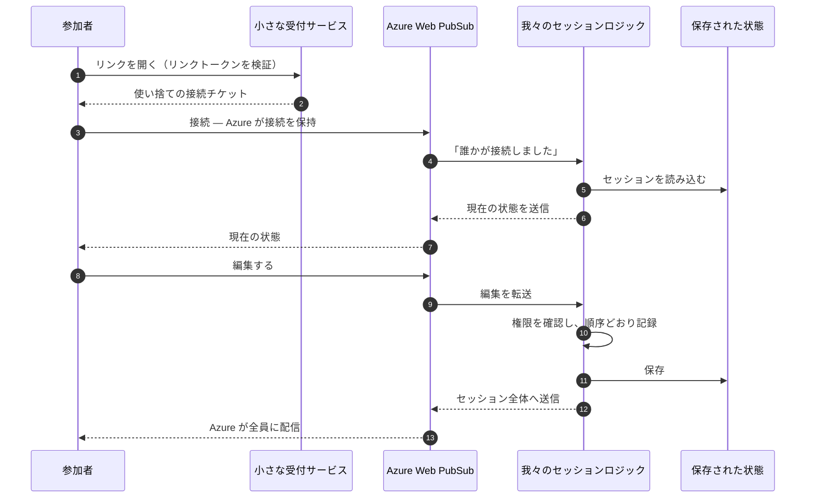
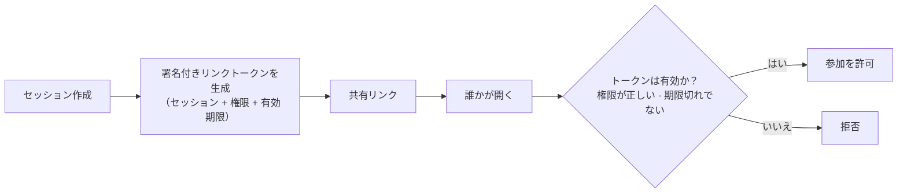

## 1. 現状 — 同一ネットワーク内のみ

| すでに動いていること                   | 「オンライン化」を阻んでいること                           |
| ---------------------------- | ------------------------------------------ |
| リアルタイム共同編集：各編集が1秒未満で全員に反映される | 参加者が**同じネットワーク**にいる必要がある（リモート・自宅・他拠点は不可）   |
| 途中参加者は自動的に現在の状態に追いつく         | セッションは**作成者のPC上にしか存在しない**（アプリを閉じるとセッション消滅） |
| 権限は2種類：**編集**と**閲覧**         | リンクを持っていれば誰でも信用される                         |

---

## 2. 目標 — Azure 上でホストする共有中継サーバー

- 中継サーバーを作成者のPCから Azure へ移し、どこからでも到達できるようにする。
- 作成者がアプリを閉じてもセッションは維持される。
- 共有リンクには**署名付きトークン**（セッション + 権限 + 有効期限）が入り、中継サーバーが検証する。リンクは改ざんできず、期限切れになる。
- 参加者は**ブラウザからインストール不要で参加**できる（ホスティングは無料）。

---

## 3. 中継サーバーをホストする4つの方法

|                    | A · Container Apps    | B · App Service     | C · Web PubSub + サービス | D · フルサーバーレス      |
| ------------------ | --------------------- | ------------------- | --------------------- | ----------------- |
| **移行にかかる作業**       | 最小 — 現状のまま動かす         | 最小 — 現状のまま動かす       | 中 — 新しい Azure サービスを採用 | 最大 — サーバー側を作り直す   |
| **誰も使っていないときのコスト** | 小さいインスタンス1台、約 $5–20/月 | **プラン料金が24時間発生**    | **ほぼ $0**（無料枠）        | **ほぼ $0**（保存領域のみ） |
| **アイドル後の初回参加の遅延**  | なし                    | なし                  | わずかにあり                | わずかにあり            |
| **Azure への依存度**    | ほぼなし                  | 少し                  | やや高い                  | 高い                |
| **大きな初期スケジュールデータ** | 問題なし                  | 問題なし                | 小さな回避策が必要             | 小さな回避策が必要         |
| **向いているケース**       | 変更を抑えて早くオンライン化したい     | すでに App Service が標準 | リアルタイム基盤を運用したくない      | アイドル時コストゼロが絶対条件   |

---

## 4. 本当に決めるべき論点 — リアルタイム方式の選択

|               | Socket.IO を維持    | Azure Web PubSub            |
| ------------- | ---------------- | --------------------------- |
| 参加者側の変更       | なし               | 小さい、または作り直し                 |
| 同時接続のスケーリング担当 | **自分たち**         | **Azure**                   |
| アイドル時の最低コスト   | 小さいインスタンス1台が常時稼働 | 無料枠、その後 1,000ユーザーあたり約 $50/月 |
| 大きい初期スケジュール   | そのままで問題なし        | 回避策が必要                      |
| 自社プロダクトでの実績   | **あり（現在稼働中）**    | 我々にとっては新しい                  |

A/B/C/D のどれにするか、コストがいくらになるかは、すべてこの選択で決まる。

---

## 5. どちらの方式でも共通で必要なもの — セッション状態の保存

中継サーバーがどこで動くにせよ、進行中のセッション（初期スケジュール + 編集の履歴）は
**中継サーバーの外に保存**しておく必要がある。そうすれば再起動や高負荷の日でも会議中の状態を失わない。

| 選択肢                | コスト             | 使いどころ                                  |
| ------------------ | --------------- | -------------------------------------- |
| Azure Blob Storage | 月数セント           | 小規模な社内利用                               |
| サーバーレスデータベース       | 月 約 $1–10       | 中規模、多数の並行セッション                         |
| インメモリキャッシュ（Redis）  | 月 約 $16–60、常時稼働 | Socket.IO を維持し、**かつ**多数インスタンスに拡張する場合のみ |
|                    |                 |                                        |

---

pls add more case when 2nd user try to join session and session already start, if the session already exist it should no create another ACA2
## 6. セッションの開始と参加の流れ

  

誰も接続していない間も、セッションは Blob Storage に残る。後からリンクなしで検索し、再開して続行できる。

---

## 7. リアルタイム編集と切断からの復帰

---

## 8. Azure Web PubSub の場合の同じ流れ（C / D 案）

*A/B 案との違い：Azure が接続の保持と全員への配信を担うため、そこを我々が作らなくてよい。
その代わり、新しい Azure サービスの学習と、大きい初期スケジュールの回避策が必要。*

---

## 9. 匿名リンクをインターネット向けに安全にする

| 対策 | 初期値 |
|---|---|
| 1人あたりの新規セッション数 / 時間 | 10 |
| セッションあたりの参加者数 | 25 |
| セッションの寿命 | 全員退出の30分後に終了 · 最長8時間で強制終了 |
| インターネットから到達できる範囲 | 共同編集機能のみ — ローカルファイル関連機能はホスト版から除外 |
| 将来必要になれば | 同じ検証ポイントで匿名リンクを社内サインインに差し替え可能（再設計不要） |

---

## 10. コスト — 概算、1リージョン

| 案 | 小規模（社内、同時25人以下） | 中規模（同時100〜500人） |
|---|---|---|
| **A · Container Apps** | **月 約 $5–20** | 月 約 $50–100 |
| **B · App Service** | 月 約 $15（常時稼働） | 月 約 $110〜 |
| **C · Web PubSub + サービス** | 月 約 $1（無料枠）· 約 $55（有料枠） | 月 約 $65 |
| **D · フルサーバーレス** | 月 約 $5（無料枠）· 約 $55–70（有料枠） | 月 約 $65 |

ブラウザ参加のホスティングは**無料**。金額は概算 — Azure の価格計算ツールで要確認。

---

### アイドル時のコストと終了

|案|ゼロまでスケール可能か|全員退出後の動作|
|---|---|---|
|**A · Container Apps**|`min replicas = 0` で可能|セッション状態を保存後、アイドル時に停止可能|
|**B · App Service**|通常は不可|常時稼働し、料金も継続|
|**C · Web PubSub + サービス**|サービスは可能。Web PubSub は利用可能な状態を維持|状態を保存し、アクティブメモリから削除|
|**D · フルサーバーレス**|Functions はアイドル時に停止可能|保存データは残り、次の参加時に Functions が起動|

---

  
  

---