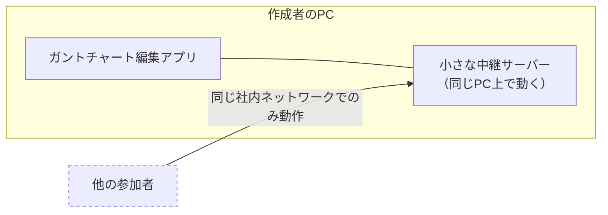
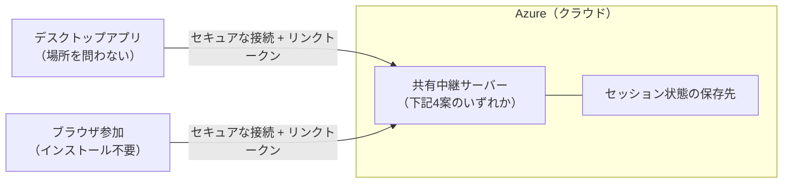
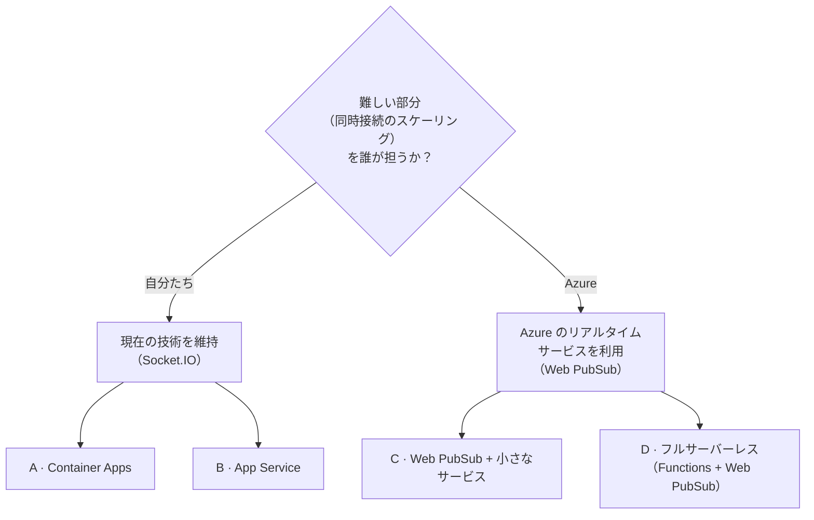
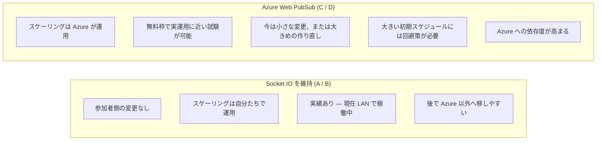
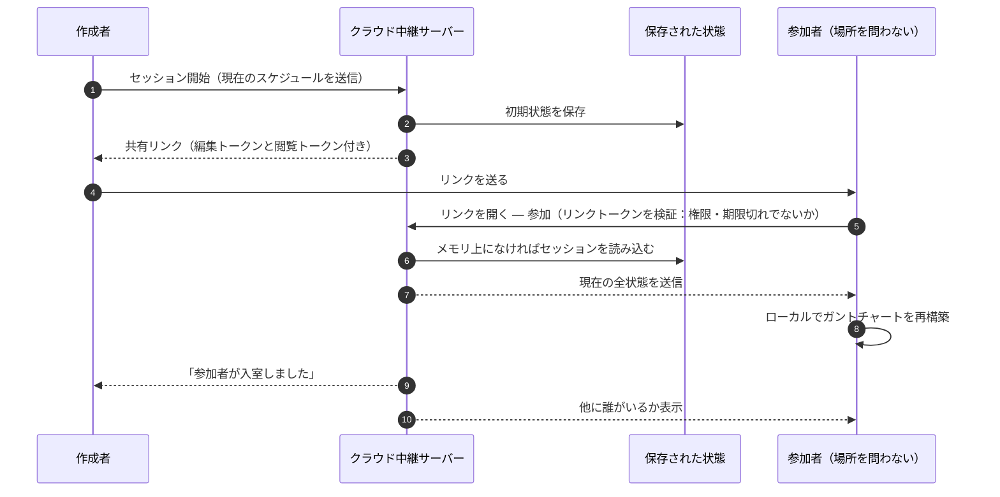
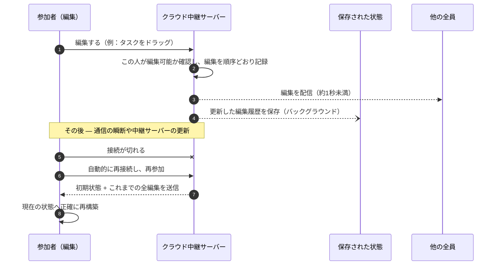
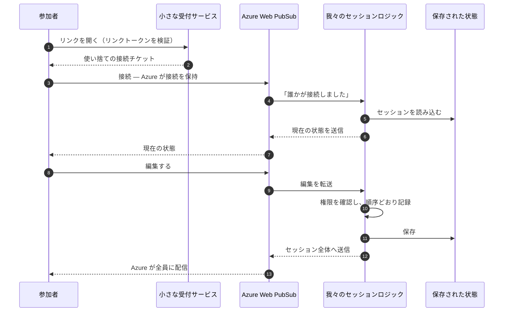
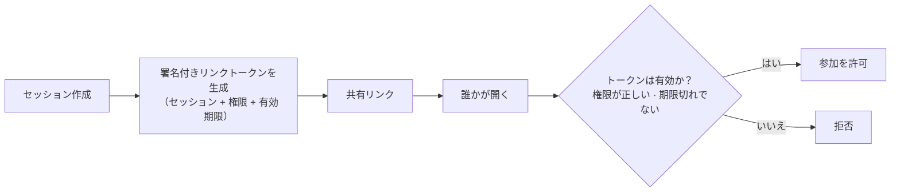
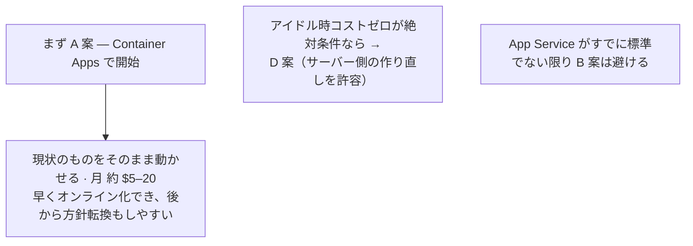

# GanttChartEditor — Azure でのオンライン共同編集

### チーム定例 · 2026-09-04

**目的:** 参加者が同じネットワークにいなくても共同編集できるようにする。
**制約:** 会議のときだけ使う想定なので、運用コストはほぼゼロに抑える。
**認証:** 共有リンク方式のまま（ログイン不要）。

技術詳細（CLI・設定・コード）: `GanttChartEditor_OnlineCollabAzure_Design20260904.md`

---

## 1. 現状 — 同一ネットワーク内のみ

| すでに動いていること | 「オンライン化」を阻んでいること |
|---|---|
| リアルタイム共同編集：各編集が1秒未満で全員に反映される | 参加者が**同じネットワーク**にいる必要がある（リモート・自宅・他拠点は不可） |
| 途中参加者は自動的に現在の状態に追いつく | セッションは**作成者のPC上にしか存在しない**（アプリを閉じるとセッション消滅） |
| 権限は2種類：**編集**と**閲覧** | リンクを持っていれば誰でも信用される（本当のチェックがない） |

---

## 2. 目標 — Azure 上でホストする共有中継サーバー

- 中継サーバーを作成者のPCから Azure へ移し、どこからでも到達できるようにする。
- 作成者がアプリを閉じてもセッションは維持される。
- 共有リンクには**署名付きトークン**（セッション + 権限 + 有効期限）が入り、中継サーバーが検証する。リンクは改ざんできず、期限切れになる。
- 参加者は**ブラウザからインストール不要で参加**できる（ホスティングは無料）。
- チームがすでに慣れているリアルタイム編集の挙動は**変わらない**。

---

## 3. 中継サーバーをホストする4つの方法

| | A · Container Apps | B · App Service | C · Web PubSub + サービス | D · フルサーバーレス |
|---|---|---|---|---|
| **移行にかかる作業** | 最小 — 現状のまま動かす | 最小 — 現状のまま動かす | 中 — 新しい Azure サービスを採用 | 最大 — サーバー側を作り直す |
| **誰も使っていないときのコスト** | 小さいインスタンス1台、約 $5–20/月 | **プラン料金が24時間発生** | **ほぼ $0**（無料枠） | **ほぼ $0**（保存領域のみ） |
| **スケーリングの担当** | 自分たち | 自分たち | **Azure** | **Azure** |
| **アイドル後の初回参加の遅延** | なし | なし | わずかにあり | わずかにあり |
| **日々の運用の手間** | 低 | 低 | 中 | 中〜やや高 |
| **Azure への依存度** | ほぼなし | 少し | やや高い | 高い |
| **大きな初期スケジュールデータ** | 問題なし | 問題なし | 小さな回避策が必要 | 小さな回避策が必要 |
| **向いているケース** | 変更を抑えて早くオンライン化したい | すでに App Service が標準 | リアルタイム基盤を運用したくない | アイドル時コストゼロが絶対条件 |

**採用しない案:** 自前運用の Kubernetes（運用負荷が大きすぎる）· 素の仮想マシン（すべて自前管理になる）· Azure SignalR（動作はするが我々の構成には不向き）。

---

## 4. 本当に決めるべき論点 — リアルタイム方式の選択

| | Socket.IO を維持 | Azure Web PubSub |
|---|---|---|
| 参加者側の変更 | なし | 小さい、または作り直し |
| 同時接続のスケーリング担当 | **自分たち** | **Azure** |
| アイドル時の最低コスト | 小さいインスタンス1台が常時稼働 | 無料枠、その後 1,000ユーザーあたり約 $50/月 |
| 大きい初期スケジュール | そのままで問題なし | 回避策が必要 |
| 自社プロダクトでの実績 | **あり（現在稼働中）** | 我々にとっては新しい |

A/B/C/D のどれにするか、コストがいくらになるかは、すべてこの選択で決まる。

---

## 5. どちらの方式でも共通で必要なもの — セッション状態の保存

中継サーバーがどこで動くにせよ、進行中のセッション（初期スケジュール + 編集の履歴）は
**中継サーバーの外に保存**しておく必要がある。そうすれば再起動や高負荷の日でも会議中の状態を失わない。

| 選択肢 | コスト | 使いどころ |
|---|---|---|
| シンプルなファイルストレージ | 月数セント | 小規模な社内利用 — まずはここから |
| サーバーレスデータベース | 月 約 $1–10 | 中規模、多数の並行セッション |
| インメモリキャッシュ（Redis） | 月 約 $16–60、常時稼働 | Socket.IO を維持し、**かつ**多数インスタンスに拡張する場合のみ |

---

## 6. セッションの開始と参加の流れ

---

## 7. リアルタイム編集と切断からの復帰

---

## 8. Azure Web PubSub の場合の同じ流れ（C / D 案）

*A/B 案との違い：Azure が接続の保持と全員への配信を担うため、そこを我々が作らなくてよい。
その代わり、新しい Azure サービスの学習と、大きい初期スケジュールの回避策が必要。*

---

## 9. 匿名リンクをインターネット向けに安全にする

| 対策 | 初期値 |
|---|---|
| 1人あたりの新規セッション数 / 時間 | 10 |
| セッションあたりの参加者数 | 25 |
| セッションの寿命 | 全員退出の30分後に終了 · 最長8時間で強制終了 |
| インターネットから到達できる範囲 | 共同編集機能のみ — ローカルファイル関連機能はホスト版から除外 |
| 将来必要になれば | 同じ検証ポイントで匿名リンクを社内サインインに差し替え可能（再設計不要） |

---

## 10. コスト — 概算、1リージョン

| 案 | 小規模（社内、同時25人以下） | 中規模（同時100〜500人） |
|---|---|---|
| **A · Container Apps** | **月 約 $5–20** | 月 約 $50–100 |
| **B · App Service** | 月 約 $15（常時稼働） | 月 約 $110〜 |
| **C · Web PubSub + サービス** | 月 約 $1（無料枠）· 約 $55（有料枠） | 月 約 $65 |
| **D · フルサーバーレス** | 月 約 $5（無料枠）· 約 $55–70（有料枠） | 月 約 $65 |

ブラウザ参加のホスティングは**無料**。金額は概算 — Azure の価格計算ツールで要確認。

---

## 11. 推奨

**この場で決めること:**

1. **リアルタイム方式** — Socket.IO 維持（変更小、スケーリングは自社運用） **対** Azure Web PubSub（スケーリングは Azure、変更大）
2. **月 約 $15 の常時稼働**を許容できるか、それとも**アイドル時コストほぼゼロ**が必須条件か
3. 6か月後・12か月後の想定同時利用者数
4. 参加ページと中継サーバー用の**独自ドメイン**はあるか
5. **Azure サブスクリプションとコスト**の管理者は誰か
6. **リージョン** — Japan East を想定。データ所在地の制約はあるか
7. **ブラウザ参加を先に出す**か、まずはデスクトップアプリからクラウド中継サーバーに繋ぐ形にするか
