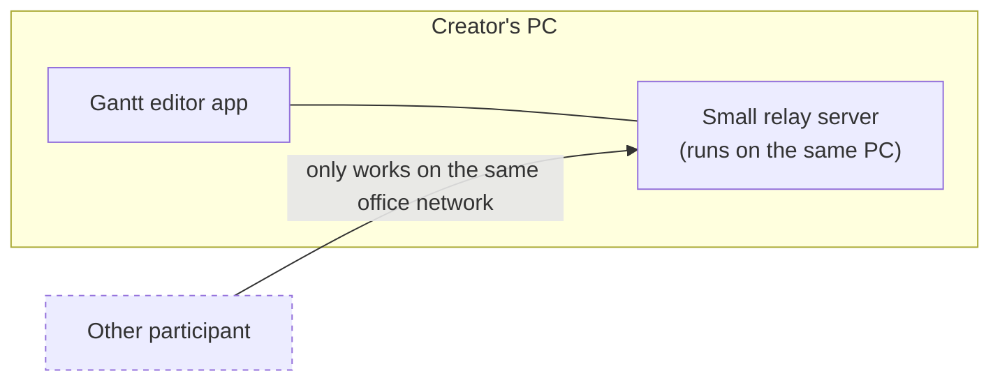
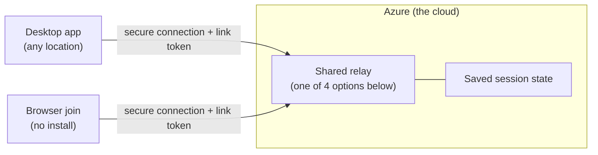
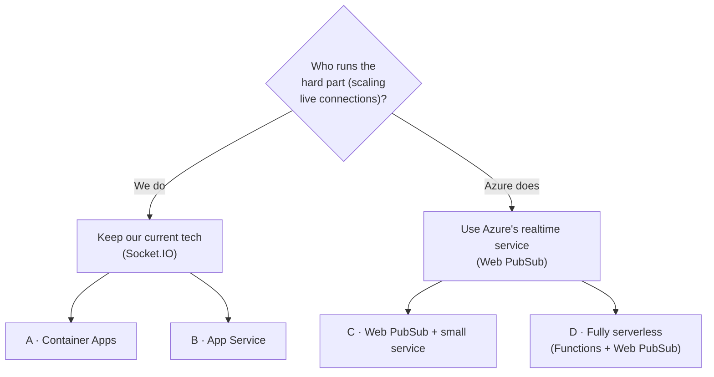
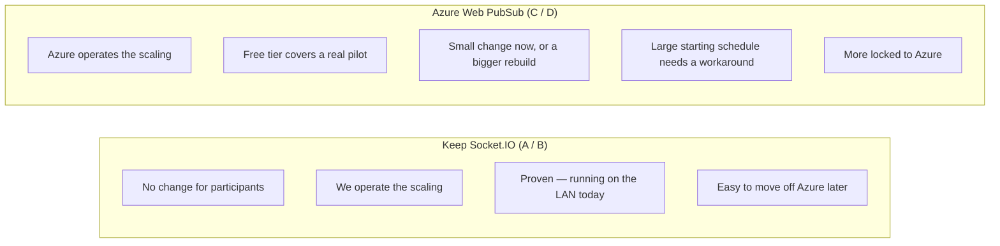
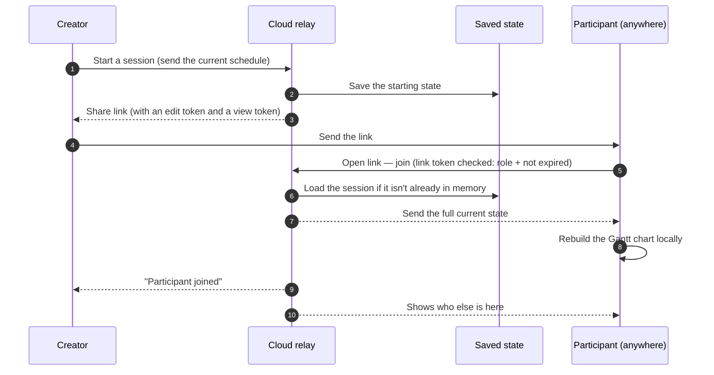
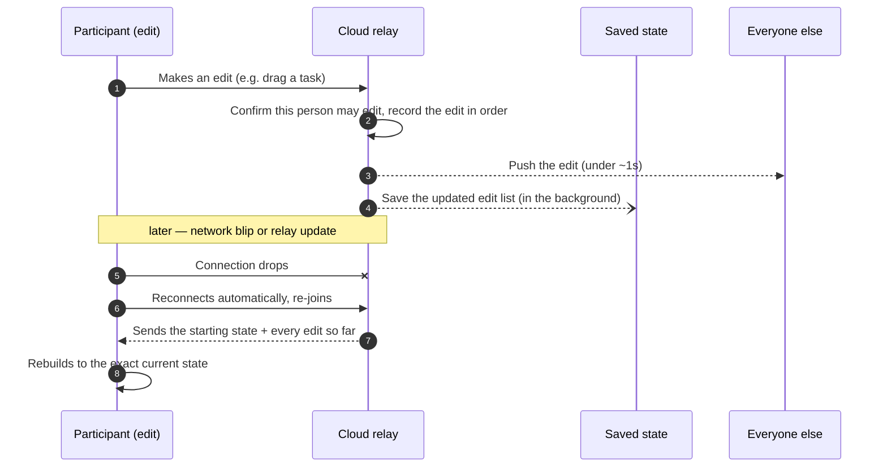
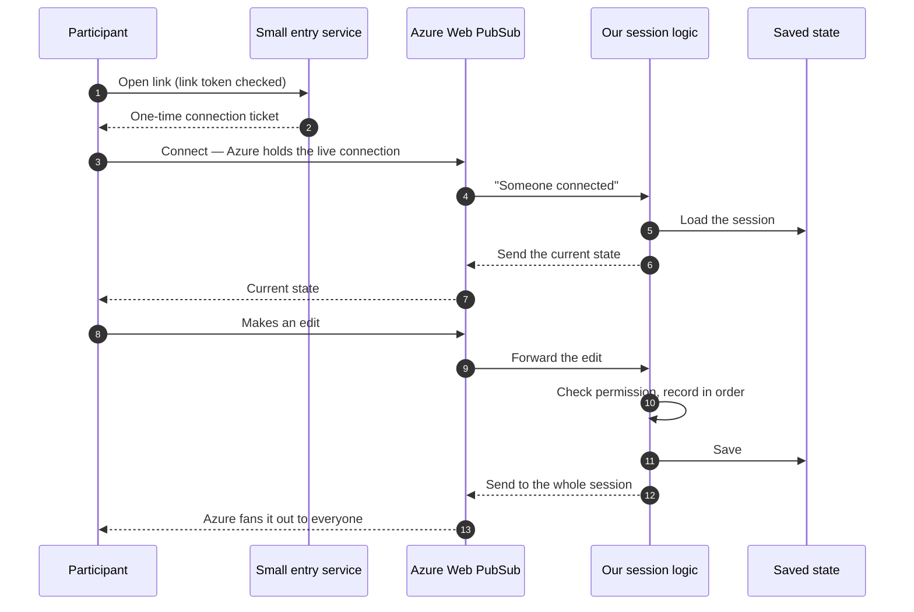
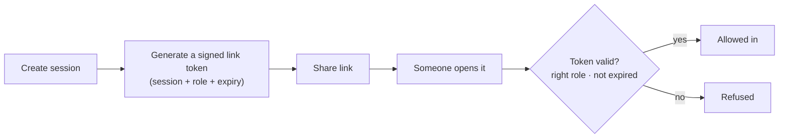
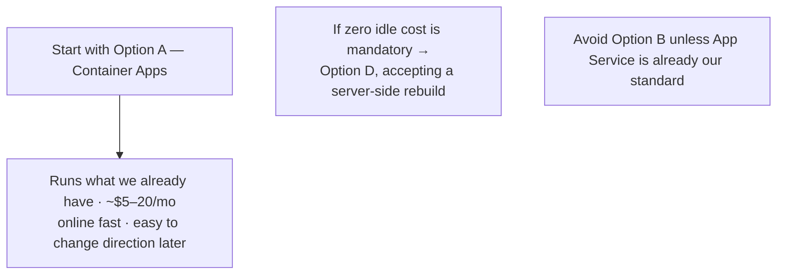

# GanttChartEditor — Online Collaboration on Azure

### Team meeting · 2026-09-04

**Goal:** collaborators no longer need to be on the same network.
**Constraint:** keep running cost near zero for bursty, meeting-time use.
**Auth:** stays an anonymous share-link — no login.

Engineering detail (CLI, config, code): `GanttChartEditor_OnlineCollabAzure_Design20260904.md`

---

## 1. Today — same network only

| What already works | What blocks "online" |
|---|---|
| Live shared editing: everyone sees each edit in under a second | Participants must be on the **same network** — no remote / home / other-office |
| A late joiner catches up automatically to the current state | The session lives **only on the creator's PC** — close the app, session is gone |
| Two roles: **edit** and **view** | Anyone who gets the link is trusted — no real check |

---

## 2. Target — a shared relay hosted on Azure

- The relay moves off the creator's PC into Azure, reachable from anywhere.
- The session survives the creator closing their app.
- The share link carries a **signed token** (session + role + expiry) that the relay checks — the link can't be tampered with, and it expires.
- Participants can join from a **browser, no install** (hosted free).
- The live-editing behaviour the team already knows does **not** change.

---

## 3. Four ways to host the relay

| | A · Container Apps | B · App Service | C · Web PubSub + service | D · Fully serverless |
|---|---|---|---|---|
| **Work to get there** | least — run what we have | least — run what we have | some — adopt a new Azure service | most — rebuild the server side |
| **Cost when nobody is using it** | one small instance, ~$5–20/mo | **full plan, 24/7** | **near $0** (free tier) | **near $0** (storage only) |
| **Who handles scaling** | us | us | **Azure** | **Azure** |
| **First-join delay after idle** | none | none | slight | slight |
| **Effort to run day-to-day** | low | low | medium | medium–higher |
| **Tied to Azure** | barely | a little | somewhat | heavily |
| **Big starting schedule** | fine | fine | needs a small workaround | needs a small workaround |
| **Best when** | we want online fast, minimal change | App Service is already our standard | we don't want to operate realtime infra | zero idle cost is non-negotiable |

**Not pursued:** self-managed Kubernetes (too much to operate) · a plain virtual machine (we'd own everything) · Azure SignalR (works, but a poorer fit for our stack).

---

## 4. The one real decision — which realtime approach

| | Keep Socket.IO | Azure Web PubSub |
|---|---|---|
| Change for participants | none | small, or a rewrite |
| Who scales the live connections | **us** | **Azure** |
| Cost floor when idle | one small instance always on | free tier, then ~$50/mo per 1,000 users |
| Large starting schedule | fine as-is | needs a workaround |
| Proven in our product | **yes, in use today** | newer for us |

Everything else (which of A/B/C/D, the cost) follows from this choice.

---

## 5. One shared piece either way — saved session state

Wherever the relay runs, the live session (the starting schedule + the list of edits) must be
**saved outside the relay** so a restart or a busy day doesn't lose an in-progress meeting.

| Option | Cost | When |
|---|---|---|
| Simple file storage | cents / month | small internal use — start here |
| Serverless database | ~$1–10 / month | medium use, many parallel sessions |
| In-memory cache (Redis) | ~$16–60 / month, always on | only if we keep Socket.IO **and** grow to many instances |

---

## 6. How a session starts and people join

---

## 7. Live editing and recovering from a drop

---

## 8. Same flow with Azure Web PubSub (options C / D)

*Difference from options A/B: Azure owns the live connections and the fan-out, so we don't
build that. Cost of that: a new Azure service to learn, and the large-starting-schedule
workaround.*

---

## 9. The anonymous link, made safe for the internet

| Safeguard | Starting value |
|---|---|
| New sessions per hour, per person | 10 |
| Participants per session | 25 |
| Session lifetime | ends 30 min after everyone leaves · hard stop at 8 h |
| Reachable from the internet | only the collaboration features — local-file features are removed from the hosted build |
| Later, if needed | swap the anonymous link for company sign-in at the same check — no redesign |

---

## 10. Cost — approximate, one region

| Path | Small (internal, ≤25 online) | Medium (100–500 online) |
|---|---|---|
| **A · Container Apps** | **~$5–20 / mo** | ~$50–100 / mo |
| **B · App Service** | ~$15 / mo (always on) | ~$110+ / mo |
| **C · Web PubSub + service** | ~$1 / mo (free tier) · ~$55 (paid tier) | ~$65 / mo |
| **D · Fully serverless** | ~$5 / mo (free tier) · ~$55–70 (paid tier) | ~$65 / mo |

Browser join hosting is **free**. Figures are estimates — to be confirmed on Azure's pricing calculator.

---

## 11. Recommendation

**Decide in the room:**

1. **Realtime approach** — keep Socket.IO (less change, we run scaling) **vs** Azure Web PubSub (Azure runs scaling, more change)
2. Is **~$15/mo always-on** acceptable, or is **near-zero idle cost** a hard requirement?
3. Expected number of simultaneous users at 6 and 12 months
4. Do we have a **custom domain** for the join page and the relay?
5. Who owns the **Azure subscription and the cost**?
6. **Region** — Japan East assumed; any data-location rule?
7. Does **browser join ship first**, or desktop-only pointing at the cloud relay first?
