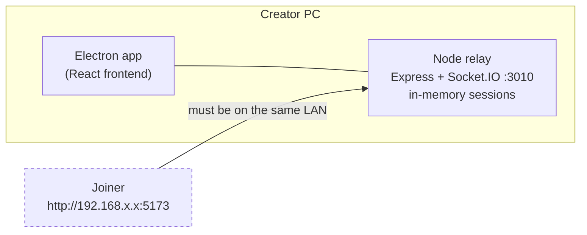
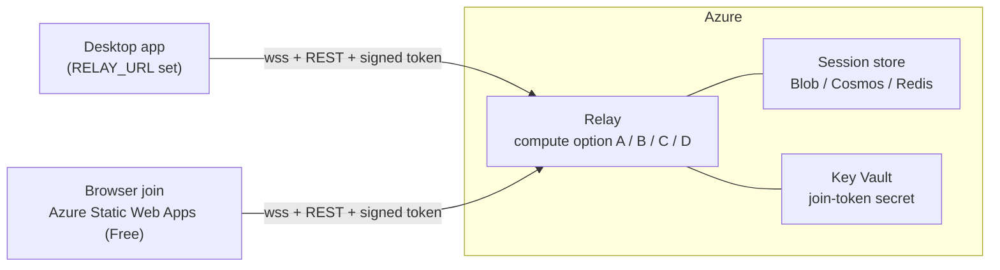
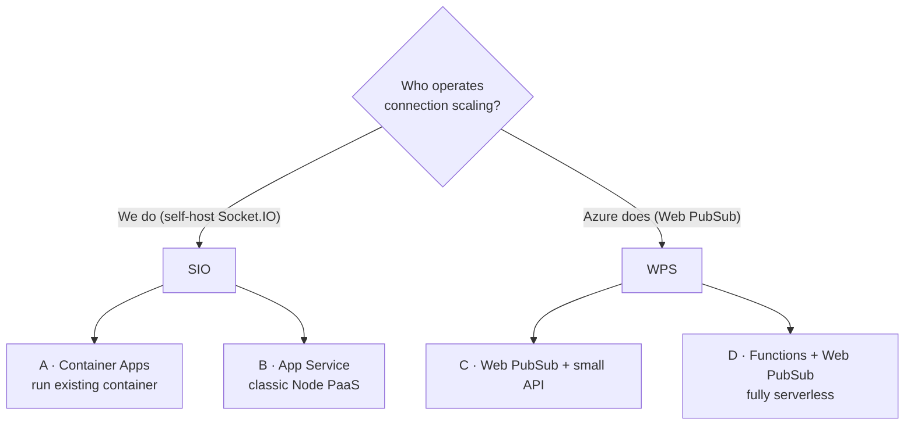
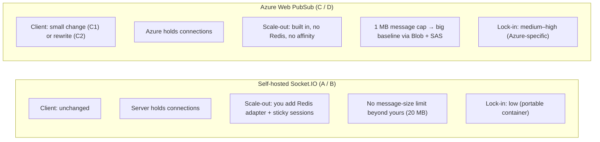
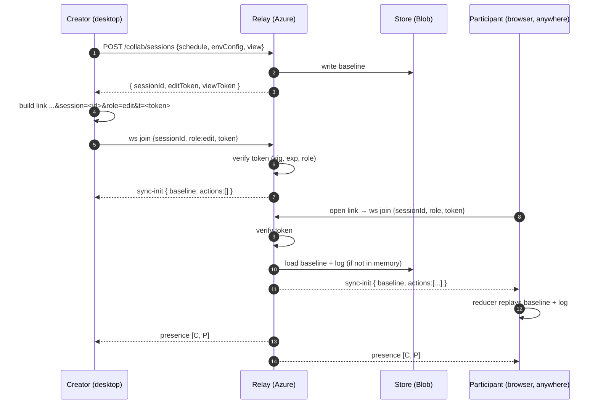
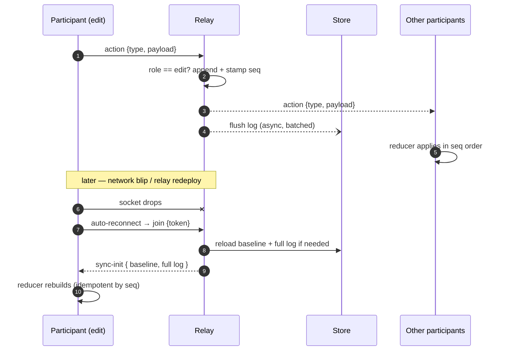
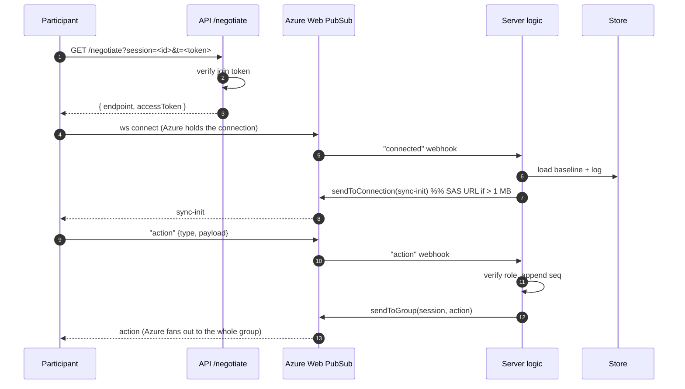
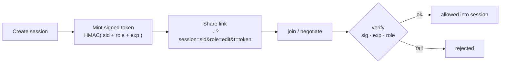
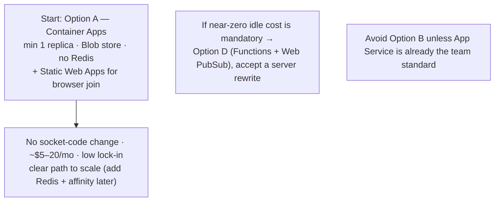

# GanttChartEditor — Online Collaboration on Azure

### Team meeting · 2026-09-04

Goal: **collaborators no longer need the same network** · keep **cost near zero** for
bursty, meeting-time use · auth stays **anonymous share-link**.

Full engineering detail: `GanttChartEditor_OnlineCollabAzure_Design20260904.md`

---

## 1. Today — LAN only

| Works | Doesn't |
|---|---|
| Event-sourced model: baseline + ordered action log, client reducer is source of truth | Joiner must be on the **same LAN** (`192.168.x.x` link) |
| Clients already replay the log on every reconnect | Sessions live in **one process's memory** — no restart survival |
| Roles: `edit` / `view` | **No authentication** — `join` only checks the session exists |
| | CORS locked to LAN; share link is a LAN IP |

---

## 2. Target — hosted relay on Azure

**Unchanged:** event-sourced model, `reducer.ts`, roles.
**Added:** recoverable session store · signed anonymous join token · real CORS ·
desktop-only routes removed from the public build · TLS + custom domain · abuse limits.

---

## 3. Four compute options

| | A · Container Apps | B · App Service | C · Web PubSub + API | D · Functions + Web PubSub |
|---|---|---|---|---|
| **Client change** | none | none | small (C1) / rewrite (C2) | rewrite `collabService` |
| **Server change** | none (+Dockerfile) | none | swap 1 transport line | rewrite as Functions |
| **Idle cost** | ~1 small replica | **full plan 24/7** | Free tier **$0** / $50 unit | **storage only** + WPS |
| **Scales connections** | you (Redis + affinity) | you (Redis + affinity) | **Azure** | **Azure** |
| **Cold starts** | none (min 1) | none (Always On) | small API only | HTTP Functions |
| **Ops burden** | low–medium | low–medium | medium | medium–high |
| **Lock-in** | low | low–medium | medium / high | high |
| **Big sync payload** | fine (20 MB) | fine (20 MB) | **1 MB cap → Blob+SAS** | **1 MB cap → Blob+SAS** |
| **Local dev** | `node` | `node` | `+ awps-tunnel` | `+ Core Tools + awps-tunnel` |
| **Best when** | least rework, clear scale path | App Service is the team standard | don't want to run realtime infra | near-zero idle cost is mandatory |

**Rejected:** AKS (too much ops) · bare VM (re-own everything) · Azure SignalR (.NET-first
sibling — analysis transfers if preferred).

---

## 4. Protocol fork — the decision to make in the room

| | Socket.IO (self-host) | Azure Web PubSub |
|---|---|---|
| Client change | none | small (C1) / rewrite (C2) |
| Connection scaling & fan-out | **you** (Redis adapter + sticky) | **Azure** (built in) |
| Idle cost floor | ~1 replica always on | Free tier $0, else ~$50 / 1,000-conn unit |
| Message size | 20 MB (as configured now) | **1 MB hard cap** |
| Reconnect + backfill | your `seq` log (already built) | your `seq` log (same) |
| Local dev | run `node` | run `node` + `awps-tunnel` |
| Maturity in our stack | **in production on LAN today** | "for Socket.IO" shim is newer |

---

## 5. Session store (every option needs one)

| Store | Cost | Use for |
|---|---|---|
| **Blob Storage** | cents/mo | baseline snapshot + log flush — small scale, 1 replica |
| **Cosmos DB serverless** | ~$1–10/mo bursty | durable action log at medium scale (pairs with Functions) |
| **Azure Managed Redis** | ~$16–60/mo, always-on | Socket.IO multi-replica backplane — only once you scale past 1 replica |

Progression: **Blob only → add Redis when Socket.IO goes multi-replica → Cosmos if Web PubSub path.**

---

## 6. Sequence — create session + join (Socket.IO path)

---

## 7. Sequence — live edit + reconnect

---

## 8. Sequence — Web PubSub variant (C / D)

---

## 9. Anonymous link — hardened

| Control | Value (start) |
|---|---|
| Session-create rate limit | 10 / hour / IP |
| Max participants / session | 25 |
| Action payload cap | 1 MB (matches Web PubSub; big baseline → Blob) |
| Session TTL | 30 min idle (today) + 8 h absolute |
| CORS | web origin only + allow no-Origin (desktop) |
| Public routes | `/api/collab/*` + `/api/health` only — `save-files` etc. removed |
| Phase-2 hook | swap anonymous for Entra ID at the **same** token check |

---

## 10. Cost — approximate, single region, JSON traffic

| Path | Small (internal, ≤25 online) | Medium (100–500 online) |
|---|---|---|
| **A · Container Apps** + Blob + Static Web Apps | **~$5–20 / mo** | ~$50–100 / mo (+ Managed Redis) |
| **B · App Service B1** + Blob | ~$15 / mo (always on) | ~$110+ / mo (S1 + Redis) |
| **C · Web PubSub** + small API | ~$1 / mo (Free tier) · ~$55 (Standard) | ~$65 / mo |
| **D · Functions + Web PubSub** | ~$5 / mo (Free tier) · ~$55–70 (Standard) | ~$65 / mo |

Static Web Apps (browser join) = **Free**. Verify on the Azure Pricing Calculator before committing.

---

## 11. Recommendation

**Decide in the room:**

1. **Protocol** — self-hosted Socket.IO (less change, we operate scaling) **vs** Azure Web PubSub (more change + 1 MB workaround, Azure operates scaling)
2. Is **~$15/mo always-on** acceptable, or is **scale-to-zero** a hard requirement?
3. Expected **concurrency** at 6 / 12 months → small vs medium sizing
4. **Custom domain** for browser-join origin + API?
5. **Azure subscription / resource group / cost owner**
6. **Region** (Japan East assumed) — any data-residency constraint?
7. Does **browser-join ship in v1**, or desktop-only pointing at the cloud relay first?
