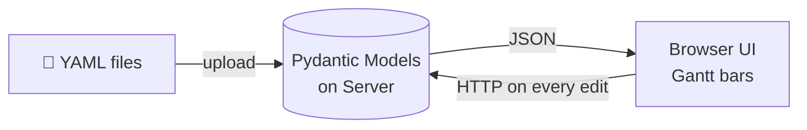
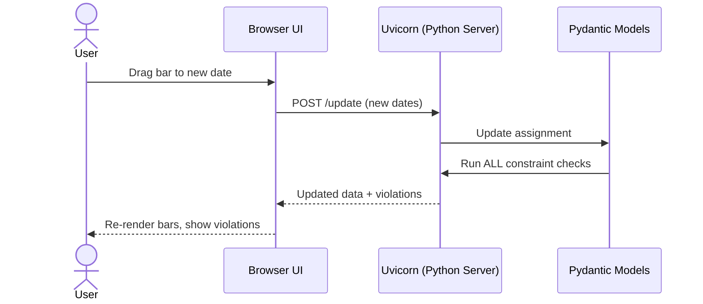
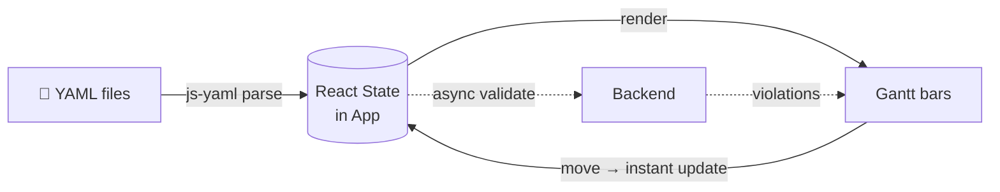
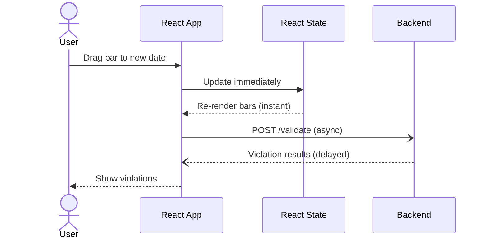
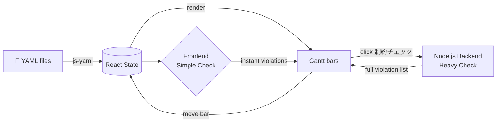
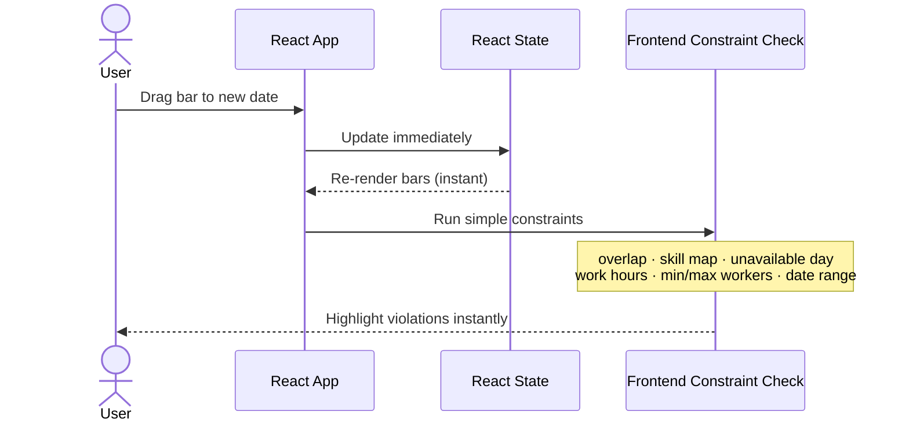
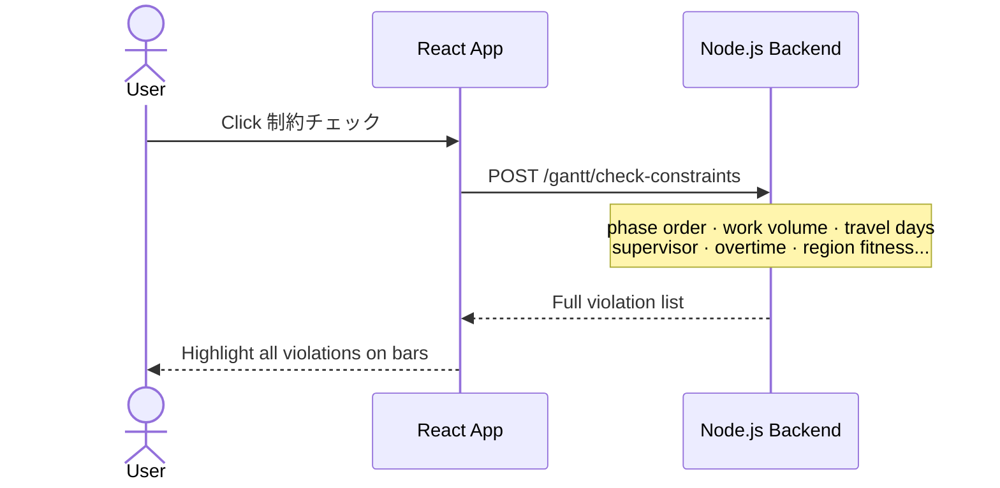

# GanttChart Editor — Implementation Plan (Progress Report)

**Date:** 2026-06-18  
**Status:** Phase 1–2 in progress (UI near completion)

---

## 1. Goal

Build a new GanttChart Editor to replace the existing 2025 / 2026 versions.  
The editor lets users load YAML schedule data, visually edit assignments on a Gantt chart, and (eventually) submit them to the Scheduler Webapp.

---

## 2. References

| Source | How we use it |
|---|---|
| **2025 Python version** | UI layout and feature reference — what buttons, views, and dialogs the tool should have |
| **2026 Tauri version** | Source code reference — state management pattern (Context + Reducer), TypeScript types, file parsing logic |
| **New build** | Rendering, chart library, file abstraction, service endpoints |

> We use 2025 as the **design spec** and 2026 as the **code base** — the new app is a clean rewrite combining the best of both.

---

## 3. Technology Stack

### Frontend

| Layer | Technology |
|---|---|
| Framework | React 19 + TypeScript |
| Build tool | Vite 5 |
| Chart rendering | Custom HTML/CSS Gantt (supports multi-bar rows) |
| State management | React Context + useReducer |
| YAML parsing | js-yaml |

### Backend

| Phase | Technology | Reason |
|---|---|---|
| Phase 3–5 (development) | **Node.js + Express** | Already exists in `web/service/server.js`, fast to extend, easy to run during development |
| Phase 6 (desktop app) | **Rust (via Tauri)** | Replaces Node.js when packaging as standalone `.exe` — no separate server needed |

> The backend starts as Node.js for speed of development.  
> When building the desktop app (Phase 6), the same logic is rewritten in Rust as Tauri IPC commands.  
> Frontend code does **not change** between the two — only the service layer switches.

**Language:** UI text is Japanese. Code and variable names are English.

---

## 4. Implementation Phases

```
Phase 1–2  │  Frontend web app (current)
           │  Loads YAML, shows Gantt, edits assignments in browser
           │  No backend needed
           │
Phase 3–4  │  Node.js service layer (extend existing web/service/server.js)
           │  Heavy constraint checking endpoints
           │  Validation API
           │
Phase 5    │  Connect GanttChart ↔ Scheduler Webapp
           │  Submit → opens Webapp New Run
           │  Show Result → opens GanttChart  ← Demo milestone
           │
Phase 6    │  Package as Tauri desktop app
           │  Rewrite Node.js backend logic in Rust
           │  No browser or Node.js required to run
```

---

## 5. Project Structure

```
GanttChartEditor/
│
├── src/                            ← React frontend (runs in browser)
│   ├── components/
│   │   ├── GanttChart/             ← Chart rendering (Device view, Worker view)
│   │   ├── Toolbar/                ← Menu bar, toolbar buttons, search
│   │   ├── SidePanel/              ← Assignment detail panel (right side)
│   │   └── Dialogs/                ← File open, task add, new schedule, error
│   ├── context/                    ← AppContext + reducer (all state mutations)
│   ├── services/                   ← File read/save, YAML parse
│   ├── types/                      ← TypeScript types (Schedule, EnvConfig, AppState)
│   ├── utils/                      ← Date math, color palette
│   ├── config/                     ← UI text, constants
│   └── pages/                      ← GanttPage (main layout)
│
├── service/                        ← Node.js backend (Phase 3–5)
│   ├── server.js                   ← Express server (extends existing web/service/)
│   ├── routes/
│   │   ├── gantt.js                ← /gantt/submit, /gantt/open endpoints
│   │   └── constraint.js           ← /gantt/check-constraints endpoint
│   └── lib/
│       ├── constraintChecker.js    ← Heavy constraint logic (runs server-side)
│       └── yamlUtils.js            ← YAML read/write on filesystem
│
├── src-tauri/                      ← Rust (Phase 6 only — Tauri desktop app)
│   └── src/
│       ├── main.rs                 ← App entry point, CLI args
│       └── commands/
│           ├── file.rs             ← open/save YAML (native file dialog)
│           └── constraint.rs       ← Rust rewrite of constraint logic
│
└── documents/                      ← Planning and setup docs
```

> `service/` is the Node.js backend for Phase 3–5.  
> `src-tauri/` is only created in Phase 6. The folder does not exist yet.

---

## 6. Frontend / Backend Split

| What | Phase 1–5 | Phase 6 (Tauri) |
|---|---|---|
| YAML parse / save | Frontend (browser) | Frontend (same) |
| File open / save dialog | Browser File API (frontend) | Rust IPC (Tauri) |
| Gantt chart rendering | Frontend | Frontend (same) |
| Simple constraint checks | Frontend (instant feedback) | Frontend (same) |
| Heavy constraint checks | Node.js backend (`/gantt/check-constraints`) | Rust backend (Tauri IPC) |
| Submit to Webapp | Node.js backend | Rust backend |
| Launch from Webapp | Node.js backend | Rust backend |

---

## 7. What Has Been Done (Phase 1–2 progress)

### 7.1 UI Implemented

- **Menu bar** — File menu with Open / Save / Save As + keyboard shortcuts (Ctrl+O, Ctrl+S)
- **Toolbar** — Search bar, Undo/Redo buttons, view toggle (Device / Worker), date range picker
- **Device view Gantt** — expandable rows: device → phase summary → operation slots
- **Worker view Gantt** — one row per worker, bars labeled with device name (e.g. SU 1001A)
- **Side panel** — shows selected assignment details, plan flexibility edit
- **Scroll sync** — left row-header panel follows vertical scroll of the chart
- **CSS drag** — bars draggable left/right and resizable, smooth with no lag
- **Dark navy UI** — consistent color theme

### 7.2 Buttons / Dialogs Added

| Button | Location | What it does |
|---|---|---|
| ファイルを開く | Menu → File | Opens 2-file picker (EnvConfig + Schedule YAML) |
| 保存 / 名前を付けて保存 | Menu → File | Downloads updated Schedule YAML |
| 割付追加 | Toolbar | Add one or more assignments (multi-card dialog with cascading dropdowns) |
| 新規製番追加 | Toolbar | Add new workflow task — 2-tab dialog (file upload merge OR form entry) |
| 計画管理ツールへ送信 | Toolbar (right) | Placeholder — disabled until Phase 5 backend connection |
| 計画柔軟性 一括設定 | Toolbar | Bulk-change plan flexibility for all assignments |

---

## 8. Open Questions — Decisions Needed

### 8.1 Filter / Search

**Question:** How should the search bar filter the chart?

- **Option A — Category filter:** Separate dropdowns for 作業者 / 装置 (worker / device)
- **Option B — Free text search:** One input that searches any bar or row label matching the text

**Consideration:** Option B is simpler to use and easier to implement. Recommended unless stakeholders need precise per-category filtering.

---

### 8.2 Data Location — Frontend State vs Backend

**Question:** Should schedule data live in React state (current) or be served from a backend?

| | Frontend state (current approach) | Backend server |
|---|---|---|
| **Pro** | Works offline, no server needed, fast UI | Single source of truth, supports multi-user |
| **Con** | Data lost on refresh, hard to share between users | Requires server running, more complex setup |
| **Best for** | Single-user desktop tool | Multi-user web tool |

**Recommendation:** Keep frontend state for Phase 1–5 (desktop use case). If multi-user editing is required, add backend sync in Phase 5.

---

### 8.3 Right Side Panel — What to Show

**Question:** What information should appear in the side panel when a bar is selected?

Suggested content:
- 作業者名 (worker name)
- 装置 / 工程 / 作業 (device / phase / operation)
- 開始日 / 終了日 (start / end date)
- 作業時間 (hours per day)
- 計画柔軟性 (plan flexibility — editable dropdown)
- 削除ボタン (delete assignment)

Should the panel show for both Worker view and Device view? → **Yes, recommended**

---

### 8.4 Moving a Bar — What Data Changes?

**Question:** When a user drags a bar to a new date, what should update?

Topics to confirm (will demo in app):
- `startDate` and `endDate` of the assignment
- `workDateList` entries (individual work days and hours)
- Constraint violation highlights that depend on dates
- Whether weekends / unavailable days are automatically skipped on regeneration

---

### 8.5 新規製番追加 Dialog — Is It Good?

**Question:** Is the current 新規製番追加 dialog (2-tab: file upload / form) the right design?

Current design:
- Tab 1: Upload a YAML file to merge additional workflow tasks
- Tab 2: Form to manually enter a new workflow task with phases, operations, and hours per operation

**Points to confirm:**
- Is the form layout clear enough?
- Should hours be per operation or per phase?
- Do we need a preview of what will be added before confirming?

---

### 8.6 Constraint Checking — Frontend vs Backend

#### Which constraints belong where

The constraint list is large and varied. Simple local checks (does this bar overlap another?) can run instantly in the browser. But complex checks that look at the whole schedule across all workers, regions, and dates are too heavy for the frontend — they belong in the Node.js backend (and later Rust).

| 制約名 | 内容 | Frontend / Backend |
|---|---|---|
| 作業時間 | 1日の作業時間が定義範囲内か | **Frontend** — simple range check on each bar |
| スキルマップ | 作業者のスキルが作業に合っているか | **Frontend** — lookup at assignment creation time |
| 同一日作業重複禁止 | 同一作業者が同日に複数作業 | **Frontend** — fast scan over same-worker bars |
| 最小・最大作業者数 | 1日の作業者数が範囲内か | **Frontend** — count assignments per day per operation |
| 作業不可日 | 作業者の不可日に割り当てていないか | **Frontend** — date lookup against worker unavailable list |
| 工程開始日・終了日 | 各工程の全作業が期間内に収まっているか | **Frontend** — date range check per phase |
| 初工程開始日固定 | 最初の工程が定義された開始日から始まっているか | **Frontend** — single date comparison |
| 工程間順序 | 先行工程の全作業完了後に後続工程が開始しているか | **Backend** — needs to verify completion across all assignments in a phase |
| 必要作業量 | 総作業時間が必要量を満たし、かつ過剰でないか | **Backend** — sum all assigned hours across workers and compare to required total |
| 移動日制 | 異なる地域間の割り当て間に移動日があるか | **Backend** — cross-assignment check with region/travel day data |
| 作業責任者制約 | 各作業種別に責任者が割り当てられているか | **Backend** — search all assignments to verify supervisor presence |
| 滞在期間制約 | 同国への連続・年間滞在日数が上限内か  | **Backend** — cumulative count across all trips for each worker |
| 残業時間制約 | 月・年間の残業時間が上限内か  | **Backend** — aggregate hours over time per worker |
| 地域適性 | 作業者が特定地域で作業不可でないか  | **Backend** — worker × region compatibility check |
| 企業適性 | 作業者が特定企業で作業不可でないか  | **Backend** — worker × company compatibility check |

---

#### When should constraint checking run?

**Option A — After every bar move (real-time)**

| | Detail |
|---|---|
| **Pro** | User sees violations immediately; no need to press a separate button |
| **Con** | Frontend checks can run live, but backend checks cannot — calling an API on every drag would be too slow and fire too many requests |
| **Verdict** | Works for frontend-only constraints. Not practical for backend constraints. |

**Option B — After pressing a "制約チェック" button (on demand)**

| | Detail |
|---|---|
| **Pro** | Runs all constraints including backend; no performance issue; user chooses when to check |
| **Con** | User might not notice a violation until they manually press the button |
| **Verdict** | The only practical option for backend constraints. |

**Option C — Hybrid (recommended)**

- **Frontend constraints** → run automatically after every bar move (instant, no API call)
- **Backend constraints** → run only when user presses **「制約チェック」** button

This gives immediate feedback on simple issues (overlap, skill mismatch, unavailable day) while keeping the heavier checks on demand.

**Question to decide:** Should the 制約チェック button be in the toolbar always visible, or inside a menu?  
And should violations be shown as red bar highlights, a popup list, or both?

---

## 9. Data Architecture — How Each Version Handles Data

---

### 9.1 — 2025 Python Version

**Where data lives: Python server (Pydantic models)**



**On bar move:**



> ✅ All constraint logic on server — reliable, single source of truth  
> ✅ UI always reflects true validated state  
> ❌ Every edit needs a server round-trip — slower response  
> ❌ Requires Python server running at all times

---

### 9.2 — 2026 Tauri Version

**Where data lives: React State (inside the app)**



**On bar move:**



> ✅ Instant UI — no waiting for server on every move  
> ✅ Works without server for basic editing  
> ❌ Complex constraints on frontend = heavy JS, hard to maintain  
> ❌ Async validation means UI and validation are briefly out of sync

---

### 9.3 — New Version: Hybrid Approach

**Where data lives: React State — constraint checking split by complexity**



**Step 1 — On every bar move (automatic, no server call):**



**Step 2 — On 制約チェック button (on demand):**



> ✅ Instant feedback on common issues — no server call needed  
> ✅ Full constraint check available any time on demand  
> ✅ Backend logic moves cleanly to Rust in Phase 6 — frontend unchanged
