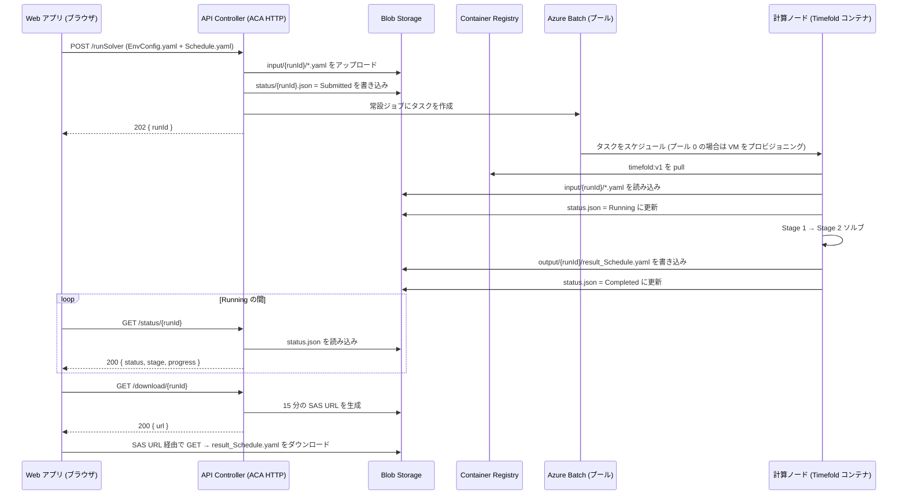

# Azure リソース・アクセス権要件 — Timefold Scheduler

## プロジェクト背景

Timefold スケジューラは、2 つの入力 YAML ファイルから従業員スケジュール
を最適化するシステムです。ローカル PC 上の React 製 Web アプリ、Azure
Container Apps 上の HTTP API、Azure Batch 上でコンテナとして実行される
Timefold ソルバ、そして全ファイル I/O を担う Azure Blob Storage で構成
されます。

全リソースは管理を簡潔にするため、単一のリソースグループ内に配置します。

---

## 1. システム概要

### 1.1 シーケンス図 (エンドツーエンドのリクエストライフサイクル)



### 1.2 コンポーネント図

```
                       ┌──────────┐
                       │ Web アプリ│
                       │ (ブラウザ)│
                       └────┬─────┘
                            │ HTTPS
                            ▼
                  ┌─────────────────────────┐
                  │ Azure Container Apps    │
                  │ (HTTP アプリ: ca-tf-api) │── 入力アップロード ─┐
                  │ System-assigned MI       │── タスク作成 ────┼─┐
                  └────────┬────────────────┘── ステータス読み込み ┤ │
                           │ イメージ pull                       │ │
                           ▼                                      │ │
                  ┌─────────────────────────┐                     │ │
                  │ Azure Container Registry│                     │ │
                  │ - api-controller:v1     │                     │ │
                  │ - timefold:v1           │◀──── pull ─────────┼─┘
                  └─────────────────────────┘                     │
                                                                   │
                  ┌─────────────────────────┐                     │
                  │ Azure Batch              │                     │
                  │  - アカウント            │◀────────────────────┘
                  │  - プール (0→N オートスケール) │
                  │  - User-assigned MI       │── Blob 読み書き ─┐
                  └─────────────────────────┘                    │
                                                                  │
                  ┌─────────────────────────┐                    │
                  │ Azure Blob Storage       │◀─────────────────┘
                  │  - input/{runId}/        │
                  │  - output/{runId}/       │
                  │  - status/{runId}.json   │
                  └─────────────────────────┘
```

### 1.3 各 Azure リソースの利用目的

- **Azure Blob Storage** — 入力 YAML (`input/{runId}/`)、ソルバ出力
  YAML (`output/{runId}/`)、実行ステータス JSON
  (`status/{runId}.json`) を集中保管するストア。全コンポーネントが
  読み書きを行います。
- **Azure Container Registry (ACR)** — 展開する 2 種類の Docker
  イメージ (`api-controller`、`timefold`) を保管するプライベート
  レジストリ。
- **Azure Container Apps (ACA) 環境 + HTTP アプリ** — API Controller を
  ホストするサーバーレス基盤。リクエストがない間はゼロスケール。
- **Azure Batch アカウント + プール** — Timefold ソルバをコンテナ
  タスクとして、オートスケールする計算 VM 上で実行します。アイドル時は
  ノード数 0。API がタスクを投入するとスケールアップします。
- **User-assigned マネージド ID** — Batch プールに紐付ける ID。各計算
  ノードはこの ID を用いて ACR からソルバイメージを pull し、Blob から
  入力を読み・出力を書きます。ACA アプリでは同等の役割を System-assigned
  MI が担います。

### 1.4 サブスクリプションレベルのリソースプロバイダー登録

以下のプロバイダー登録が必要です (サブスクリプション毎に 1 回のみ、コストなし)。
各 `Microsoft.X` は、ある Azure サービスチームが所有する名前空間であり、
そのカテゴリのリソースを作成する前に当該プロバイダーを **登録 (Registered)**
状態にしておく必要があります。

| プロバイダー                       | 所管するリソース                                                       | 必要理由 (上記のどのリソースを支えるか)                                                |
| --------------------------------- | --------------------------------------------------------------------- | --------------------------------------------------------------------------------------- |
| `Microsoft.Storage`               | ストレージアカウント、Blob コンテナー、キュー、テーブル、ファイル共有 | Blob ストレージアカウントを支える (リソース 2.1)                                        |
| `Microsoft.Authorization`         | RBAC: ロール割り当て、ロール定義、ロック                              | `az role assignment` 全般に必須。未登録時は権限付与不可                                  |
| `Microsoft.App`                   | Azure Container Apps 環境 + HTTP アプリ                              | ACA 環境および HTTP アプリを支える (リソース 2.3, 2.3.1)                                |
| `Microsoft.OperationalInsights`   | Log Analytics ワークスペース                                         | ログを無効化していても ACA の依存関係として登録必須                                       |
| `Microsoft.ContainerRegistry`     | Azure Container Registry (ACR)                                       | ACR を支える (リソース 2.2)                                                              |
| `Microsoft.ManagedIdentity`       | User-assigned マネージド ID                                          | `mi-tf-pool` を作成するために必要 (リソース 2.5)                                        |
| `Microsoft.Batch`                 | Batch アカウント、プール、ジョブ、タスク                              | Batch アカウントとプールを支える (リソース 2.4, 2.4.1)                                  |

登録状態の確認:
```bash
az provider list --query "[?contains(['Microsoft.Storage','Microsoft.Authorization','Microsoft.App','Microsoft.OperationalInsights','Microsoft.ContainerRegistry','Microsoft.ManagedIdentity','Microsoft.Batch'], namespace)].{name:namespace, state:registrationState}" -o table
```
`NotRegistered` と表示されたプロバイダーがあれば、以下で登録:
```bash
az provider register --namespace Microsoft.<X>
```

---

## 2. 設定オプション詳細

各リソースについて、判断が必要な項目のみを記載しています。「オプション」列
には代替案を示し、選択内容を再検討できるようにしています。

### 2.1 Storage Blob コンテナー

| 項目                       | 要望値                            | オプション                                                                                                |
| ------------------------- | --------------------------------- | --------------------------------------------------------------------------------------------------------- |
| ストレージアカウント名      | `sttimefoldprod<suffix>`          | 全世界でユニーク必須。小文字英数字のみ、3〜24 文字。`st` プレフィックスは「storage」を示す慣例。           |
| SKU                       | `Standard_LRS`                    | **LRS** = ローカル冗長 (3 コピー / 1 データセンター、最安)。**ZRS** = ゾーン冗長 (1 リージョン内 3 ゾーン)。**GRS** / **RA-GRS** = 地理冗長 (クロスリージョン、約 2 倍のコスト)。 |
| 種類 (Kind)               | `StorageV2`                       | **StorageV2** = 現在の標準、全機能対応。`Storage`・`BlobStorage` は旧世代、新規作成では非推奨。           |
| アクセスティア              | `Hot`                             | **Hot** = 頻繁アクセス (保管料が高め、読み出しコストが低い)。**Cool** = 低頻度 (30 日以上、保管料約 50% 安い)。**Cold** = まれ (90 日以上)。**Archive** = オフライン取得。 |
| パブリック Blob アクセス     | **無効**                          | **無効** = SAS URL のみ (推奨)。**有効** = コンテナを公開読み取り可能にできる (本設計では不使用)。         |
| 最小 TLS バージョン         | `TLS1_2`                          | TLS 1.0 / 1.1 は非推奨。TLS 1.2 が最低限。TLS 1.3 は Storage ではまだ GA 未提供。                          |
| コンテナー名                | `timefold` (プライベート)         | 「プライベート」= 匿名アクセス不可。小文字 3〜63 文字。                                                   |

### 2.2 Azure Container Registry

| 項目 | 要望値                       | オプション                                                                                                |
| ---- | --------------------------- | --------------------------------------------------------------------------------------------------------- |
| 名前 | `acrtimefoldprod<suffix>`   | 全世界でユニーク必須。小文字英数字、5〜50 文字。`<name>.azurecr.io` となる。                              |
| SKU  | `Basic`                     | **Basic** ($5/月、10 GB)。**Standard** ($20/月、100 GB、Webhook)。**Premium** ($50/月、500 GB、地理レプリケーション、プライベートエンドポイント)。本イメージサイズおよび pull 頻度では Basic で十分。 |

### 2.3 Azure Container Apps 環境

| 項目  | 要望値                  |
| ----- | ----------------------- |
| 環境名 | `cae-timefold-prod`     |

### 2.3.1 Azure Container Apps HTTP アプリ

| 項目          | 要望値                                  | オプション                                                                                                |
| ------------ | --------------------------------------- | --------------------------------------------------------------------------------------------------------- |
| アプリ名       | `ca-tf-api`                             | 小文字 2〜32 文字。                                                                                       |
| ターゲットポート| `8080`                                  | コンテナがリッスンする任意のポート。本 API (Node) は 8080 をリッスン。                                       |
| Ingress      | External                                | **External** = 公開 HTTPS エンドポイント (TLS は Azure 管理)。**Internal** = 環境内からのみ到達可能。**Disabled** = HTTP 受信なし。 |
| 最小レプリカ数   | `0` (ゼロスケール)                       | **0** = アイドル時 $0、初回リクエストで約 1 秒のコールドスタート。**1 以上** = 常時稼働 (24/7 課金)。       |
| 最大レプリカ数   | `2`                                     | 1〜30 が一般的。コスト上限 — オートスケールはこの数を超えない。                                              |
| CPU / メモリ   | 0.5 vCPU / 1 GiB                       | 有効な組み合わせ: 0.25/0.5Gi、0.5/1Gi、0.75/1.5Gi、1/2Gi、1.25/2.5Gi、… 最大 4/8Gi。負荷に合う最小サイズを選定。 |

### 2.4 Azure Batch アカウント

| 項目                       | 要望値                            | オプション                                                                                                |
| ------------------------- | --------------------------------- | --------------------------------------------------------------------------------------------------------- |
| 名前                       | `batchtimefoldprod<suffix>`       | 全世界でユニーク必須。小文字英数字、3〜24 文字。                                                            |
| パブリックネットワークアクセス | 有効 (AAD 認証必須)              | **有効** = 公開インターネット経由で到達可能、ただし全呼び出しに AAD トークン必須。**無効** = プライベートエンドポイントのみ (VNet 構築要)。 |

### 2.4.1 Azure Batch プール

| 項目                            | 要望値                                                            | オプション                                                                                                |
| ------------------------------- | ----------------------------------------------------------------- | --------------------------------------------------------------------------------------------------------- |
| プール ID                        | `pool-timefold-prod`                                              | 1〜64 文字の英数字 / ハイフン / アンダースコア。                                                            |
| VM SKU                          | `Standard_F2s_v2` (2 vCPU / 4 GiB、計算最適化)                    | **計算最適化 (F シリーズ):** F2s_v2 (2/4)、F4s_v2 (4/8)、F8s_v2 (8/16)、F16s_v2 (16/32)。高クロックでソルバ向き。**汎用 (D シリーズ):** D2s_v3、D4s_v3 — バランス型。**HPC (HBv4、HX):** 高価、超大規模並列向け。 |
| ノード OS イメージ                | `microsoft-azure-batch / ubuntu-server-container 20-04-lts`       | **ubuntu-server-container** = Docker プリインストール済み Ubuntu (本コンテナタスク向け推奨)。**windows-server-container** = Windows 版。 |
| Dedicated ノード目標数             | 0                                                                | 0 = 全てを low-priority でスケール。Dedicated VM は通常価格で可用性が保証される。                            |
| Low-priority ノード目標数         | 0 (保留中タスク数に応じて 0〜3 でオートスケール)                  | Low-priority / Spot VM は約 80% 安価だが、30 秒前通知で退避される可能性あり。キャンセル後の再投入が可能なため許容。 |
| 最大ノード数                      | 3                                                                | コスト上限。プールはこの数を超えてスケールしない。並列ソルブが必要であれば調整。                              |
| ノードあたりタスク数               | 1                                                                | ソルバは CPU バウンド。ノード共有は両ランの性能を損なうため 1 を維持。                                       |
| ID                              | **User-assigned** マネージド ID `mi-tf-pool` (2.5 参照)            | **User-assigned** がプール用には必須 (System-assigned はプールレベルで非対応)。                              |
| オートスケール式                   | 保留中タスク 1 件につきノード 1 台; アイドル 10 分でノード解放      | 他のパターン: 固定サイズプール、時刻ベースオートスケール。本用途では保留中タスクベースが最安かつ応答性良好。   |

### 2.5 User-assigned マネージド ID (Batch プール用)

| 項目     | 要望値                       | オプション                                                                                            |
| -------- | ---------------------------- | ----------------------------------------------------------------------------------------------------- |
| 名前      | `mi-tf-pool`                 | 3〜128 文字の任意の名前。                                                                              |
| リージョン | リソースグループと同一        | Batch プールのリージョンと一致させてクロスリージョン遅延を回避。                                          |

この ID は Batch プールに紐付けられます。各計算ノードがこの ID を用いて
ACR から Timefold コンテナイメージを pull し、Blob を読み書きします。

---

## 3. vCPU クォータ申請 (Azure Batch)

新規サブスクリプションでは Batch の vCPU クォータが **初期値 0** である
ケースが多くあります。プールをスケールアップするため、事前にクォータ
引き上げが必要です。

| クォータ                                    | 申請値 | 根拠                                                              |
| ------------------------------------------ | ----- | ----------------------------------------------------------------- |
| Batch — Total Low-priority vCPUs           | `6`   | 最大ノード 3 台 × 2 vCPU/台 (Standard_F2s_v2 ファミリ)            |
| Batch — Dedicated cores per VM family (Fsv2) | `4` (任意) | 本番環境で dedicated (非 low-priority) VM が必要となった場合 |

申請経路: ポータル → **クォータ** → **コンピューティング** → サブスクリプ
ション + リージョンで絞り込み → 対象行を選択 → 引き上げ申請。通常の承認
所要時間は数分〜48 時間。

---

## 4. 必要な RBAC ロール割り当て

### 4.A プロジェクトユーザーアカウント

| ロール                                | スコープ                                | 用途                                                              |
| ------------------------------------ | -------------------------------------- | ----------------------------------------------------------------- |
| **Reader**                           | リソースグループ                        | ポータルおよび CLI でリソースを参照                                |
| **Storage Blob Data Contributor**    | ストレージアカウント `sttimefoldprod*`  | CLI からの Blob のアップロード・ダウンロード・確認 (デバッグ用)     |
| **AcrPush**                          | ACR `acrtimefoldprod*`                  | アプリケーションイメージのレジストリへの push                       |
| **Container Apps Contributor**       | ACA アプリ `ca-tf-api`                  | API の新リビジョン展開 (イメージ更新)                              |
| **Azure Batch Account Contributor**  | Batch アカウント `batchtimefoldprod*`   | テスト時の Batch タスク投入および終了                              |

`Owner` および `User Access Administrator` は**不要です**。

### 4.B ACA アプリの System-assigned マネージド ID

ACA アプリ `ca-tf-api` を作成すると、System-assigned マネージド ID が
自動生成されます。その ID に対して以下を付与してください。

| ロール                                | スコープ                                | 用途                                                              |
| ------------------------------------ | -------------------------------------- | ----------------------------------------------------------------- |
| **Storage Blob Data Contributor**    | ストレージアカウント `sttimefoldprod*`  | API による入力・出力・ステータス Blob の読み書き                    |
| **AcrPull**                          | ACR `acrtimefoldprod*`                  | デプロイ時およびコールドスタート時のイメージ取得                    |
| **Azure Batch Account Contributor**  | Batch アカウント `batchtimefoldprod*`   | API による Batch タスクの作成・終了 (REST 経由)                     |

### 4.C Batch プールの User-assigned マネージド ID (`mi-tf-pool`)

| ロール                                | スコープ                                | 用途                                                              |
| ------------------------------------ | -------------------------------------- | ----------------------------------------------------------------- |
| **Storage Blob Data Contributor**    | ストレージアカウント `sttimefoldprod*`  | 計算ノードによる入力 YAML の読み込みおよび出力 YAML / status.json の書き込み |
| **AcrPull**                          | ACR `acrtimefoldprod*`                  | 計算ノードによる Timefold コンテナイメージの pull                    |

**ロール割り当て合計: 10 件** (ユーザー 5 件 + ACA MI 3 件 + Pool MI 2 件)。

割り当て箇所:
- ACA アプリの MI プリンシパル ID — ポータル → ACA アプリ `ca-tf-api` →
  左サイドバー **Identity** → System assigned → オブジェクト (プリンシパル) ID
- プール MI プリンシパル ID — ポータル → マネージド ID `mi-tf-pool` →
  概要 → オブジェクト (プリンシパル) ID

---

## 5. 提供後に必要な情報

アプリケーションコードを展開するため、以下の情報をご提供ください。

1. サブスクリプション ID (GUID)
2. リソースグループ名
3. ストレージアカウント名 (実際に作成された一意の名前)
4. コンテナー名 (`timefold` から変更がある場合)
5. ACR 名 + ログインサーバー (例: `acrtimefoldprodxyz` / `acrtimefoldprodxyz.azurecr.io`)
6. ACA 環境名 + ACA アプリ名
7. ACA アプリのパブリック URL (`https://...azurecontainerapps.io` 形式の完全な ingress エンドポイント)
8. Batch アカウント名 + URL (例: `batchtimefoldprodxyz` / `https://batchtimefoldprodxyz.<region>.batch.azure.com`)
9. Batch プール ID (`pool-timefold-prod`)
10. User-assigned MI 名 + リソース ID (`mi-tf-pool` および `/subscriptions/.../mi-tf-pool` 形式の完全リソース ID)
11. 使用リージョン
12. セクション 4.A の 5 つのユーザーロールが全て割り当て済みである旨の確認
13. セクション 4.B の 3 つの ACA MI ロールが割り当て済みである旨の確認
14. セクション 4.C の 2 つのプール MI ロールが割り当て済みである旨の確認
15. Batch vCPU クォータの引き上げが完了している旨の確認
