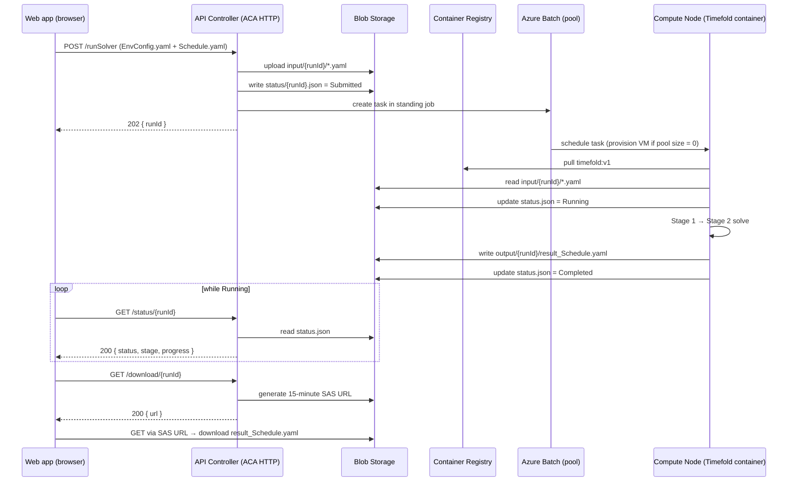

# Azure Resource & Access Requirements — Timefold Scheduler

## Project context

The Timefold scheduler is a system to optimise employee schedules from two
input YAML files. It consists of a local React webapp, an HTTP API on
Azure Container Apps, the Timefold solver running as a container on Azure
Batch, and Azure Blob Storage for all file I/O.

All resources live in a single resource group for clean ownership and
lifecycle management.

---

## 1. System overview

### 1.1 Sequence diagram (end-to-end request lifecycle)



### 1.2 Component diagram

```
                       ┌──────────┐
                       │ Web app  │
                       │ (browser)│
                       └────┬─────┘
                            │ HTTPS
                            ▼
                  ┌─────────────────────────┐
                  │ Azure Container Apps    │
                  │ (HTTP app: ca-tf-api)   │── upload input ─┐
                  │ System-assigned MI       │── create task ──┼─┐
                  └────────┬────────────────┘── read status ──┤ │
                           │ pull image                       │ │
                           ▼                                   │ │
                  ┌─────────────────────────┐                  │ │
                  │ Azure Container Registry│                  │ │
                  │ - api-controller:v1     │                  │ │
                  │ - timefold:v1           │◀──── pull image ─┼─┘
                  └─────────────────────────┘                  │
                                                                │
                  ┌─────────────────────────┐                  │
                  │ Azure Batch              │                  │
                  │  - account               │◀─────────────────┘
                  │  - pool (autoscale 0→N)  │
                  │  - user-assigned MI      │── read/write blobs ─┐
                  └─────────────────────────┘                       │
                                                                    │
                  ┌─────────────────────────┐                       │
                  │ Azure Blob Storage       │◀──────────────────────┘
                  │  - input/{runId}/        │
                  │  - output/{runId}/       │
                  │  - status/{runId}.json   │
                  └─────────────────────────┘
```

### 1.3 Why we need each Azure resource

- **Azure Blob Storage** — central store for input YAMLs (`input/{runId}/`),
  solver output YAML (`output/{runId}/`), and run status JSON
  (`status/{runId}.json`). All other components read/write here.
- **Azure Container Registry (ACR)** — private Docker registry that holds
  the two images we deploy: `api-controller` (the HTTP API) and
  `timefold` (the solver).
- **Azure Container Apps (ACA)** environment + HTTP app — serverless host
  for the API Controller. Scales to zero between calls; one app per
  environment.
- **Azure Batch** account + pool — runs the Timefold solver as a
  containerized task on auto-scaling compute VMs. Pool sits at zero nodes
  when idle; scales up when the API submits a task.
- **User-assigned Managed Identity** — the identity attached to the Batch
  pool. Lets each compute node authenticate to ACR (to pull the solver
  image) and to Blob (to read inputs / write outputs). System-assigned
  MIs are also used on the ACA app for the same pattern.

### 1.4 Subscription-level resource provider registrations

Required providers (one-time per subscription, no cost). Each `Microsoft.X`
is the namespace owned by one Azure service team; a provider must be
**registered** on the subscription before any resource of that type can be
created.

| Provider                          | What it owns                                                            | Why we need it (which resource above)                                                |
| --------------------------------- | ----------------------------------------------------------------------- | ------------------------------------------------------------------------------------ |
| `Microsoft.Storage`               | Storage accounts, blob containers, queues, tables, file shares          | Backs the Blob Storage account (resource 2.1)                                        |
| `Microsoft.Authorization`         | RBAC: role assignments, role definitions, locks                         | Required for every `az role assignment` — without it no permissions can be granted   |
| `Microsoft.App`                   | Azure Container Apps environments + HTTP apps                           | Backs the ACA environment + HTTP app (resources 2.3, 2.3.1)                          |
| `Microsoft.OperationalInsights`   | Log Analytics workspaces                                                | ACA dependency; required even when logs are disabled                                 |
| `Microsoft.ContainerRegistry`     | Azure Container Registries (ACR)                                        | Backs the ACR (resource 2.2)                                                         |
| `Microsoft.ManagedIdentity`       | User-assigned managed identities                                        | Required to create the standalone `mi-tf-pool` identity (resource 2.5)               |
| `Microsoft.Batch`                 | Batch accounts, pools, jobs, tasks                                      | Backs the Batch account + pool (resources 2.4, 2.4.1)                                |

Verification:
```bash
az provider list --query "[?contains(['Microsoft.Storage','Microsoft.Authorization','Microsoft.App','Microsoft.OperationalInsights','Microsoft.ContainerRegistry','Microsoft.ManagedIdentity','Microsoft.Batch'], namespace)].{name:namespace, state:registrationState}" -o table
```
For any provider showing `NotRegistered`:
```bash
az provider register --namespace Microsoft.<X>
```

---

## 2. Setting option detail

For each resource, only the properties that need a decision are listed.
The "Options" column shows alternatives so the choice can be reviewed.

### 2.1 Storage blob container

| Property                 | Requested value                  | Options                                                                                                |
| ------------------------ | -------------------------------- | ------------------------------------------------------------------------------------------------------ |
| Storage account name     | `sttimefoldprod<suffix>`         | Globally unique. Lowercase letters + digits only, 3–24 chars. `st` prefix is convention for "storage". |
| SKU                      | `Standard_LRS`                   | **LRS** = local (3 copies, 1 datacenter, cheapest). **ZRS** = zone-redundant (3 zones in 1 region). **GRS** / **RA-GRS** = geo-redundant (cross-region, ~2× cost). |
| Kind                     | `StorageV2`                      | **StorageV2** = current default, supports all features. Older `Storage` and `BlobStorage` kinds exist but should not be used for new accounts. |
| Access tier              | `Hot`                            | **Hot** = frequent access (highest storage cost, lowest read cost). **Cool** = infrequent (>30 days, ~50% cheaper storage but higher read cost). **Cold** = rare (>90 days). **Archive** = offline retrieval. |
| Allow public blob access | **Disabled**                     | **Disabled** = SAS URLs only (recommended). **Enabled** = containers can be made publicly readable (not used in this design). |
| Min TLS version          | `TLS1_2`                         | TLS 1.0 and 1.1 are deprecated. TLS 1.2 is the minimum modern; TLS 1.3 not yet GA on Storage.          |
| Container name           | `timefold` (private)             | "private" = no anonymous access. Any 3–63 char lowercase name allowed.                                 |

### 2.2 Azure Container Registry

| Property | Requested value             | Options                                                                                            |
| -------- | --------------------------- | -------------------------------------------------------------------------------------------------- |
| Name     | `acrtimefoldprod<suffix>`   | Globally unique. Lowercase alphanumeric, 5–50 chars. Becomes `<name>.azurecr.io`.                  |
| SKU      | `Basic`                     | **Basic** ($5/mo, 10 GB storage). **Standard** ($20/mo, 100 GB, webhooks). **Premium** ($50/mo, 500 GB, geo-replication, private endpoints). Basic is sufficient for image size and pull rate. |

### 2.3 Azure Container Apps environment

| Property         | Requested value      |
| ---------------- | -------------------- |
| Environment name | `cae-timefold-prod`  |

### 2.3.1 Azure Container Apps HTTP app

| Property         | Requested value                                  | Options                                                                                                |
| ---------------- | ------------------------------------------------ | ------------------------------------------------------------------------------------------------------ |
| App name         | `ca-tf-api`                                      | Any 2–32 char lowercase name allowed.                                                                  |
| Target port      | `8080`                                           | Any port the container listens on. Our Node API listens on 8080.                                       |
| Ingress          | External                                         | **External** = public HTTPS endpoint (Azure-managed TLS). **Internal** = reachable only inside the env. **Disabled** = no HTTP ingress. |
| Min replicas     | `0` (scale-to-zero)                              | **0** = $0 idle, ~1 s cold start on first request. **1+** = always-on (charged 24/7).                  |
| Max replicas     | `2`                                              | 1–30 typical. Cost cap — autoscale never exceeds this number of instances.                             |
| CPU / Memory     | 0.5 vCPU / 1 GiB                                 | Valid pairs: 0.25/0.5Gi, 0.5/1Gi, 0.75/1.5Gi, 1/2Gi, 1.25/2.5Gi, ... up to 4/8Gi. Pick the smallest that fits the workload. |

### 2.4 Azure Batch account

| Property              | Requested value                  | Options                                                                                            |
| --------------------- | -------------------------------- | -------------------------------------------------------------------------------------------------- |
| Name                  | `batchtimefoldprod<suffix>`      | Globally unique. Lowercase alphanumeric, 3–24 chars.                                               |
| Public network access | Enabled (AAD auth required)      | **Enabled** = reachable over public internet but every call requires AAD token. **Disabled** = private endpoint only (requires VNet setup). |

### 2.4.1 Azure Batch pool

| Property                  | Requested value                                              | Options                                                                                                |
| ------------------------- | ------------------------------------------------------------ | ------------------------------------------------------------------------------------------------------ |
| Pool ID                   | `pool-timefold-prod`                                         | Any 1–64 char alphanumeric/hyphen/underscore name.                                                     |
| VM SKU                    | `Standard_F2s_v2` (2 vCPU / 4 GiB, compute-optimized)        | **Compute-optimized (F-series):** F2s_v2 (2/4), F4s_v2 (4/8), F8s_v2 (8/16), F16s_v2 (16/32). High clock; best for single-thread solver phases. **General purpose (D-series):** D2s_v3, D4s_v3 — balanced. **HPC (HBv4, HX):** expensive, only worth it for very large parallel solves. |
| Node OS image             | `microsoft-azure-batch / ubuntu-server-container 20-04-lts`  | **ubuntu-server-container** = Ubuntu with Docker pre-installed (recommended for our container task). **windows-server-container** = Windows equivalent. |
| Target dedicated nodes    | 0                                                            | 0 = scale entirely on low-priority. Dedicated VMs guarantee availability at full price.                |
| Target low-priority nodes | 0 (autoscale 0–3 based on pending tasks)                     | Low-priority/Spot VMs are ~80% cheaper but can be evicted with 30s notice. Acceptable since cancelled runs can be re-submitted. |
| Maximum nodes             | 3                                                            | Cost safety cap. Pool will never scale above this. Adjust if more concurrent solves needed.            |
| Tasks per node            | 1                                                            | Solver is CPU-bound; sharing a node hurts both runs. Keep at 1.                                        |
| Identity                  | **User-assigned** managed identity `mi-tf-pool` (see 2.5)    | **User-assigned** is required for pools (system-assigned not supported at pool level).                 |
| Autoscale formula         | 1 node per pending task; drop idle nodes after 10 min        | Other patterns: fixed-size pool, time-of-day autoscale. Pending-task autoscale is the cheapest/most responsive for our usage. |

### 2.5 User-assigned Managed Identity (for the Batch pool)

| Property | Requested value         | Options                                                                                            |
| -------- | ----------------------- | -------------------------------------------------------------------------------------------------- |
| Name     | `mi-tf-pool`            | Any 3–128 char name.                                                                               |
| Region   | Same as resource group  | Should match the Batch pool's region to avoid cross-region latency.                                |

This identity is attached to the Batch pool. Each compute node uses it to
pull the Timefold container image from ACR and to read/write blobs.

---

## 3. vCPU quota request (Azure Batch)

New subscriptions often have **0 vCPU quota** for Batch. The quota must
be increased before any pool can scale up.

| Quota                                        | Requested value | Justification                                                       |
| -------------------------------------------- | --------------- | ------------------------------------------------------------------- |
| Batch — Total Low-priority vCPUs             | `6`             | 3 max nodes × 2 vCPU each (Standard_F2s_v2 family)                  |
| Batch — Dedicated cores per VM family (Fsv2) | `4` (optional)  | Only if dedicated (non-low-priority) VMs are ever needed for prod   |

Submitted via: Portal → **Quotas** → **Compute** → filter by subscription
+ region → find the relevant row → request increase. Typical approval
time: minutes to 48 hours.

---

## 4. RBAC role assignments required

### 4.A Project user account

| Role                                  | Scope                                  | Purpose                                                          |
| ------------------------------------- | -------------------------------------- | ---------------------------------------------------------------- |
| **Reader**                            | Resource group                          | View resources in portal / CLI                                   |
| **Storage Blob Data Contributor**     | Storage account `sttimefoldprod*`      | Upload / download / inspect blobs from CLI during debugging      |
| **AcrPush**                           | ACR `acrtimefoldprod*`                  | Push application images to the registry                          |
| **Container Apps Contributor**        | ACA app `ca-tf-api`                     | Deploy new revisions of the API (image updates)                  |
| **Azure Batch Account Contributor**   | Batch account `batchtimefoldprod*`     | Submit and terminate Batch tasks during testing                  |

`Owner` and `User Access Administrator` are explicitly **not** required.

### 4.B ACA app's system-assigned Managed Identity

After the ACA app `ca-tf-api` is created, it has a system-assigned
Managed Identity (auto-generated). That identity requires:

| Role                                  | Scope                                  | Purpose                                                          |
| ------------------------------------- | -------------------------------------- | ---------------------------------------------------------------- |
| **Storage Blob Data Contributor**     | Storage account `sttimefoldprod*`      | API reads/writes input, output, and status blobs                 |
| **AcrPull**                           | ACR `acrtimefoldprod*`                  | ACA pulls the API image on deploy and cold-start                 |
| **Azure Batch Account Contributor**   | Batch account `batchtimefoldprod*`     | API creates / terminates Batch tasks via REST                    |

### 4.C Batch pool's user-assigned Managed Identity (`mi-tf-pool`)

| Role                                  | Scope                                  | Purpose                                                          |
| ------------------------------------- | -------------------------------------- | ---------------------------------------------------------------- |
| **Storage Blob Data Contributor**     | Storage account `sttimefoldprod*`      | Compute nodes read input YAMLs, write output YAML and status.json |
| **AcrPull**                           | ACR `acrtimefoldprod*`                  | Compute nodes pull the Timefold container image                  |

**Total RBAC assignments: 10** (5 user + 3 ACA MI + 2 Pool MI).

Assignment locations:
- ACA app's MI principal ID — portal → ACA app `ca-tf-api` → **Identity** (left sidebar) → System assigned → Object (principal) ID
- Pool MI principal ID — portal → Managed Identity `mi-tf-pool` → Overview → Object (principal) ID

---

## 5. Information required after provisioning

To deploy the application code, the following values are needed:

1. Subscription ID (GUID)
2. Resource group name
3. Storage account name (final globally-unique name chosen)
4. Container name (`timefold` unless changed)
5. ACR name + login server (e.g. `acrtimefoldprodxyz` / `acrtimefoldprodxyz.azurecr.io`)
6. ACA environment name + ACA app name
7. ACA app public URL (the full `https://...azurecontainerapps.io` ingress endpoint)
8. Batch account name + URL (e.g. `batchtimefoldprodxyz` / `https://batchtimefoldprodxyz.<region>.batch.azure.com`)
9. Batch pool ID (`pool-timefold-prod`)
10. User-assigned MI name + resource ID (`mi-tf-pool` and its `/subscriptions/.../mi-tf-pool` resource ID)
11. Region used
12. Confirmation that all five user roles in section 4.A are assigned
13. Confirmation that all three ACA-MI roles in section 4.B are assigned
14. Confirmation that both Pool-MI roles in section 4.C are assigned
15. Confirmation that the Batch vCPU quota has been increased
