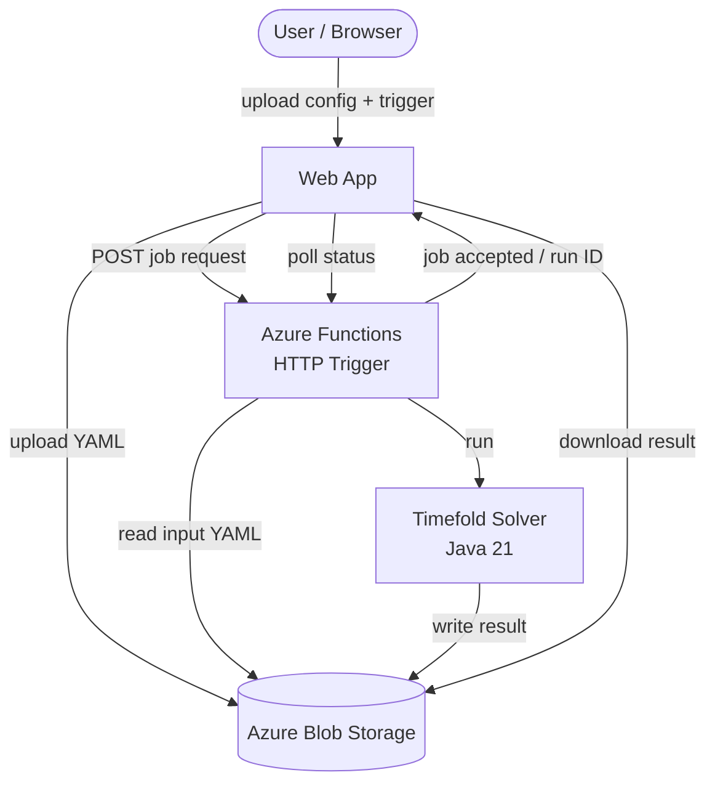
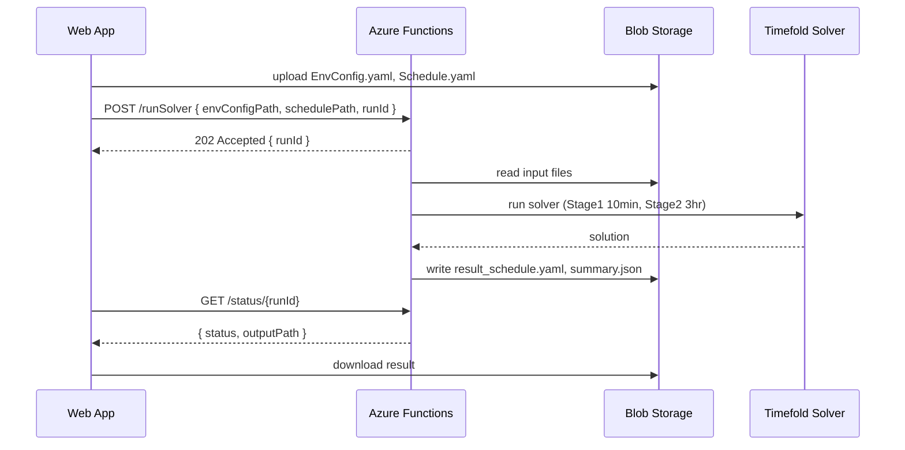
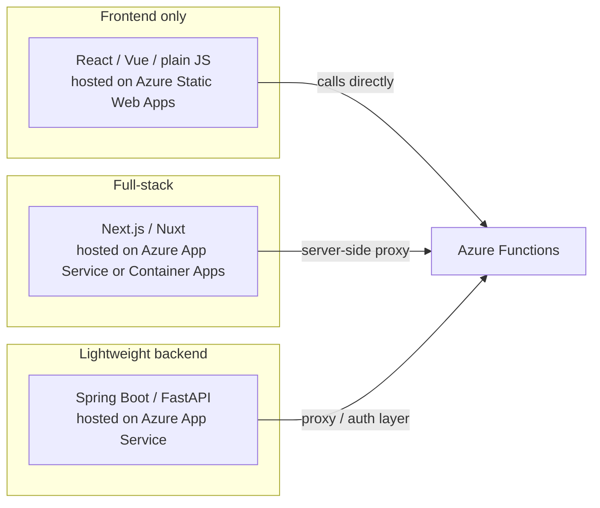
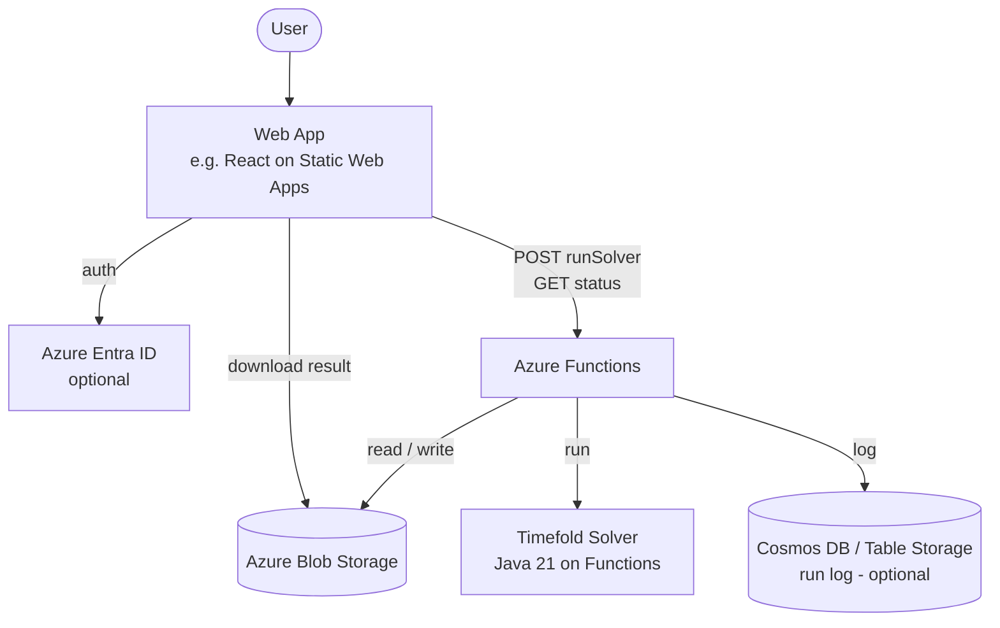

# Azure Functions Design — Timefold Scheduler

  

---

  

## Overall Architecture

  



  

---

  

## 1. Java Version

  

| Item | Value |

|---|---|

| Local Java | 24.0.2 |

| Azure Functions target | **Java 21** |

| Timefold Solver 1.x | Java 17 or 21 |

| Timefold Solver 2.x | Java 21 required |

| Java 22 / 23 / 24 on Azure Functions | Not supported as runtime target |

  

Required `pom.xml` settings:

  

```xml

<properties>

  <maven.compiler.source>21</maven.compiler.source>

  <maven.compiler.target>21</maven.compiler.target>

</properties>

  

<!-- Azure Functions Maven Plugin -->

<javaVersion>21</javaVersion>

```

  

---

  

## 2. HTTP Trigger Flow

  



  

- The Function returns `202 Accepted` immediately — the user does not wait for solve to finish

- The web app polls `/status/{runId}` to check completion

- Parallel runs use separate `runId` folders in Blob Storage

  

---

  

## 3. Input File Handling

  

Three options — Blob path method is recommended:

  

| Method | How | Good for | Watch out |

|---|---|---|---|

| YAML in HTTP body | Send file content directly in POST | Small test / dev | Not suited for large files |

| **Blob Storage paths** | Upload files first, pass paths in POST | **Production** | Needs Blob read/write logic |

| JSON payload | Send data as JSON instead of YAML | Frontend-friendly | Requires changing Java parsing |

  

Recommended request body:

  

```json

{

  "envConfigPath": "input/EnvConfig.yaml",

  "schedulePath":  "input/Schedule.yaml",

  "runId":         "run-20260428-001"

}

```

  

---

  

## 4. Blob Storage Layout

  

```

blob-container/

├── input/

│   ├── EnvConfig.yaml

│   └── Schedule.yaml

└── output/

    ├── run-20260428-001/

    │   ├── result_schedule.yaml

    │   └── summary.json

    └── run-20260428-002/

        ├── result_schedule.yaml

        └── summary.json

```

  

- Each run gets its own folder — no overwrite conflicts between parallel runs

- Summary JSON holds score, violation list, and top-level stats (small, safe to return in HTTP response)

  

---

  

## 5. Azure Function — Code Skeleton

  

```java

@FunctionName("runSolver")

public HttpResponseMessage runSolver(

    @HttpTrigger(

        name = "req",

        methods = {HttpMethod.POST},

        authLevel = AuthorizationLevel.FUNCTION

    )

    HttpRequestMessage<Optional<String>> request,

    final ExecutionContext context

) {

    // 1. Parse runId, envConfigPath, schedulePath from request body

    // 2. Read YAML files from Blob Storage

    // 3. Run EmployeeSchedule solver (Stage1 + Stage2)

    // 4. Write result to Blob Storage under output/{runId}/

    // 5. Return { status, outputPath }

  

    return request.createResponseBuilder(HttpStatus.ACCEPTED)

        .body("{\"status\":\"running\",\"runId\":\"...\"}")

        .build();

}

```

  

---

  

## 6. Web Server Options for the Web App

  

The web app sits in front of Azure Functions — it handles the UI and delegates all heavy work to Functions + Blob.

  



  

| Option | Stack | Host | Best when |

|---|---|---|---|

| Azure Static Web Apps | React / Vue / plain JS | Azure Static Web Apps | UI only, Functions handle all logic |

| Next.js / Nuxt | JS full-stack | Azure App Service | Need server-side rendering or API routes |

| Spring Boot | Java | Azure App Service / Container Apps | Java team, want one language end-to-end |

| FastAPI | Python | Azure App Service / Container Apps | Python team, quick REST layer |

  

**Simplest path:** React SPA on Azure Static Web Apps calling Azure Functions directly.

- Static Web Apps has a built-in `/api` proxy to Functions — no CORS setup needed

- No server to manage

  

**If auth / session is needed:** add Azure AD (Entra ID) — both Static Web Apps and App Service support it with minimal config.

  

---

  

## 7. Full Stack Summary

  



  

---

  

## Key Constraints to Remember

  

- Azure Functions has a default timeout of 5 min (Consumption plan) — the Stage 2 solve is 3 hr, so use **Premium plan** or **Dedicated (App Service) plan** with `functionTimeout` set

- Memory: Timefold holds the full model in heap — monitor and set appropriate App Service plan size

- Cold start: Java Functions have noticeable cold start — consider **always-on** setting or Premium plan for production