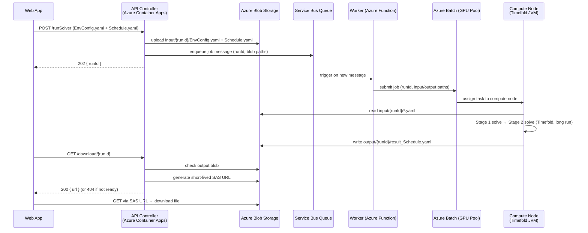

## Architecture (Azure)

  

### Azure batch

  
  



  

### Azure Container app job

  

  ```mermaid

  sequenceDiagram

  

  

    participant W as Web App

  

    participant API as API Controller<br/>(Azure Container Apps)

  

    participant BLOB as Azure Blob Storage

  

    participant SB as Service Bus Queue

  

    participant JOB as ACA Job<br/>(Event-driven / Timefold JVM)

  

  

    W->>API: POST /runSolver (EnvConfig.yaml + Schedule.yaml)

  

  

    API->>BLOB: upload input/{runId}/EnvConfig.yaml + Schedule.yaml

  

    API->>SB: enqueue job message (runId, blob paths)

  

    API-->>W: 202 { runId }

  

  

    SB->>JOB: trigger job (via KEDA event-driven scaling)

  

  

    JOB->>BLOB: read input/{runId}/*.yaml

  

    JOB->>JOB: Stage 1 solve → Stage 2 solve (Timefold, long run)

  

    JOB->>BLOB: write output/{runId}/result_Schedule.yaml

  

  

    W->>API: GET /download/{runId}

  

  

    API->>BLOB: check output blob

  

    API->>BLOB: generate short-lived SAS URL

  

    API-->>W: 200 { url } (or 404 if not ready)

  

  

    W->>BLOB: GET via SAS URL → download file

  ```

  

### Comparison: ACA Jobs vs Azure Batch

  

The two diagrams above describe the same end-to-end shape — the only real difference is

**how the queue message gets turned into a running solver**.

  

| Dimension                            | **Azure Container Apps Jobs**                                                          | **Azure Batch**                                                                                    |

| ------------------------------------ | -------------------------------------------------------------------------------------- | -------------------------------------------------------------------------------------------------- |

| Native Service Bus trigger           | **Yes** — KEDA Service Bus scaler is built in; queue → job execution directly          | **No** — needs an external trigger (Function, Logic Apps Standard, or an always-on ACA worker) to call Batch's REST/SDK |

| Max runtime per execution            | `replicaTimeout` configurable up to **7 days**                                         | Effectively **unlimited**                                                                          |

| Compute model                        | Serverless container, **scale to zero** between runs                                   | Managed **VM pool** (Linux/Windows); you pick the SKU                                              |

| VM / SKU choice                      | vCPU + memory only (no GPU, no HPC SKUs)                                               | Full VM catalog incl. **Fsv2/Fasv6** (compute-optimized) and **HBv4** (HPC)                        |

| Parallelism model                    | One job execution per message; concurrency knob                                        | First-class **job/task** model — thousands of tasks per pool                                       |

| Idle cost                            | $0 (scale to zero)                                                                     | Pool VMs cost while allocated (auto-scale to 0 possible, extra setup)                              |

| Setup complexity                     | **Low** — same Container Apps environment as the API controller                        | **Higher** — Batch account, pools, autoscale formula, app packages                                 |

| Needs Azure Function in the pipeline | **No**                                                                                 | **Yes** (or a non-Function substitute — see below)                                                 |

| Best when…                           | Up to "a few" concurrent runs, moderate CPU, simplest ops                              | Heavy concurrent solves, specialized SKUs, big batch workloads                                     |

| Cost (4 vCPU × 8 hr)                 | ~$1.60                                                                                 | ~$1.50 (similar; pool overhead may add a bit)                                                      |

  

**Recommendation for this project:** start with **ACA Jobs** — KEDA gives you the event

listener for free, scale-to-zero, the same environment as the API controller, and no

Function in the loop. Move to Batch later only if you need many parallel solves or a

specialized VM SKU.

  

#### Triggering Azure Batch without an Azure Function

  

The "no Azure Functions" rule was about **compute** — Functions can't host an 8 hr solve.

A *trigger* Function (seconds of work to read a message and call Batch) doesn't hit that

limit and is genuinely fine. If you want to keep Functions out entirely, the realistic

non-Function triggers for the Batch path are:

  

- **Logic Apps Standard** — built-in Service Bus trigger + HTTP action calling the Batch REST API. No code to write.

- **Always-on ACA HTTP/worker app** — runs a Service Bus SDK listener and calls Batch via SDK. Custom code, no Functions.

- **Skip Service Bus entirely** — the API controller (`POST /runSolver`) calls Batch directly. Service Bus only earns its place when you want buffering, retries, or burst smoothing.

  

The same "skip Service Bus" shortcut also works for ACA Jobs (the API can start a job

execution directly); the queue is purely a buffering/throttling layer in either path.

  

### Azure service mapping

  
  

| Layer              | Azure product                       | Role                                                                                         |

| ------------------ | ----------------------------------- | -------------------------------------------------------------------------------------------- |

| **API controller** | **Azure Container Apps** (HTTP app) | Receives submit/download calls, uploads inputs, starts the solver job, mints download links. |

| **Storage**        | **Azure Blob Storage**              | Holds `input/{runId}/` and `output/{runId}/`. Download = SAS URL straight to the browser.    |

| **Compute job**    | **Azure Container Apps Jobs** *(recommended)* — fallback **Azure Batch** for heavy / specialized workloads | Runs the Timefold JVM container to completion, scale-to-zero between runs.                   |

  
  

---

  

## Compute options

  

### 1. Azure Container Apps Job

  

- Serverless **manual/scheduled jobs** designed to run a container to completion.

- `replicaTimeout` is configurable up to **7 days** — comfortably covers an 8 hr solve.

- Scales to zero between runs (pay only while solving); one execution per run, isolated.

- Same platform as the API controller → one environment, simplest ops.

  

### 2. Azure Container Instances (ACI) — *simple alternative*

  

- Launch a single container per run; it runs until the process exits (**no hard timeout**).

- Per-second billing; create with `az container create`, container exits when the solve finishes.

- Slightly more to wire up

  

### 3. Azure Batch — *for heavy / many parallel solves*

  

- Purpose-built for large-scale batch compute; pools of VMs, queue of tasks, no runtime cap.

- Best if  later run many solves in parallel or need bigger VM SKUs.

- Heaviest to set up

  

### 4.Azure Virtual Machines

  

Just spin up a VM, install JDK 21+, deploy app, and run it. Pick a **compute-optimized SKU** since solving is CPU-bound:

  

- **Fsv2-series** or **Fasv6-series** — high CPU clock, good for single-threaded solver phases

- **HBv4 / HX-series** —

  

  

---

  

  

## API controller options (Azure)

  

| Option                   | Notes                                                                                                |

| ------------------------ | ---------------------------------------------------------------------------------------------------- |

| **Azure Container Apps** | Serverless HTTP container; same environment as the solver job; scale-to-zero; easy Managed Identity. |

| **Azure App Service**    | Fully managed always-on host; good                                                                   |

| **Azure API Management** | API gateway for auth, rate-limiting, keys —                                                          |

  

---

  

  

## Storage options (Azure)

  

| Option                 | Notes                                                          |

| ---------------------- | -------------------------------------------------------------- |

| **Azure Blob Storage** | Cheap, durable object storage. <br>No server streaming needed. |

| **Azure Files**        |                                                                |

  

### Blob layout

  

  

```

  

https://<account>.blob.core.windows.net/timefold/

  

├── input/

  

│   └── {runId}/

  

│       ├── EnvConfig.yaml

  

│       └── Schedule.yaml

  

└── output/

  

    └── {runId}/

  

        └── result_Schedule.yaml

  

```

  

  

`{runId}` matches the run folder in the web app (e.g. `20260521`).

  

  

---

  

  

## HTTP API design (no status endpoint)

  

  

A thin REST wrapper on the API controller. Note there is **no `/status`** — we don't track status.

  

  

### POST /runSolver

  

Uploads the two YAML files to `input/{runId}/` and starts the solver job.

  

  

```jsonc

  

// Request: multipart/form-data with runId + the two YAML files

  

// (or JSON if the files are already in Blob)

  

  

// Response 202

  

{ "runId": "20260521" }

  

```

  

  

### GET /download/{runId}

  

Checks whether `output/{runId}/result_Schedule.yaml` exists.

  

  

```jsonc

  

// 200 — ready: a short-lived (e.g. 15 min) SAS URL the browser downloads directly

  

{ "url": "https://<account>.blob.core.windows.net/timefold/output/20260521/result_Schedule.yaml?<sas>" }

  

  

// 404 — not ready yet (solver still running or never run)

  

{ "ready": false }

  

```

  

  

That's the whole contract: **submit a run**, and **download the output when it's there**.

  

The web app's *Fetch Result* / *Download* button calls `GET /download/{runId}`; on `200` it

  

follows the SAS URL to save the file locally, on `404` it stays disabled.

  

  

---

  

  

## Cost (rough, per 8 hr solve)

  

  

| Component            | Azure product           | Approx. cost / run | Notes |

  

| -------------------- | ----------------------- | ------------------ | ----- |

  

| Compute              | Container Apps Job (4 vCPU / 8 GB) | ~$1.60 | Billed only while solving; scale-to-zero idle. |

  

| Storage              | Blob Storage            | pennies | A few MB of YAML per run + minimal egress on download. |

  

| API controller       | Container Apps (HTTP)   | ~$0 idle | Scale-to-zero; trivial cost for occasional calls. |

  

  

Total ≈ **$1.50–$2.00 per run**, dominated by compute time.

  

  

---

  

  

## Why this shape

  

  

- **Container Apps Jobs** removes the Functions timeout problem while staying serverless.

  

- **Blob + SAS** makes "download to local" a single client-side fetch — no DB, no app server in the data path.

  

- **Dropping status tracking** removes an entire stateful component (and its cost/ops): the

  

  presence of the output blob is the only signal we need.