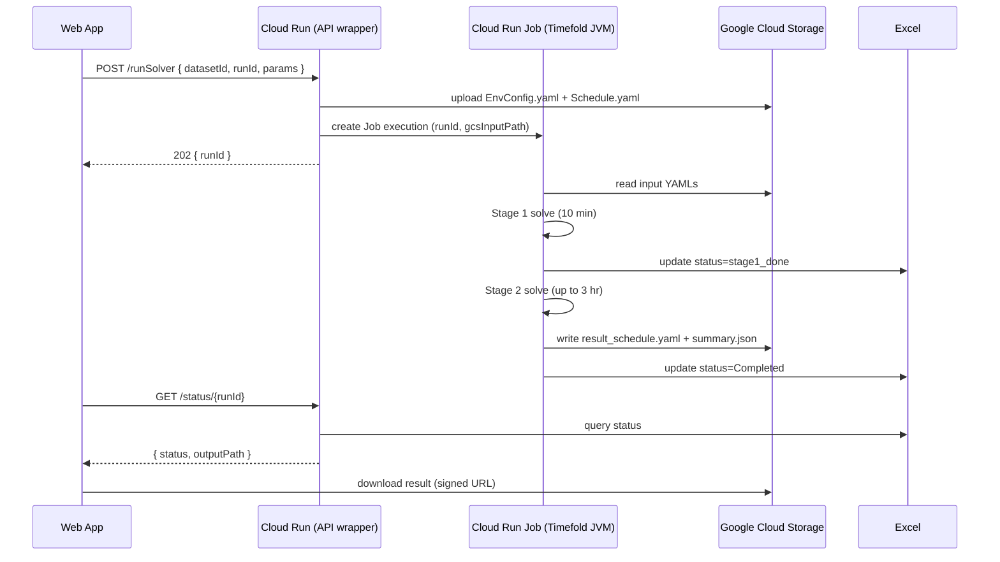
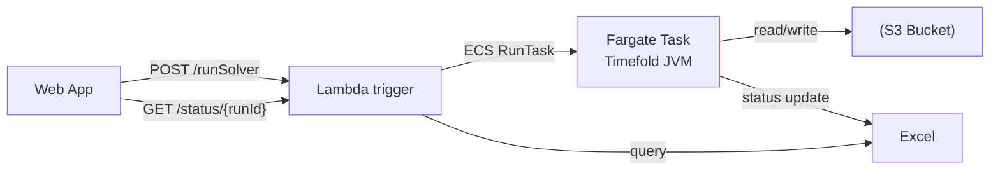
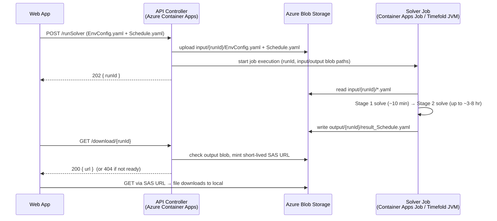

# Solver Execution Pipeline


The Timefold solver (Java 21) needs an external compute host — it can run for up to 8 hours per Stage 2 solve. Azure Functions are excluded (timeout limits). Below are recommended options.


---
## GCP Cloud Run Jobs




  

### Why Cloud Run Jobs


| Feature      | Detail                                                      |
| ------------ | ----------------------------------------------------------- |
| Max run time | **24 hours** (no timeout problem)                           |
| Scaling      | Each job = isolated container; parallel runs by default     |
| Java support | Any JDK version in a Docker image                           |
| Pricing      | ~$0.00002400/vCPU-sec; 8 hr × 2 vCPU ≈ **$1.38/run**        |
| Storage      | Google Cloud Storage (GCS) — cheap, durable, signed URLs    |
| Status       | Firestore — real-time updates, free tier covers small usage |

  

### GCS Layout

  

```

gs://timefold-scheduler/

├── input/

│   └── {runId}/

│       ├── EnvConfig.yaml

│       └── Schedule.yaml

└── output/

    └── {runId}/

        ├── result_schedule.yaml

        └── summary.json

```

  

---

  

## Alternative: AWS ECS Fargate

  



  


| Feature      | Detail                                           |
| ------------ | ------------------------------------------------ |
| Max run time | No hard cap on Fargate task duration             |
| Memory       | Up to 120 GB per task                            |
| Pricing      | ~$0.04048/vCPU-hr; 4 vCPU × 8 hr ≈ **$1.30/run** |
  

Fargate is a solid AWS-native alternative if the team is already on AWS.

  

---

  

## Alternative: Fly.io Machines

  

- Spin up a machine on demand for each run, auto-stop when done

- Max 24 hr machine lifetime per run

- Simpler ops than ECS; good for smaller teams

- ~$0.078/CPU-hr on `performance-4x` → 8 hr × 4 CPU ≈ **$2.50/run**

  

```bash

flyctl machine run \

  --image registry.fly.io/timefold-solver \

  --vm-memory 8192 \

  --vm-cpu-kind performance \

  --vm-cpus 4 \

  --env RUN_ID=run-001 \

  --env GCS_BUCKET=timefold-scheduler \

  --restart no

```

  

---

  

## HTTP API Design (solver wrapper)

  

A thin REST wrapper (Spring Boot or FastAPI) deployed on Cloud Run (always-on) handles job coordination.

  

### POST /runSolver

```json

Request:

{

  "runId": "run-20260428-001",

  "datasetId": "2025SU_OTHER",

  "envConfigPath": "input/run-20260428-001/EnvConfig.yaml",

  "schedulePath":  "input/run-20260428-001/Schedule.yaml",

  "solveDurationMinutes": 180,

  "allowOvertime": false

}

  

Response 202:

{

  "runId": "run-20260428-001",

  "status": "Queued"

}

```

  

### GET /status/{runId}

```json

Response:

{

  "runId": "run-20260428-001",

  "status": "Completed",

  "startedAt": "2026-04-28T09:00:00Z",

  "finishedAt": "2026-04-28T12:10:00Z",

  "outputPath": "output/run-20260428-001/",

  "hardScore": 0,

  "softScore": -142

}

```

  

### GET /download/{runId}/{file}

Returns a signed GCS URL (valid 1 hour) for downloading `result_schedule.yaml` or `summary.json`.

  

---

  

## Cost Summary

  

| Platform             | vCPU | Memory | 8 hr run | Notes                                 |
| -------------------- | ---- | ------ | -------- | ------------------------------------- |
| GCP Cloud Run Jobs   | 4    | 8 GB   | ~$1.40   | Recommended                           |
| AWS ECS Fargate      | 4    | 16 GB  | ~$1.30   | AWS-native                            |
| Fly.io Machines      | 4    | 8 GB   | ~$2.50   | Simple ops                            |
| Azure Container Apps | 4    | 8 GB   | ~$1.60   | Azure-native alternative to Functions |

  

| Category              | AWS                             | GCP                           |
| --------------------- | ------------------------------- | ----------------------------- |
| **Frontend**          | Web App                         | Web App                       |
| **API layer**         | Lambda                          | Cloud Run (HTTP service)      |
| **Compute job**       | ECS Fargate Task                | Cloud Run Job                 |
| **Trigger job**       | `RunTask`                       | Job execution                 |
| **Container runtime** | ECS/Fargate                     | Cloud Run                     |
| **File storage**      | S3                              | Google Cloud Storage (GCS)    |
| **Database (status)** | Excel                           | Excel                         |
| **Scaling model**     | Manual task per request         | Fully managed job per request |
| **Max runtime**       | Essentially unlimited           | Up to 24 hours                |
| **Pricing model**     | per vCPU/sec (Fargate) + Lambda | per vCPU/sec (Cloud Run)      |
| **Complexity**        | Higher (ECS configs, roles)     | Simpler (less setup)          |
| **Integration**       | Strong AWS ecosystem            | Strong GCP ecosystem          |
| **Best for**          | AWS-native systems              | Simpler serverless pipelines  |

  
## Architecture (recommended)

  



  

### Azure service mapping

  

| Layer              | Azure product (recommended)        | Role |

| ------------------ | ---------------------------------- | ---- |

| **API controller** | **Azure Container Apps** (HTTP app) | Receives submit/download calls, uploads inputs, starts the solver job, mints download links. |

| **Storage**        | **Azure Blob Storage**             | Holds `input/{runId}/` and `output/{runId}/`. Download = SAS URL straight to the browser. |

| **Compute job**    | **Azure Container Apps Jobs**      | Runs the Timefold JVM container to completion, scale-to-zero between runs. |

  

---

  

## Compute options (no Azure Functions)

  

The solver is long-running and CPU-bound. These Azure services can host it; pick one.

  

### 1. Azure Container Apps  — *recommended*

- Serverless **manual/scheduled jobs** designed to run a container to completion.

- `replicaTimeout` is configurable up to **7 days** — comfortably covers an 8 hr solve.

- Scales to zero between runs (pay only while solving); one execution per run, isolated.

- Started from the API via the Azure SDK/REST (`jobs start`), passing `runId` + blob paths as env vars.

- Same platform as the API controller → one environment, simplest ops.

  

### 2. Azure Container Instances (ACI) — *simple alternative*

- Launch a single container per run; it runs until the process exits (**no hard timeout**).

- Per-second billing; create with `az container create`, container exits when the solve finishes.

- Slightly more to wire up (lifecycle/cleanup) than Container Apps Jobs.

  

### 3. Azure Batch — *for heavy / many parallel solves*

- Purpose-built for large-scale batch compute; pools of VMs, queue of tasks, no runtime cap.

- Best if you later run many solves in parallel or need bigger VM SKUs.

- Heaviest to set up (pools, job/task model); overkill for a handful of runs.

  
  
### 4.Azure Virtual Machines (simplest)

Just spin up a VM, install JDK 21+, deploy app, and run it. Pick a **compute-optimized SKU** since solving is CPU-bound:

- **Fsv2-series** or **Fasv6-series** — high CPU clock, good for single-threaded solver phases
- **HBv4 / HX-series** — if you have huge problems and want to parallelize aggressively

  

---

  

## API controller options (Azure)

  

The controller is a small HTTP service (e.g. Spring Boot or Node/Express) in a container.

  

| Option                              | Notes |

| ----------------------------------- | ----- |

| **Azure Container Apps** *(recommended)* | Serverless HTTP container; same environment as the solver job; scale-to-zero; easy Managed Identity. |

| **Azure App Service** (Web App for Containers / code) | Fully managed always-on host; good if you prefer App Service tooling and slots. |

| **Azure API Management** *(optional, in front)* | API gateway for auth, rate-limiting, keys — layer over either option above if needed. |

  

It uses a **Managed Identity** to (a) read/write Blob Storage and (b) start the Container Apps Job —

no secrets in code.

  

---

  

## Storage options (Azure)

  

| Option                         | Notes |

| ------------------------------ | ----- |

| **Azure Blob Storage** *(recommended)* | Cheap, durable object storage. The *Download* button gets a short-lived **SAS URL** and the browser downloads the output blob directly to local — no server streaming needed. |

| **Azure Files** *(alternative)* | SMB/NFS file share; pick this only if a job or VM needs to **mount** the folder like a local disk. |

  

### Blob layout

  

```

https://<account>.blob.core.windows.net/timefold/

├── input/

│   └── {runId}/

│       ├── EnvConfig.yaml

│       └── Schedule.yaml

└── output/

    └── {runId}/

        └── result_Schedule.yaml

```

  

`{runId}` matches the run folder in the web app (e.g. `20260521`).

  

---

  

## HTTP API design (no status endpoint)

  

A thin REST wrapper on the API controller. Note there is **no `/status`** — we don't track status.

  

### POST /runSolver

Uploads the two YAML files to `input/{runId}/` and starts the solver job.

  

```jsonc

// Request: multipart/form-data with runId + the two YAML files

// (or JSON if the files are already in Blob)

  

// Response 202

{ "runId": "20260521" }

```

  

### GET /download/{runId}

Checks whether `output/{runId}/result_Schedule.yaml` exists.

  

```jsonc

// 200 — ready: a short-lived (e.g. 15 min) SAS URL the browser downloads directly

{ "url": "https://<account>.blob.core.windows.net/timefold/output/20260521/result_Schedule.yaml?<sas>" }

  

// 404 — not ready yet (solver still running or never run)

{ "ready": false }

```

  

That's the whole contract: **submit a run**, and **download the output when it's there**.

The web app's *Fetch Result* / *Download* button calls `GET /download/{runId}`; on `200` it

follows the SAS URL to save the file locally, on `404` it stays disabled.

  

---

  

## Cost (rough, per 8 hr solve)

  

| Component            | Azure product           | Approx. cost / run | Notes |

| -------------------- | ----------------------- | ------------------ | ----- |

| Compute              | Container Apps Job (4 vCPU / 8 GB) | ~$1.60 | Billed only while solving; scale-to-zero idle. |

| Storage              | Blob Storage            | pennies | A few MB of YAML per run + minimal egress on download. |

| API controller       | Container Apps (HTTP)   | ~$0 idle | Scale-to-zero; trivial cost for occasional calls. |

  

Total ≈ **$1.50–$2.00 per run**, dominated by compute time.

  

---

  

## Why this shape

  

- **Container Apps Jobs** removes the Functions timeout problem while staying serverless.

- **Blob + SAS** makes "download to local" a single client-side fetch — no DB, no app server in the data path.

- **Dropping status tracking** removes an entire stateful component (and its cost/ops): the

  presence of the output blob is the only signal we need.