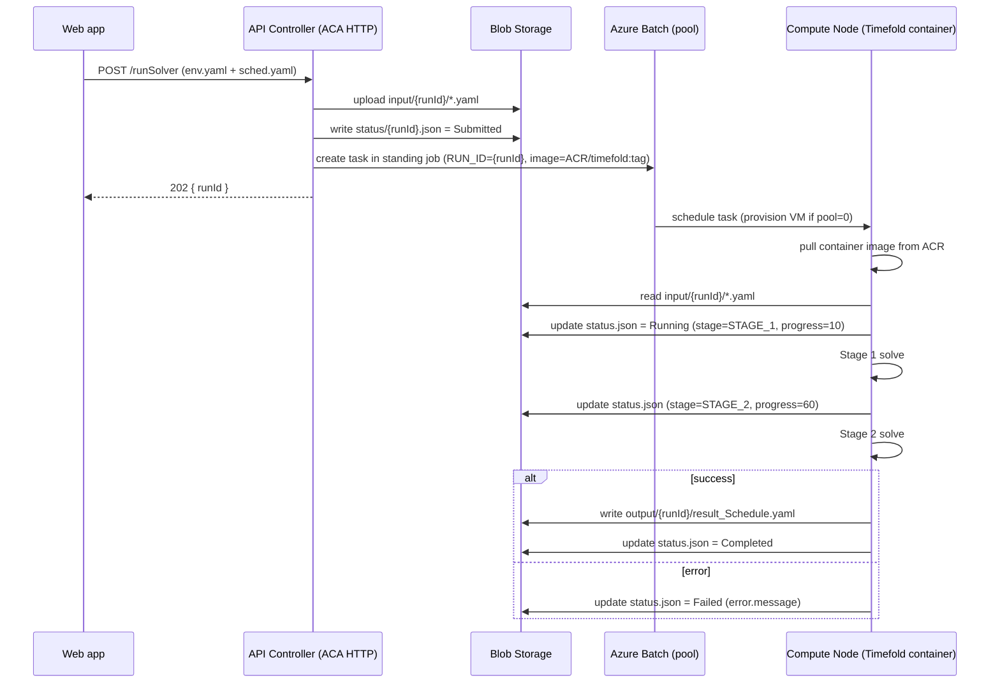

# YWT共有（2026-07-28）

・各自のYWT共有
行った作業が以下のどれに当たるか意識して書いてください。
コーディングの高速化と自動化／テストコード、リファクタリングでの品質向上／設計・レビュー支援／ドキュメント作成とコード理解／新技術の学習と技術調査／エージェントによる作業代行

---

## やったこと（Y）

### ① コーディングの高速化と自動化

コード内にコメントセクションと全体設計を記述し、GitHub Copilotがそれらのファイルを読み取った上で、コメントの指示内容に沿ったコードを生成できるようにしました。

例（GanttChartEditorでの実際のコード例：`hooks/useIncomingGanttTransfer.ts`）：

コメントで先に仕様を書いた状態（実装前）

```typescript
// Consumes a ?incomingTransfer=<token> query param set by SchedulerWeb's
// 結果を表示 / コピーファイル表示 buttons, fetching the payload from
// SchedulerWeb's own dev server (cross-origin) and loading it into the editor.
export function useIncomingGanttTransfer() {
  // TODO
}
```

Copilotがコメントを読み取って生成したコード

```typescript
export function useIncomingGanttTransfer() {
  const { dispatch } = useAppContext();

  useEffect(() => {
    const params = new URLSearchParams(window.location.search);
    const token = params.get('incomingTransfer');
    if (!token) return;

    // Strip the query param immediately so a refresh/back doesn't re-trigger it.
    const url = new URL(window.location.href);
    url.searchParams.delete('incomingTransfer');
    window.history.replaceState({}, '', url.toString());

    (async () => {
      try {
        const res = await fetch(`${SCHEDULER_WEB_URL}/api/handoff/consume/${token}`);
        const data = await res.json().catch(() => ({}));
        if (!res.ok || !data.ok) {
          throw new Error(data.error ?? `HTTP ${res.status}`);
        }
        const envConfig = parseEnvConfigYaml(data.envYaml);
        const schedule = parseScheduleYaml(data.scheduleYaml);
        dispatch({
          type: 'LOAD_FILES',
          payload: { envConfig, schedule, envPath: 'EnvConfig.yaml', schedulePath: 'Schedule.yaml' },
        });
      } catch (e) {
        dispatch({ type: 'SET_ERROR', payload: `計画管理ツールからのデータ受信に失敗しました: ${String((e as Error).message ?? e)}` });
      }
    })();
  }, [dispatch]);
}
```

「誰が発行したクエリパラメータか」「どこから取得するか」「取得後に何をするか」までコメントに書いておいたことで、その仕様通りの実装が生成されました。

---

### ② テストコード、リファクタリングでの品質向上

実装するアプリの要件や挙動をドキュメント化し、Copilotに読み込ませることで、CypressやJestを使ったテストコードの生成、およびテストケースの提案を行ってもらいました。

例（GanttChartEditorの「ワーカービュー」機能。実際に存在するテストファイルからの抜粋）：

先に文章化した要件

- ワーカービューには、割付（assignment）を持つ作業者だけでなく、割付がなくても不可日（unavailable dates）を持つ作業者も行として表示する。
- 各日付セルは、その作業者のその日の状態（work／unavailable）に応じて正しく分類される。
- 日付ヘッダーは月ごとにグループ化される。
- 同じ作業者の連続する2つの割付は、1本のバーに結合されず、別々のバーとして描画される。

Jestユニットテスト（実在する `__tests__/gantt/workerViewModel.test.ts` からの抜粋）

```typescript
describe('buildWorkerTimelineModel', () => {
  let model: ReturnType<typeof buildWorkerTimelineModel>;

  beforeEach(() => {
    model = buildWorkerTimelineModel(ENV, SCHEDULE, DATES, '2025-09-01');
  });

  it('includes workers with unavailable dates even without assignments', () => {
    const ids = model.rows.map(r => r.workerId);
    expect(ids).toContain('w003');
  });

  it('fills unavailable day cells for w003', () => {
    const carolRow = model.rows.find(r => r.workerId === 'w003')!;
    const sep3Index = DATES.indexOf('2025-09-03');
    expect(carolRow.dayCells[sep3Index].kind).toBe('unavailable');
  });

  it('generates correct month groups', () => {
    expect(model.monthGroups).toHaveLength(1);
    expect(model.monthGroups[0].label).toBe('9月');
    expect(model.monthGroups[0].span).toBe(5);
  });
});
```

Cypress e2eテスト（実在する `cypress/e2e/03_worker_view_filter.cy.ts` からの抜粋）

```typescript
describe('03 – Worker View Filter Bar', () => {
  beforeEach(loadApp);

  it('bar name search input is visible and writable', () => {
    cy.get('input[placeholder*="バー名"]').should('be.visible').type('SU-1001');
    cy.get('input[placeholder*="バー名"]').should('have.value', 'SU-1001');
  });

  it('装置 chip opens a dropdown with searchable options', () => {
    cy.contains('button', '装置').click();
    cy.contains('SU-1001').should('be.visible');
    cy.contains('SU-1002').should('be.visible');
  });

  it('clicking クリア resets bar name filter', () => {
    cy.get('input[placeholder*="バー名"]').type('nonexistent');
    cy.contains('クリア').click();
    cy.get('input[placeholder*="バー名"]').should('have.value', '');
  });
});
```

要件を先に言語化してからテストを依頼したことで、「割付がなく不可日だけ持つ作業者」のような自分では見落としがちなケースも、提案されたテストケースに最初から含まれていました。

---

### ③ 設計・レビュー支援

現在担当しているタスクのWebワークフローやAPI設計についてAIにレビューしてもらい、アーキテクチャ上の改善点や修正案を提示してもらいました。

例：現在のGanttChartEditorは、ASさんから引き継いだ以前のバージョンをベースに作り直したもので、状態がずれる・一部のダイアログの変更が保存されないなど、いくつか不安定な挙動がありました。コードを一行ずつ読む代わりに、Copilot Chatに全体アーキテクチャの要約と、再利用できそうな部分／バグが出やすそうな部分の指摘を依頼しました。

実際に投げたプロンプト例

```text
Read through this project's context/ and services/ folders.
Summarize the state management pattern, then list which parts
look safe to reuse as-is in a rewrite, and which parts look
bug-prone or too tightly coupled.
```

これにより、Context + `useReducer` の状態管理パターンとYAMLの読み込み・書き出しの流れの要約と、「そのまま再利用してよい部分」と「書き直すべき部分」の切り分けが得られました。具体的には、YAMLの読み書き部分（`services/yamlService.ts`）はそのまま流用し、バーのドラッグ／リサイズの状態管理とビューフィルターの状態は、最も不安定で密結合になっていた部分として書き直す、という判断につながり、それが実際のリライト計画のたたき台になりました。

---

### ④ ドキュメント作成とコード理解

ドキュメント作成時に、Mermaid記法を使った図（フローチャートや構成図など）をAIに生成してもらい、Markdown内に組み込みました。

例（実在するドキュメント `documents/SchedulerWeb/Azure.md`「5. End-to-end sequence」からの抜粋）：


（実際のドキュメントにはこの後、ポーリングやキャンセル、ダウンロードのやり取りも続きます）

文章で説明していたアーキテクチャを、この形の図にしてもらうことで、手作業で箱と矢印を配置するより短時間で整理でき、構成が変わったときも文章側を直して再生成するだけで済みました。

---

### ⑤ 新技術の学習と技術調査

ExcelJS、Tauri、Azureリソースについて、AIに仕組みや使い方を説明してもらいながら学習しました。

（この項目については例は不要）

---

## わかったこと（W）

### ① コーディングの高速化と自動化

コメントや設計意図を事前にしっかり書いておくことで、Copilotの生成コードの精度が大きく上がることが分かりました。逆に、コメントが曖昧だと的外れなコードが生成されやすいため、指示の書き方（粒度・具体性）が成果物の質に直結すると実感しました。

### ② テストコード、リファクタリングでの品質向上

要件・挙動を明文化してからAIに渡すと、抜け漏れのないテストケースを提案してもらいやすいことが分かりました。特に自分では気づきにくいエッジケースをAIが挙げてくれる点が有効でした。一方で、生成されたテストコードが実際の仕様と微妙にずれることもあるため、最終的な確認は自分で行う必要があると感じました。

### ③ 設計・レビュー支援

AIにレビューを依頼すると、既存の実装に引きずられがちな自分では出てこない視点（別のアーキテクチャパターンや責務の分離案など）を提示してもらえることが分かりました。ただし提案をそのまま採用するのではなく、現行システムとの整合性を自分で判断する必要があると感じました。

### ④ ドキュメント作成とコード理解

Mermaid記法の図をAIに任せることで、手書きよりも短時間で構成が整理された図を作成できることが分かりました。ただし、複雑な図になるほど意図通りに生成されないこともあり、簡単な修正指示を繰り返すことで精度を上げる工夫が必要でした。

### ⑤ 新技術の学習と技術調査

公式ドキュメントを読むより先にAIに概要を聞くことで、全体像を早くつかんでから詳細を調べる、という学習の流れが効率的だと分かりました。特にExcelJSやTauriのような情報が分散しがちな技術では、AIによる要点整理が理解の助けになりました。
